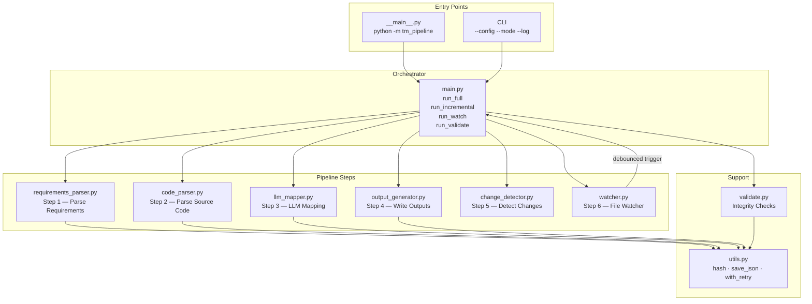
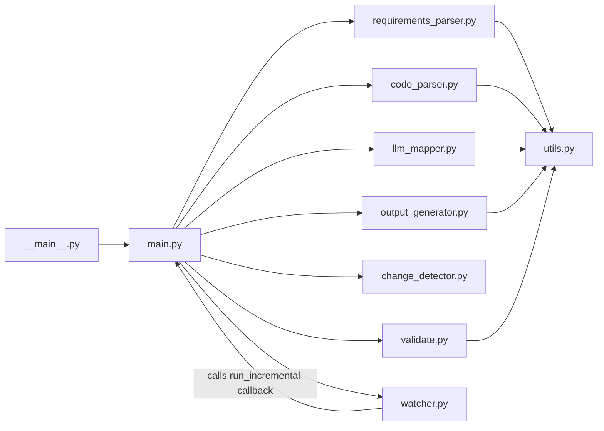
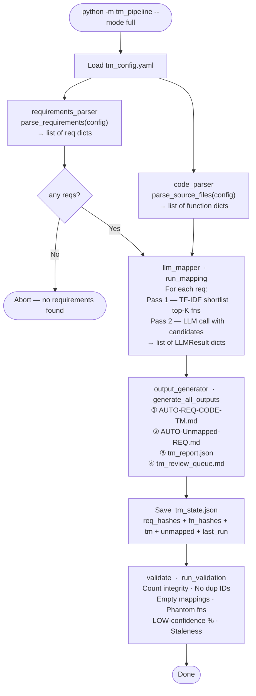
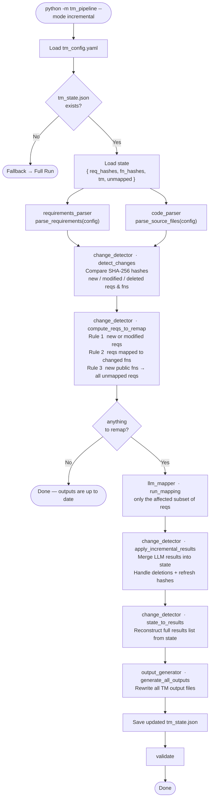
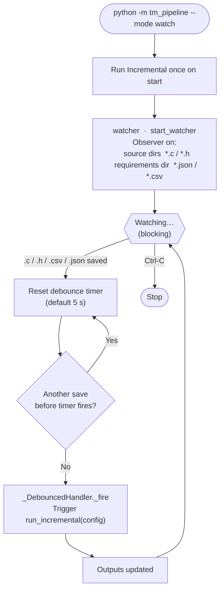
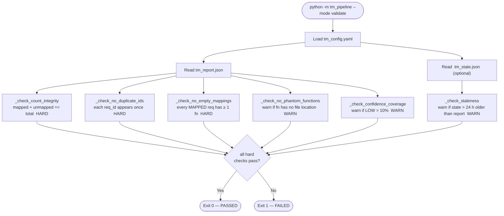
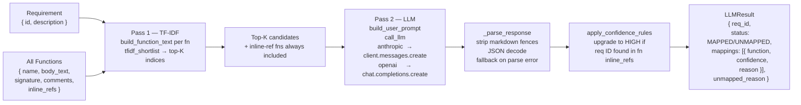
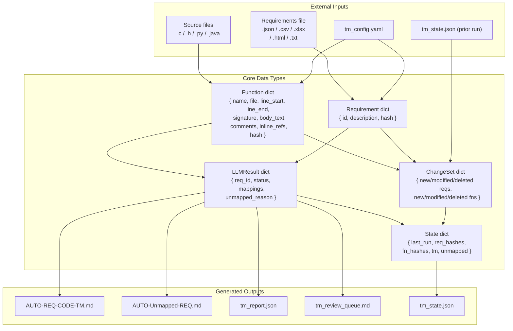
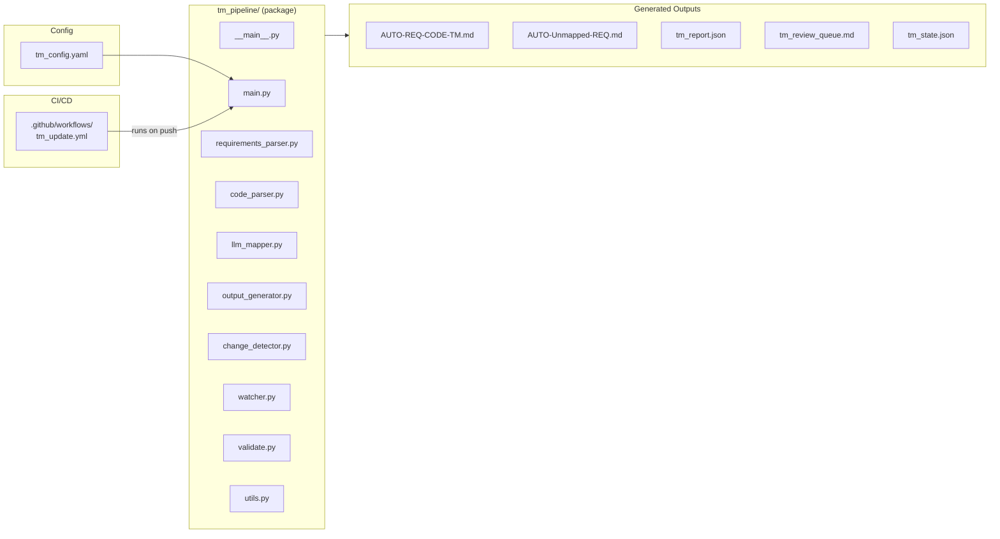

# TM Pipeline — Architecture

---

## 1. Module Map

Ten Python modules make up the package. Each has a single responsibility.

---

## 2. Module Dependencies

Arrows show `import` relationships. `utils.py` is the only shared leaf — nothing else is imported by two or more modules.

---

## 3. Full Run Flow  (`--mode full`)

Every requirement is mapped from scratch. Used when there is no previous state or when a complete refresh is needed.

---

## 4. Incremental Run Flow  (`--mode incremental`)

Only re-maps requirements affected by changes since the last run. Reads and updates `tm_state.json`.

---

## 5. Watch Mode Flow  (`--mode watch`)

Runs one incremental pass on startup, then blocks and re-runs after each debounced file-change event.

---

## 6. Validate-Only Flow  (`--mode validate`)

No LLM calls, no file writes. Reads the last `tm_report.json` and checks integrity.

---

## 7. Two-Pass LLM Mapping Strategy

Inside `llm_mapper.run_mapping()` — called once per requirement.

---

## 8. Key Data Structures

Shapes and arrows show what data each module produces and consumes.

---

## 9. File & Output Map

