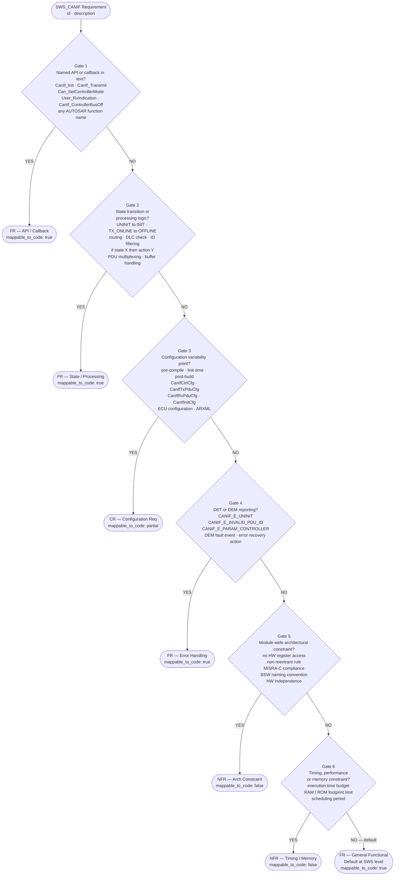
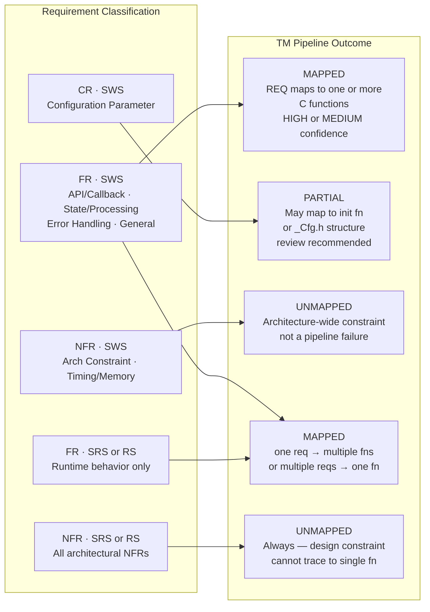
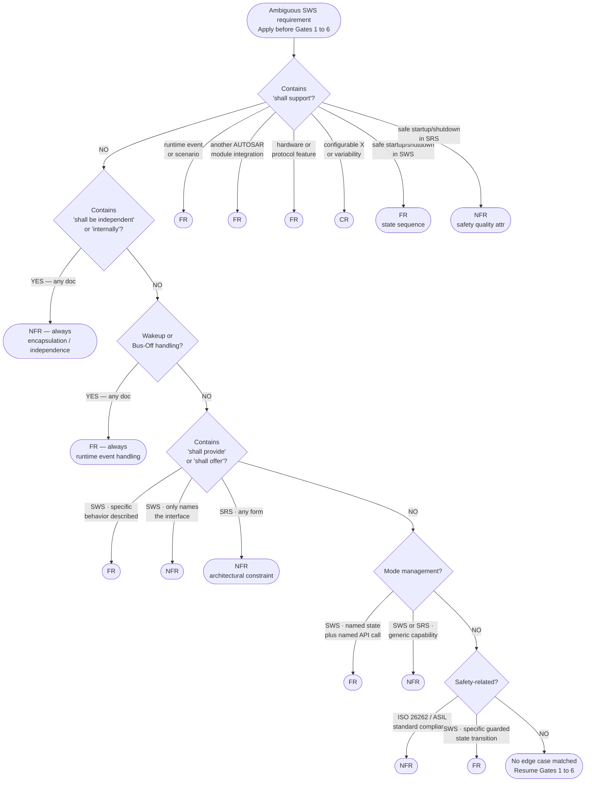

# AUTOSAR Requirements — Types, Explanation & Classification Guide

---

## 1. AUTOSAR Document Types That Contain Requirements

AUTOSAR organizes requirements across different document types, each at a different abstraction level:

| Document Type | Full Name | Abstraction Level |
|---|---|---|
| **RS** | Requirements Specification | System / Concept level |
| **SRS** | Software Requirements Specification | Software level |
| **SWS** | Software Specification | Detailed design / Implementation level |
| **TPS** | Template Specification | Modeling / Meta level |
| **EXP** | Explanation | Informational (non-binding) |
| **TR** | Technical Report | Informational (non-binding) |

> **Note:** Only RS, SRS, and SWS contain binding requirements. TPS has structural/modeling rules. EXP and TR are explanatory only.

---

## 2. Requirement Categories in AUTOSAR

### 2.1 Functional Requirements (FR)

**Definition:** Describe a specific behavior, capability, or service that the system/module must perform at runtime.

**Key indicators:**
- The module SHALL do / process / compute / detect / report / respond / handle / execute
- Describes input → processing → output
- Can be tested by observing runtime behavior

**Examples:**
- The CAN Transceiver Driver shall handle wakeup by bus during standby transition *(runtime event handling)*
- The CAN Interface shall notify the upper layer on transmission confirmation *(observable behavior)*
- The transceiver driver shall support an API to enable/disable wakeup notification per bus *(in SWS — specific API behavior)*

---

### 2.2 Non-Functional Requirements (NFR)

**Definition:** Describe quality attributes, constraints, or architectural properties of the system — not *what* it does, but *how well* or *how it is structured*.

#### Sub-categories of NFR in AUTOSAR:

| Sub-category | Description | Example |
|---|---|---|
| **Portability / Independence** | Module must not depend on specific HW or SW | CAN Interface shall be independent from CAN Controller and Transceiver |
| **Abstraction / Architecture** | Defines layering or abstraction design rules | CAN State Manager shall offer a network abstract API to upper layer *(SRS)* |
| **Encapsulation** | Internal details must be hidden from outside | Transceiver driver shall handle timing requirements internally |
| **Safety** | Must support safe states or safe transitions | Transceiver driver shall support safe system startup and shutdown |
| **Availability / Reliability** | Module must operate correctly under defined conditions | — |
| **Performance / Timing** | Processing time or latency constraints | — |
| **Maintainability** | Code/design must be easy to modify | — |
| **Scalability** | Must support varying configurations or sizes | — |
| **Interoperability** | Must comply with a standard or protocol version | CAN bus transceiver driver shall support CAN XL *(protocol compliance)* |

---

### 2.3 Configuration Requirements (CR)

**Definition:** Specific to SWS documents. Define parameters that must be configurable by the system integrator via AUTOSAR tooling (ARXML, ECU Configuration).

**Key indicators:**
- References a configuration container or parameter (e.g., `CanIfCtrlCfg`, `CanIfTxPduCfg`)
- Uses terms like "shall be configurable", "pre-compile time", "link time", "post-build time"
- Describes what the integrator can set, not what the module does at runtime

**Example:**
- The CanIf module shall provide a configuration parameter to enable/disable the DLC check per PDU
- The maximum number of CAN Controllers shall be configurable at pre-compile time

---

### 2.4 Interface Requirements (IR)

**Definition:** Define the existence and structure of a provided or required interface — applicable at both SRS and SWS level.

**Classification rule (critical):**

| Document | Classification | Reason |
|---|---|---|
| **SRS** | **Non-Functional** | At SRS level, defining an interface is an architectural constraint |
| **SWS** | **Functional** | At SWS level, the interface exists; the requirement describes its specific runtime behavior |

**Example in SRS (NFR):**
- The CAN Interface and Driver shall offer a CAN Controller-specific interface for initialization → *architectural constraint*

**Example in SWS (FR):**
- `CanIf_Init()` shall initialize all internal variables of the CanIf module → *specific runtime behavior*

---

### 2.5 Error Handling Requirements

**Definition:** Define how the module detects, reports, or recovers from errors.

**Classification:** Usually **Functional** — they describe concrete runtime behavior (detect fault → report DET/DEM → take action).

**Example:**
- The CAN Interface shall report a development error if called with an invalid controller index

---

### 2.6 Initialization / Shutdown Requirements

**Definition:** Define the behavior of the module during startup, initialization sequence, or shutdown.

**Classification:** Usually **Functional** — they describe a concrete sequence of actions at runtime.

**Example:**
- The CanIf module shall initialize all PDU routing paths during `CanIf_Init()`

---

## 3. How to Differentiate: Decision Guide

> **Scope:** SWS (Software Specification) requirements are the primary subject of this guide because they are the only requirement type that directly and consistently maps to C source functions in the Traceability Matrix pipeline. SRS and RS requirements operate at a higher abstraction level — they define system capabilities and architectural constraints rather than specific function behavior. Some SRS functional requirements (runtime event handling, protocol support) do propagate down to code and may appear as MAPPED in the TM, but they are exceptional cases. NFR requirements from any document type describe design properties of the entire module and will never map to a single C function.

---

### 3.0 SWS Classification Decision Tree



---

### 3.1 TM Pipeline Traceability Implication



> A high UNMAPPED rate for NFR requirements is **expected and correct behavior**, not a pipeline failure. The review queue must distinguish NFR-driven UNMAPPED items from genuinely missing implementations.

---

### 3.2 Edge Case Resolution Flowchart

Apply this chart **before** Gates 1–6 whenever the requirement text contains an ambiguous phrase.



---

### 3.3 Step-by-Step Explanation — SWS Gates

Work through each gate in order. Stop at the **first YES**. Do not continue to later gates after a match.

---

#### Gate 1 — Named API or Callback

A named AUTOSAR function anywhere in the requirement text is the strongest indicator of a Functional requirement. The requirement is describing the behavior of a specific, identifiable code symbol.

**Signal keywords:** any `CanIf_*`, `Can_*`, `PduR_*`, `EcuM_*`, `ComM_*` function name; `<User>_RxIndication`, `<User>_TxConfirmation`, `<User>_BusOffNotification`; any function referenced with `()` notation.

```
YES → FR  (sub_type: API_CALLBACK)
NO  → Gate 2
```

| Requirement text | Result |
|---|---|
| "...shall call `Can_SetControllerMode()`..." | FR |
| "`CanIf_Init()` shall initialize all static variables..." | FR |
| "...shall invoke the registered `<User>_RxIndication()` callback..." | FR |

---

#### Gate 2 — State Transition or Processing Logic

The requirement describes a concrete input-to-output transformation or a guarded state machine transition. Even without a named function, this always generates code.

**Signal keywords:** UNINIT, INIT, SLEEP, STARTED, STOPPED, TX_ONLINE, TX_OFFLINE, TX_LPDU_ACTIVE; `if [state] then [action]`; route, filter, discard, forward, translate, check, multiplex, buffer.

```
YES → FR  (sub_type: STATE_PROCESSING)
NO  → Gate 3
```

| Requirement text | Result |
|---|---|
| "...shall discard PDUs whose DLC is smaller than configured..." | FR |
| "...shall route incoming L-PDUs to the configured upper layer..." | FR |
| "If controller is STOPPED, CanIf shall reject all Tx requests..." | FR |

---

#### Gate 3 — Configuration Variability Point

The requirement defines what a system integrator can configure — not what the module does at runtime. These requirements trace to `_Cfg.h` structures, generated ARXML containers, or initialization parameters rather than to functional code bodies.

**Signal keywords:** pre-compile time, link time, post-build, configurable, `CanIfCtrlCfg`, `CanIfTxPduCfg`, `CanIfRxPduCfg`, `CanIfInitCfg`, `CanIfTrcvCfg`, ECU configuration, ARXML, `SWC parameter`.

```
YES → CR  (sub_type: CONFIG_PARAM)
NO  → Gate 4
```

| Requirement text | Result |
|---|---|
| "The number of CAN Controllers shall be configurable at pre-compile time" | CR |
| "DLC check shall be enabled/disabled per PDU via configuration" | CR |
| "Each Tx PDU shall have a configurable handle ID `CanIfTxPduId`" | CR |

---

#### Gate 4 — DET / DEM Error Reporting

Error detection and fault notification are always runtime behaviors — they result in concrete function calls to `Det_ReportError()` or `Dem_ReportErrorStatus()`. Both DET (development-time API misuse) and DEM (production fault events) produce traceable code.

**Signal keywords:** DET, DEM, `CANIF_E_UNINIT`, `CANIF_E_INVALID_PDU_ID`, `CANIF_E_PARAM_CONTROLLER`, `CANIF_E_PARAM_CANID`, `Det_ReportError`, `Dem_ReportErrorStatus`, development error, production error, error recovery.

```
YES → FR  (sub_type: ERROR_HANDLING)
NO  → Gate 5
```

| Requirement text | Result |
|---|---|
| "...shall report `CANIF_E_UNINIT` to DET if called before init..." | FR |
| "...shall report a DEM event when Bus-Off state is detected..." | FR |

---

#### Gate 5 — Module-Wide Architectural Constraint

The requirement imposes a rule on the entire module's design — it cannot be traced to a single function because it applies everywhere (or nowhere in code specifically). These are design decisions enforced by architecture, code review, or static analysis tools, not by a specific function body.

**Signal keywords:** shall not access hardware registers directly, independent from, non-reentrant, MISRA-C, MISRA-C:2012, BSW naming convention, shall not use platform-specific types, shall not call [module] directly, memory-mapped.

```
YES → NFR  (sub_type: ARCH_CONSTRAINT)
NO  → Gate 6
```

| Requirement text | Result |
|---|---|
| "The CanIf module shall not directly access CAN hardware registers" | NFR |
| "CanIf functions shall be non-reentrant unless explicitly stated" | NFR |
| "The CanIf module shall be MISRA-C:2012 compliant" | NFR |

---

#### Gate 6 — Timing, Performance, or Memory Constraint

The requirement defines a quality bound that applies across the module's execution. No single function implements a timing budget — it is validated by measurement, scheduler configuration, or static analysis.

**Signal keywords:** within X milliseconds, scheduling period, execution time, worst-case execution time (WCET), RAM usage, ROM footprint, stack depth, shall not exceed X bytes, real-time.

```
YES → NFR  (sub_type: TIMING_PERF_MEMORY)
NO  → Default → FR  (sub_type: GENERAL_FUNCTIONAL)
```

> **Default rule:** At SWS level, if no gate matches, the requirement is Functional. SWS documents exist to specify implementation; any unclassified SWS requirement is almost certainly describing runtime behavior that has a code counterpart.

---

### 3.4 Note on SRS and RS Requirements Affecting Code

While SWS is the primary source for the TM pipeline, two SRS/RS patterns do propagate to code and may appear as MAPPED:

| SRS / RS Pattern | TM Behavior |
|---|---|
| Wakeup / Bus-Off event handling | Maps to `CanIf_ControllerBusOff()`, `CanIf_CheckWakeup()` |
| Protocol feature support (CAN XL, CAN FD) | Maps to frame-type handling in Rx/Tx paths |
| All other SRS FR | May map to multiple functions; expect LOW confidence |
| All SRS / RS NFR | Always UNMAPPED — design constraints only |

---

### 3.5 LLM Classification Prompt

Use this prompt as the **system message** in a preprocessing classification step added to the TM pipeline before `llm_mapper.run_mapping()`. It returns a structured JSON classification for each requirement, which the pipeline can use to skip NFR/CR requirements from the LLM mapping stage and reduce unnecessary API calls.

````
SYSTEM PROMPT — AUTOSAR SWS Requirement Classifier
====================================================

You are an AUTOSAR SWS requirements classification expert embedded in an
automated Traceability Matrix (TM) generation pipeline for AUTOSAR CanIf.

INPUT
-----
A single AUTOSAR requirement object:
  { "req_id": "SWS_CANIF_XXXXX", "description": "..." }

TASK
----
Classify the requirement and determine its traceability potential to C source
functions. Work through the gates below in order. Stop at the first YES answer.

EDGE CASE RULES — check these FIRST before the gates
-----------------------------------------------------
Apply the first matching rule and skip the gates entirely.

  E1  Text contains "shall be independent" or "internally"
      → NFR, sub_type ARCH_CONSTRAINT, mappable false

  E2  Text describes wakeup or Bus-Off handling (any phrasing)
      → FR, sub_type STATE_PROCESSING, mappable true

  E3  Text contains "shall support" → resolve by what follows:
        runtime event / scenario          → FR, sub_type STATE_PROCESSING
        another AUTOSAR module            → FR, sub_type API_CALLBACK
        hardware or protocol feature      → FR, sub_type STATE_PROCESSING
        safe startup / shutdown           → FR, sub_type STATE_PROCESSING
        configurable / variability        → CR, sub_type CONFIG_PARAM

  E4  Text contains "shall provide" or "shall offer":
        + specific runtime behavior described → FR, sub_type API_CALLBACK
        + only names an interface            → NFR, sub_type ARCH_CONSTRAINT

  E5  Mode management:
        named state + named API call present → FR, sub_type STATE_PROCESSING
        generic capability / no named call   → NFR, sub_type ARCH_CONSTRAINT

  E6  Safety-related:
        ISO 26262 / ASIL compliance          → NFR, sub_type ARCH_CONSTRAINT
        specific guarded state transition    → FR, sub_type STATE_PROCESSING

CLASSIFICATION GATES — apply in order if no edge case matched
-------------------------------------------------------------
  Gate 1 — Named API or callback in text?
    Signal: CanIf_*, Can_*, PduR_*, EcuM_*, ComM_* function name;
            <User>_RxIndication, <User>_TxConfirmation; any name with ()
    YES → FR, sub_type API_CALLBACK, mappable true

  Gate 2 — State transition or processing logic?
    Signal: UNINIT, INIT, SLEEP, STARTED, STOPPED, TX_ONLINE, TX_OFFLINE;
            route, filter, discard, forward, translate, check, multiplex,
            buffer; "if [state] then [action]"
    YES → FR, sub_type STATE_PROCESSING, mappable true

  Gate 3 — Configuration variability point?
    Signal: pre-compile, link time, post-build, configurable,
            CanIfCtrlCfg, CanIfTxPduCfg, CanIfRxPduCfg, CanIfInitCfg,
            ECU configuration, ARXML, SWC parameter
    YES → CR, sub_type CONFIG_PARAM, mappable partial

  Gate 4 — DET or DEM error reporting?
    Signal: DET, DEM, CANIF_E_UNINIT, CANIF_E_INVALID_PDU_ID,
            CANIF_E_PARAM_CONTROLLER, Det_ReportError,
            Dem_ReportErrorStatus, development error, production error
    YES → FR, sub_type ERROR_HANDLING, mappable true

  Gate 5 — Module-wide architectural constraint?
    Signal: shall not access hardware, non-reentrant, MISRA-C,
            BSW naming, independent from, shall not use platform-specific,
            memory-mapped, shall not call [module] directly
    YES → NFR, sub_type ARCH_CONSTRAINT, mappable false

  Gate 6 — Timing, performance, or memory constraint?
    Signal: milliseconds, scheduling period, WCET, RAM usage, ROM footprint,
            stack depth, shall not exceed X bytes, real-time, execution time
    YES → NFR, sub_type TIMING_PERF_MEMORY, mappable false

  Default (no gate matched):
    → FR, sub_type GENERAL_FUNCTIONAL, mappable true

CONFIDENCE RULES
----------------
  HIGH   — A gate matched via an unambiguous keyword (named function,
            exact DET error code, named config container, named state)
  MEDIUM — Gate matched via general descriptive language (no specific names)
  LOW    — Text is ambiguous; could fit two gates; human review required

OUTPUT FORMAT
-------------
Return ONLY a valid JSON object. No explanation, no markdown, no extra text.

{
  "req_id":          "<requirement ID>",
  "classification":  "<FR | NFR | CR>",
  "sub_type":        "<API_CALLBACK | STATE_PROCESSING | CONFIG_PARAM |
                       ERROR_HANDLING | ARCH_CONSTRAINT |
                       TIMING_PERF_MEMORY | GENERAL_FUNCTIONAL | GENERAL_NFR>",
  "mappable_to_code": <true | false | "partial">,
  "confidence":      "<HIGH | MEDIUM | LOW>",
  "gate_matched":    "<Edge Case E1..E6 | Gate 1..6 | Default>",
  "reasoning":       "<one sentence explaining the classification decision>"
}

EXAMPLES
--------
Input:
  { "req_id": "SWS_CANIF_00308",
    "description": "The CAN Interface shall call Can_SetControllerMode() to
                    request the transition to the requested controller mode." }

Output:
  {
    "req_id": "SWS_CANIF_00308",
    "classification": "FR",
    "sub_type": "API_CALLBACK",
    "mappable_to_code": true,
    "confidence": "HIGH",
    "gate_matched": "Gate 1",
    "reasoning": "Named AUTOSAR API Can_SetControllerMode() is explicitly
                  referenced, indicating a direct function call in code."
  }

---

Input:
  { "req_id": "SWS_CANIF_00032",
    "description": "The CanIf module shall not directly access CAN hardware
                    registers or any memory-mapped hardware resource." }

Output:
  {
    "req_id": "SWS_CANIF_00032",
    "classification": "NFR",
    "sub_type": "ARCH_CONSTRAINT",
    "mappable_to_code": false,
    "confidence": "HIGH",
    "gate_matched": "Edge Case E1",
    "reasoning": "Prohibits direct HW access — a module-wide architectural
                  design constraint that applies to all functions, not one."
  }

---

Input:
  { "req_id": "SWS_CANIF_00661",
    "description": "The number of CAN Controllers supported by CanIf shall be
                    configurable at pre-compile time via CanIfCtrlCfg." }

Output:
  {
    "req_id": "SWS_CANIF_00661",
    "classification": "CR",
    "sub_type": "CONFIG_PARAM",
    "mappable_to_code": "partial",
    "confidence": "HIGH",
    "gate_matched": "Gate 3",
    "reasoning": "Pre-compile time variability and named config container
                  CanIfCtrlCfg make this a configuration requirement."
  }
````

---

## 4. Summary Table — Classification by Document and Scenario

| Scenario | SRS | SWS |
|---|---|---|
| Module shall offer/provide an API | **Non-Functional** (architectural) | **Functional** (API behavior) |
| Module shall be independent from HW | **Non-Functional** | **Non-Functional** |
| Function shall handle event X at runtime | **Functional** | **Functional** |
| Module shall handle safe startup/shutdown | **Functional** | **Functional** |
| Parameter shall be configurable | N/A | **Configuration Req** |
| Module shall comply with protocol (e.g. CAN XL) | **Functional** | **Functional** |
| Timing/performance constraint | **Non-Functional** | **Non-Functional** |
| Encapsulation of internal behavior | **Non-Functional** | **Non-Functional** |
| Error detection and reporting | **Functional** | **Functional** |
| Initialization sequence behavior | **Functional** | **Functional** |

---

## 5. Quick Reference — Keyword Indicators

### Likely Functional
- shall detect, shall report, shall notify, shall transmit, shall receive
- shall initialize (when describing the sequence of actions)
- shall handle, shall process, shall respond, shall confirm
- shall support [a specific runtime scenario or event]

### Likely Non-Functional
- shall be independent, shall be portable
- shall offer [an API] *(in SRS)*
- shall handle [internally] *(encapsulation)*
- shall be configurable *(→ Configuration Req in SWS)*
- shall comply with [standard/architecture]
- shall support [ECU state manager / safe transition] *(when about system quality, not behavior)*

---

*Reference: AUTOSAR SRS_CAN, SWS_CANInterface, AUTOSAR Methodology document*
