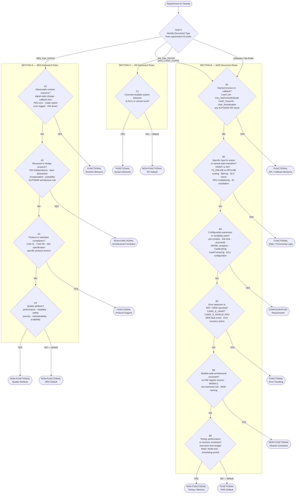
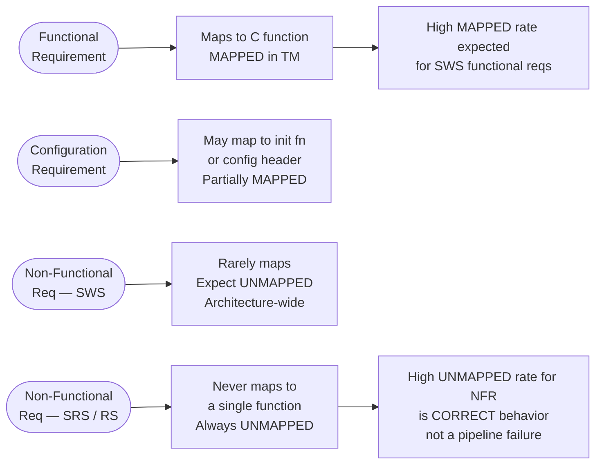
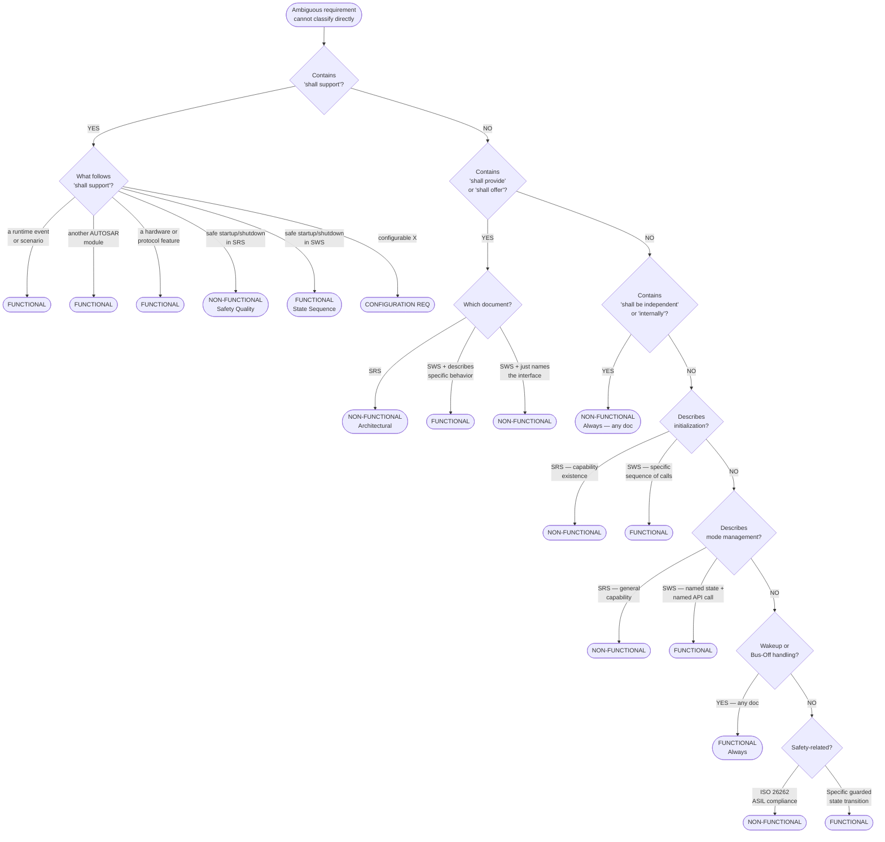

# AUTOSAR Requirements — Types, Explanation & Classification Guide

---

## 1. AUTOSAR Document Types That Contain Requirements

AUTOSAR organizes requirements across different document types, each at a different abstraction level:

| Document Type | Full Name | Abstraction Level |
|---|---|---|
| **RS** | Requirements Specification | System / Concept level |
| **SRS** | Software Requirements Specification | Software level |
| **SWS** | Software Specification | Detailed design / Implementation level |
| **TPS** | Template Specification | Modeling / Meta level |
| **EXP** | Explanation | Informational (non-binding) |
| **TR** | Technical Report | Informational (non-binding) |

> **Note:** Only RS, SRS, and SWS contain binding requirements. TPS has structural/modeling rules. EXP and TR are explanatory only.

---

## 2. Requirement Categories in AUTOSAR

### 2.1 Functional Requirements (FR)

**Definition:** Describe a specific behavior, capability, or service that the system/module must perform at runtime.

**Key indicators:**
- The module SHALL do / process / compute / detect / report / respond / handle / execute
- Describes input → processing → output
- Can be tested by observing runtime behavior

**Examples:**
- The CAN Transceiver Driver shall handle wakeup by bus during standby transition *(runtime event handling)*
- The CAN Interface shall notify the upper layer on transmission confirmation *(observable behavior)*
- The transceiver driver shall support an API to enable/disable wakeup notification per bus *(in SWS — specific API behavior)*

---

### 2.2 Non-Functional Requirements (NFR)

**Definition:** Describe quality attributes, constraints, or architectural properties of the system — not *what* it does, but *how well* or *how it is structured*.

#### Sub-categories of NFR in AUTOSAR:

| Sub-category | Description | Example |
|---|---|---|
| **Portability / Independence** | Module must not depend on specific HW or SW | CAN Interface shall be independent from CAN Controller and Transceiver |
| **Abstraction / Architecture** | Defines layering or abstraction design rules | CAN State Manager shall offer a network abstract API to upper layer *(SRS)* |
| **Encapsulation** | Internal details must be hidden from outside | Transceiver driver shall handle timing requirements internally |
| **Safety** | Must support safe states or safe transitions | Transceiver driver shall support safe system startup and shutdown |
| **Availability / Reliability** | Module must operate correctly under defined conditions | — |
| **Performance / Timing** | Processing time or latency constraints | — |
| **Maintainability** | Code/design must be easy to modify | — |
| **Scalability** | Must support varying configurations or sizes | — |
| **Interoperability** | Must comply with a standard or protocol version | CAN bus transceiver driver shall support CAN XL *(protocol compliance)* |

---

### 2.3 Configuration Requirements (CR)

**Definition:** Specific to SWS documents. Define parameters that must be configurable by the system integrator via AUTOSAR tooling (ARXML, ECU Configuration).

**Key indicators:**
- References a configuration container or parameter (e.g., `CanIfCtrlCfg`, `CanIfTxPduCfg`)
- Uses terms like "shall be configurable", "pre-compile time", "link time", "post-build time"
- Describes what the integrator can set, not what the module does at runtime

**Example:**
- The CanIf module shall provide a configuration parameter to enable/disable the DLC check per PDU
- The maximum number of CAN Controllers shall be configurable at pre-compile time

---

### 2.4 Interface Requirements (IR)

**Definition:** Define the existence and structure of a provided or required interface — applicable at both SRS and SWS level.

**Classification rule (critical):**

| Document | Classification | Reason |
|---|---|---|
| **SRS** | **Non-Functional** | At SRS level, defining an interface is an architectural constraint |
| **SWS** | **Functional** | At SWS level, the interface exists; the requirement describes its specific runtime behavior |

**Example in SRS (NFR):**
- The CAN Interface and Driver shall offer a CAN Controller-specific interface for initialization → *architectural constraint*

**Example in SWS (FR):**
- `CanIf_Init()` shall initialize all internal variables of the CanIf module → *specific runtime behavior*

---

### 2.5 Error Handling Requirements

**Definition:** Define how the module detects, reports, or recovers from errors.

**Classification:** Usually **Functional** — they describe concrete runtime behavior (detect fault → report DET/DEM → take action).

**Example:**
- The CAN Interface shall report a development error if called with an invalid controller index

---

### 2.6 Initialization / Shutdown Requirements

**Definition:** Define the behavior of the module during startup, initialization sequence, or shutdown.

**Classification:** Usually **Functional** — they describe a concrete sequence of actions at runtime.

**Example:**
- The CanIf module shall initialize all PDU routing paths during `CanIf_Init()`

---

## 3. How to Differentiate: Decision Guide

### 3.0 Master Classification Flowchart



---

### 3.1 TM Pipeline Traceability Implication



---

### 3.2 Edge Case Resolution Flowchart



---

This guide is structured as a layered decision process. Work through each gate in order. The first gate that gives a definitive answer is your final answer — do not continue to later gates.

---

### Gate 0 — Identify the Document Type First

The document type is the outermost context and changes every rule that follows.

```
Read the requirement ID prefix:
│
├── SRS_Can_XXXXX  →  SRS rules apply  (Section A below)
├── SWS_CANIF_XXXXX →  SWS rules apply  (Section B below)
├── RS_Can_XXXXX   →  RS rules apply   (Section C below)
└── No prefix / unknown → treat as SWS if it references a specific function or API
```

> **Why this matters for the TM pipeline:** Only FR and CR requirements from SWS typically map to a specific C function. NFR requirements describe design properties — they are architecture-wide and will always appear as `UNMAPPED` in the TM. Knowing the type early prevents wasted LLM calls on unmappable requirements.

---

### Section A — SRS Requirements

SRS sits at the software requirements level. It defines *what capabilities the software stack must have*, not *how any single function implements them*. This makes several patterns that look functional actually architectural.

**Step A1 — Does the requirement describe a runtime event with an observable outcome?**

Observable outcome means: a signal changes state, a callback fires, a PDU is transmitted/received, a mode switches, an error is logged, hardware is driven.

```
YES → Functional
NO  → Continue to A2
```

Examples of YES (Functional in SRS):
- "The CAN Driver shall notify the CAN Interface on reception of a CAN frame" → observable callback event
- "The CAN Transceiver Driver shall handle wakeup by bus during sleep/standby transition" → observable runtime race condition handling
- "The bus transceiver driver shall support safe system startup and shutdown" → observable lifecycle behavior with safety outcome

Examples of NO → continue:
- "The CAN Interface shall offer a network abstract API" → no specific runtime event described
- "The CAN Interface shall be independent from CAN Controller and Transceiver" → describes a design property

---

**Step A2 — Does the requirement define a structural or design property of the module?**

Structural/design properties include: hardware independence, layer abstraction, encapsulation of internal details, compliance with AUTOSAR layered architecture, portability.

```
YES → Non-Functional (Architectural Constraint)
NO  → Continue to A3
```

Examples of YES (Non-Functional in SRS):
- "The CAN Interface implementation shall be independent from underlying CAN Controller and CAN Transceiver" → portability / HW independence
- "The CAN Bus Transceiver driver shall handle transceiver-specific timing requirements internally" → encapsulation
- "The CAN State Manager shall offer a network abstract API to upper layer" → abstraction layer design constraint
- "The CAN Interface and Driver shall offer a CAN Controller-specific interface for initialization" → interface provision = architectural constraint at SRS level

---

**Step A3 — Does the requirement mandate compliance with a protocol, standard, or external specification?**

```
YES → Functional  (protocol support is a behavioral capability)
NO  → Continue to A4
```

Examples of YES (Functional):
- "The CAN bus transceiver driver shall support CAN XL" → protocol version support

---

**Step A4 — Does the requirement describe a quality attribute (performance, reliability, safety, security, maintainability)?**

```
YES → Non-Functional
NO  → Default → Non-Functional (when in doubt at SRS level, err toward NFR)
```

---

### Section B — SWS Requirements

SWS is at the detailed design and implementation level. Requirements here are tied to specific APIs, functions, configuration parameters, and runtime states. The classification rules differ significantly from SRS.

**Step B1 — Does the requirement reference a specific named function, API call, or callback?**

Named function = `CanIf_Init()`, `CanIf_Transmit()`, `Can_SetControllerMode()`, `PduR_CanIfRxIndication()`, etc.

```
YES → Functional
NO  → Continue to B2
```

Examples of YES (Functional in SWS):
- "The CAN Interface shall call `Can_SetControllerMode()` to request a mode transition" → named API call
- "CanIf_Init() shall initialize all static variables of the CanIf module" → named function behavior
- "The CAN Interface shall call the registered `<User>_RxIndication()` callback after successful reception" → named callback

---

**Step B2 — Does the requirement describe a specific input → processing → output or state transition?**

State transitions: UNINIT → INIT, ONLINE → SLEEP, TX_ONLINE → TX_OFFLINE, etc.
Processing: filtering, routing, DLC check, ID translation, PDU multiplexing.

```
YES → Functional
NO  → Continue to B3
```

Examples of YES (Functional in SWS):
- "The CAN Interface shall discard received PDUs whose DLC is smaller than the configured DLC" → input check → discard decision
- "The CAN Interface shall route incoming L-PDUs to the configured upper layer module" → routing logic
- "If the CAN Controller is in state STOPPED, CanIf shall reject all transmit requests" → state-guarded behavior

---

**Step B3 — Does the requirement define a configuration parameter, configuration container, or a compile-time/link-time/post-build variability point?**

```
YES → Configuration Requirement
NO  → Continue to B4
```

Keywords: pre-compile time, link time, post-build, `CanIfCtrlCfg`, `CanIfTxPduCfg`, `CanIfRxPduCfg`, `CanIfInitCfg`, `SWC parameter`, `ECU configuration`, `ARXML`.

Examples of YES (Configuration Requirement in SWS):
- "The number of CAN Controllers supported by CanIf shall be configurable at pre-compile time"
- "Each Tx PDU shall have a configurable handle ID (`CanIfTxPduId`)"
- "DLC check shall be enabled/disabled per PDU via configuration"

---

**Step B4 — Does the requirement describe error detection, error reporting to DET, or fault notification to DEM?**

DET = Development Error Tracer (detects API misuse during development).
DEM = Diagnostic Event Manager (reports production faults).

```
YES → Functional
NO  → Continue to B5
```

Examples of YES (Functional in SWS):
- "If `CanIf_Transmit()` is called before initialization, CanIf shall report `CANIF_E_UNINIT` to DET"
- "The CAN Interface shall report a DEM event if a CAN Controller enters Bus-Off state"

---

**Step B5 — Does the requirement describe a constraint that applies to the entire module architecture, not to a single function?**

Module-wide constraints: independence from hardware, AUTOSAR BSW compliance, memory footprint, re-entrancy rules, execution time budgets.

```
YES → Non-Functional
NO  → Continue to B6
```

Examples of YES (Non-Functional in SWS):
- "The CanIf module shall not directly access CAN hardware registers" → independence constraint
- "CanIf functions shall be non-reentrant unless explicitly stated" → concurrency constraint
- "The CanIf module shall be MISRA-C compliant" → code quality constraint

---

**Step B6 — Does the requirement describe timing, performance, or memory constraints?**

```
YES → Non-Functional
NO  → Default → Functional  (at SWS level, unclassified requirements default to Functional)
```

Examples of YES (Non-Functional in SWS):
- "The CanIf module shall complete PDU routing within the configured scheduling period"
- "CanIf RAM usage shall not exceed X bytes per controller"

---

### Section C — RS Requirements

RS is the highest-level specification. It defines system-wide goals and constraints, not module-specific behaviors. Almost all RS requirements are Non-Functional or represent system-level capabilities that translate into multiple SRS/SWS requirements downstream.

**Step C1 — Does the requirement define a concrete, testable system behavior at the ECU or vehicle level?**

```
YES → Functional
NO  → Non-Functional (default for RS level)
```

---

### Edge Cases and Ambiguous Patterns

These are the patterns most likely to cause misclassification. Each has a definitive resolution.

---

#### Edge Case 1 — "shall support" pattern

"Shall support" is the most ambiguous phrase in AUTOSAR requirements. Resolution depends on what follows:

| Pattern | Classification | Reasoning |
|---|---|---|
| "shall support [a runtime event/scenario]" | **Functional** | Describes handling of a specific runtime situation |
| "shall support [another AUTOSAR module]" | **Functional** | Describes integration behavior at runtime |
| "shall support [a hardware/protocol feature]" | **Functional** | Capability that maps to a code path |
| "shall support [safe startup/shutdown]" in **SRS** | **Non-Functional** | Safety quality attribute at architecture level |
| "shall support [safe startup/shutdown]" in **SWS** | **Functional** | Specific sequence of calls and state transitions |
| "shall support [configurable X]" | **Configuration Req** (SWS) | Variability point |

---

#### Edge Case 2 — "shall provide / shall offer" pattern

| Pattern | Document | Classification |
|---|---|---|
| "shall provide an API for X" | **SRS** | **Non-Functional** — API provision is an architectural design decision at SRS level |
| "shall provide an API for X" | **SWS** | **Functional** — the API exists; this describes its behavior |
| "shall offer a network abstract interface" | **SRS** | **Non-Functional** — abstraction layer constraint |
| "shall provide `CanIf_Init()` with signature..." | **SWS** | **Functional** — specific API contract |

---

#### Edge Case 3 — Initialization requirements

Initialization requirements are Functional in SWS but can be NFR in SRS:

| Pattern | Document | Classification | Reasoning |
|---|---|---|---|
| "Module shall support initialization" | **SRS** | **Non-Functional** | Capability existence = architectural |
| "Module shall provide an init interface" | **SRS** | **Non-Functional** | Interface provision at SRS = architectural |
| "`CanIf_Init()` shall set all Tx buffers to idle" | **SWS** | **Functional** | Specific state initialization action |
| "`CanIf_Init()` shall call `Can_Init()`" | **SWS** | **Functional** | Named sequence of calls |

---

#### Edge Case 4 — Safety requirements

Safety requirements span both FR and NFR depending on specificity:

| Pattern | Classification | Reasoning |
|---|---|---|
| "shall support safe ECU shutdown" *(SRS)* | **Non-Functional** | System safety quality attribute |
| "shall transition to SLEEP only after all pending Tx are confirmed" *(SWS)* | **Functional** | Specific guarded state transition |
| "shall not lose any PDU during mode transition" *(SWS)* | **Functional** | Observable runtime guarantee |
| "shall comply with ISO 26262 ASIL-B" | **Non-Functional** | Safety standard compliance |

---

#### Edge Case 5 — Protocol / standard compliance

| Pattern | Classification | Reasoning |
|---|---|---|
| "shall support CAN XL" | **Functional** | Protocol support = behavioral capability in code |
| "shall support CAN FD" | **Functional** | Same reasoning |
| "shall be MISRA-C compliant" | **Non-Functional** | Code quality constraint, not runtime behavior |
| "shall follow AUTOSAR BSW naming convention" | **Non-Functional** | Design standard constraint |

---

#### Edge Case 6 — Wakeup / Bus-Off handling

These are always Functional because they describe specific runtime event sequences:

| Pattern | Classification |
|---|---|
| "shall handle wakeup by bus during standby transition" | **Functional** |
| "shall notify EcuM on wakeup detection" | **Functional** |
| "shall call `CanIf_ControllerBusOff()` on Bus-Off detection" | **Functional** |
| "shall enable/disable wakeup notification per bus" | **Functional** |

---

#### Edge Case 7 — Mode management

Mode management straddles FR and NFR. Key differentiator is whether a specific runtime transition with named states/calls is described:

| Pattern | Document | Classification |
|---|---|---|
| "shall support multiple controller modes" | **SRS** | **Non-Functional** |
| "shall manage controller operating modes" | **SRS** | **Non-Functional** |
| "shall request SLEEP mode via `Can_SetControllerMode(CAN_CS_SLEEP)`" | **SWS** | **Functional** |
| "shall reject Tx requests when controller is in STOPPED state" | **SWS** | **Functional** |

---

#### Edge Case 8 — Independence / portability requirements

Always Non-Functional regardless of document type:

| Pattern | Classification |
|---|---|
| "shall be independent from CAN Controller hardware" | **Non-Functional** |
| "shall not use hardware-specific data types" | **Non-Functional** |
| "shall abstract the underlying transceiver from the upper layers" | **Non-Functional** |
| "shall handle timing requirements internally" | **Non-Functional** |

---

### TM Pipeline Implication — Mappability to Code

For the automated traceability pipeline, classification has a direct consequence on whether a requirement will map to a C function:

| Classification | Typically Maps to a C Function? | Notes |
|---|---|---|
| **Functional (SWS)** | **Yes** | Primary target for TM mapping |
| **Configuration Req (SWS)** | **Partially** | May map to `_Cfg.h` or init function, or be UNMAPPED |
| **Functional (SRS)** | **Sometimes** | High-level FR may map to multiple functions or none |
| **Non-Functional (SWS)** | **Rarely** | Architecture-wide — expect UNMAPPED in TM |
| **Non-Functional (SRS)** | **No** | Design constraint — always UNMAPPED in TM |

> A high UNMAPPED rate for NFR requirements is **expected and correct behavior**, not a pipeline failure. The review queue should distinguish NFR-driven UNMAPPED items from genuinely missing implementations.

---

## 4. Summary Table — Classification by Document and Scenario

| Scenario | SRS | SWS |
|---|---|---|
| Module shall offer/provide an API | **Non-Functional** (architectural) | **Functional** (API behavior) |
| Module shall be independent from HW | **Non-Functional** | **Non-Functional** |
| Function shall handle event X at runtime | **Functional** | **Functional** |
| Module shall handle safe startup/shutdown | **Functional** | **Functional** |
| Parameter shall be configurable | N/A | **Configuration Req** |
| Module shall comply with protocol (e.g. CAN XL) | **Functional** | **Functional** |
| Timing/performance constraint | **Non-Functional** | **Non-Functional** |
| Encapsulation of internal behavior | **Non-Functional** | **Non-Functional** |
| Error detection and reporting | **Functional** | **Functional** |
| Initialization sequence behavior | **Functional** | **Functional** |

---

## 5. Quick Reference — Keyword Indicators

### Likely Functional
- shall detect, shall report, shall notify, shall transmit, shall receive
- shall initialize (when describing the sequence of actions)
- shall handle, shall process, shall respond, shall confirm
- shall support [a specific runtime scenario or event]

### Likely Non-Functional
- shall be independent, shall be portable
- shall offer [an API] *(in SRS)*
- shall handle [internally] *(encapsulation)*
- shall be configurable *(→ Configuration Req in SWS)*
- shall comply with [standard/architecture]
- shall support [ECU state manager / safe transition] *(when about system quality, not behavior)*

---

*Reference: AUTOSAR SRS_CAN, SWS_CANInterface, AUTOSAR Methodology document*
