# CSE356: Internet of Things — Project Report
**Ain Shams University | Faculty of Engineering | Computer and Systems Engineering Dept.**
**CHEP – Spring 2026**

---

# Smart Home Automation IoT System

**Project Title:** Smart Home Automation System
**Course:** CSE356 – Internet of Things
**Submitted to:** Dr. Islam Tharwat Abdel Halim

---

## Table of Contents

1. [Step 1: Purpose & Requirements](#step-1-purpose--requirements)
2. [Step 2: Process Specification](#step-2-process-specification)
3. [Step 3: Domain Model Specification](#step-3-domain-model-specification)
4. [Step 4: Information Model Specification](#step-4-information-model-specification)
5. [Step 5: Service Specifications](#step-5-service-specifications)
6. [Step 6: IoT Level Specification](#step-6-iot-level-specification)
7. [Step 7: Functional View Specification](#step-7-functional-view-specification)
8. [Step 8: Operational View Specification](#step-8-operational-view-specification)
9. [Step 9: Device & Component Integration](#step-9-device--component-integration)
10. [Step 10: Application Development](#step-10-application-development)

---

## Step 1: Purpose & Requirements

### 1.1 Purpose

The Smart Home Automation System (SHAS) is an IoT-based solution designed to enhance the comfort, safety, energy efficiency, and security of residential environments. The system enables homeowners to remotely monitor and control home appliances, lighting, climate, security cameras, and door locks through a unified mobile/web application. It also supports autonomous decision-making through rule-based automation and AI-driven recommendations.

### 1.2 Functional Requirements

| ID | Requirement |
|----|-------------|
| FR-01 | The system shall allow users to remotely control lighting (on/off, dimming, color) via a mobile application. |
| FR-02 | The system shall monitor real-time temperature and humidity and automatically control the HVAC system. |
| FR-03 | The system shall detect motion and send push notifications to the homeowner. |
| FR-04 | The system shall control smart door locks with PIN, biometric, or remote unlock. |
| FR-05 | The system shall detect smoke/gas leakage and trigger alarms and automated ventilation. |
| FR-06 | The system shall monitor and report energy consumption per device. |
| FR-07 | The system shall support scheduled automation (e.g., turn off all lights at 11 PM). |
| FR-08 | The system shall stream live video from security cameras accessible via the app. |
| FR-09 | The system shall allow voice-command control via integration with Google Home / Amazon Alexa. |
| FR-10 | The system shall log all events and sensor readings in a cloud database. |

### 1.3 Non-Functional Requirements

| ID | Requirement |
|----|-------------|
| NFR-01 | **Performance:** Sensor data shall be processed and acted upon within 500 ms under normal network conditions. |
| NFR-02 | **Reliability:** The system shall maintain 99.5% uptime with local fallback when cloud is unavailable. |
| NFR-03 | **Scalability:** The system shall support up to 200 devices per household without performance degradation. |
| NFR-04 | **Security:** All communications shall be encrypted using TLS 1.3; user authentication shall use OAuth 2.0 + MFA. |
| NFR-05 | **Usability:** The mobile app shall have an average task completion time under 3 seconds for common actions. |
| NFR-06 | **Interoperability:** The system shall support Zigbee, Z-Wave, Wi-Fi, and Bluetooth device protocols. |
| NFR-07 | **Privacy:** No video/audio data shall be stored in the cloud without explicit user consent. |
| NFR-08 | **Maintainability:** Over-the-air (OTA) firmware updates shall be supported for all IoT devices. |

---

## Step 2: Process Specification

### 2.1 Overview

The SHAS performs three categories of processes: **Sensing & Data Collection**, **Processing & Decision Making**, and **Actuation & Response**.

### 2.2 Main System Process Flowchart

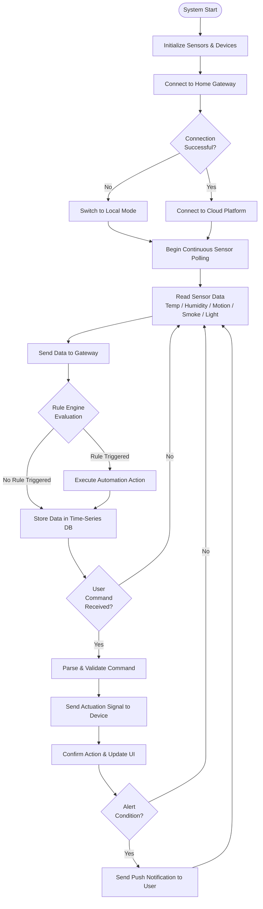

### 2.3 Automation Rule Execution Process

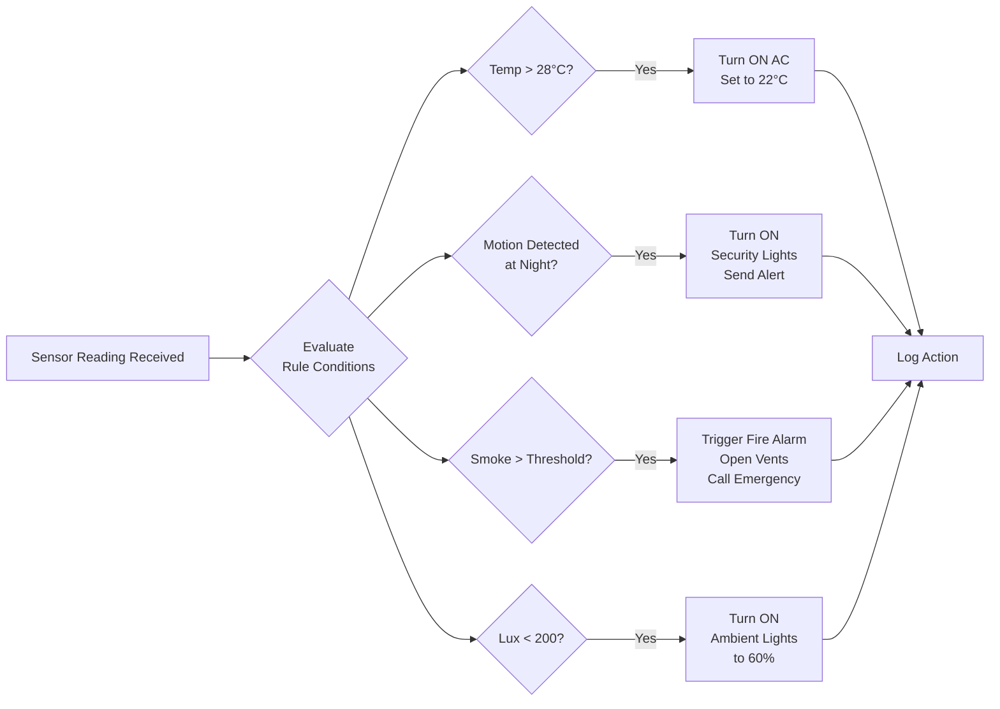

### 2.4 User Command Process

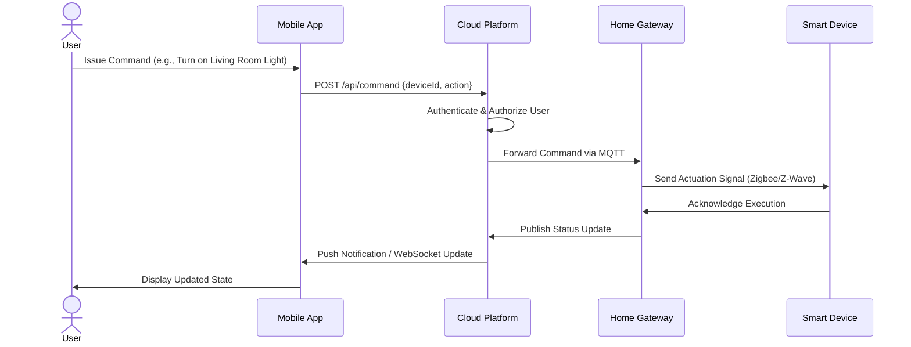

---

## Step 3: Domain Model Specification

### 3.1 Description

The domain model identifies the core entities of the Smart Home Automation System and their relationships. The main entities are: **User**, **Home**, **Room**, **Device**, **Sensor**, **Actuator**, **Gateway**, **Cloud Platform**, **Automation Rule**, and **Alert**.

### 3.2 UML Class Diagram

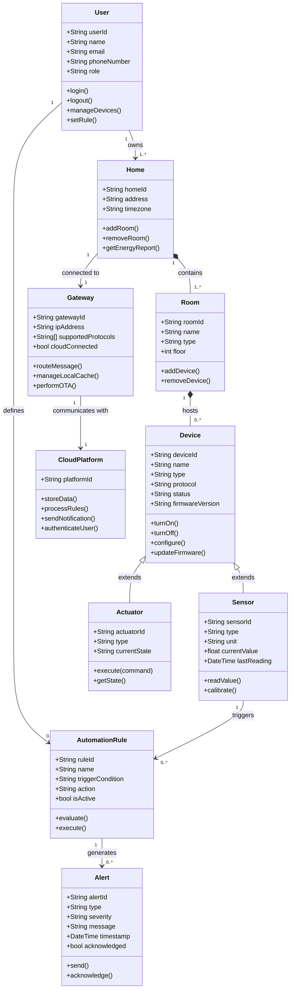

### 3.3 Entity Relationship Overview

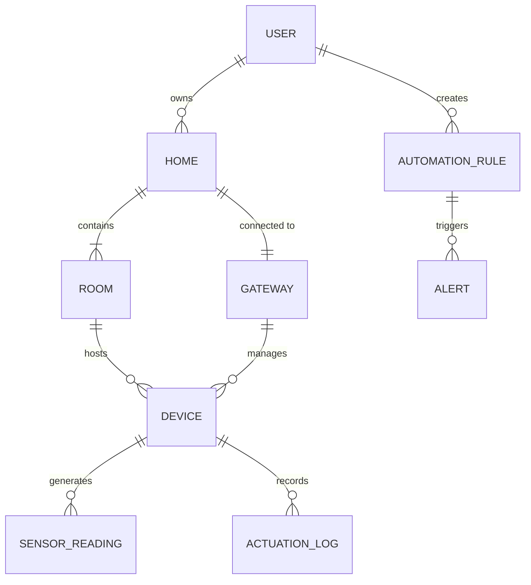

---

## Step 4: Information Model Specification

### 4.1 Data Types and Structures

#### Sensor Reading Object
```json
{
  "readingId": "uuid-v4",
  "deviceId": "sensor-001",
  "homeId": "home-123",
  "roomId": "room-456",
  "type": "temperature",
  "value": 24.5,
  "unit": "°C",
  "timestamp": "2026-04-26T10:30:00Z",
  "quality": "good"
}
```

#### Device State Object
```json
{
  "deviceId": "light-001",
  "name": "Living Room Main Light",
  "type": "smart_bulb",
  "status": "online",
  "state": {
    "power": "on",
    "brightness": 75,
    "color": "#FFFFFF",
    "colorTemp": 4000
  },
  "lastUpdated": "2026-04-26T10:28:00Z",
  "energyConsumption_W": 8.5
}
```

#### Automation Rule Object
```json
{
  "ruleId": "rule-007",
  "name": "Night Motion Security",
  "trigger": {
    "sensor": "motion-sensor-front-door",
    "condition": "motion_detected == true",
    "timeWindow": "22:00-06:00"
  },
  "action": {
    "devices": ["security-light-01", "camera-01"],
    "command": "turn_on",
    "notification": true,
    "notificationMessage": "Motion detected at front door!"
  },
  "isActive": true,
  "createdBy": "user-001"
}
```

### 4.2 Information Flow Diagram

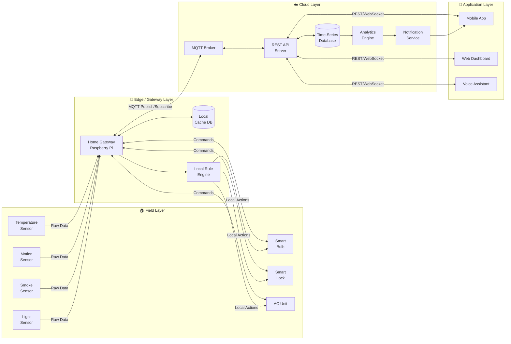

### 4.3 Data Retention Policy

| Data Type | Retention Period | Storage Location |
|-----------|-----------------|-----------------|
| Raw sensor readings | 7 days | Local Gateway Cache |
| Aggregated sensor data (1-min avg) | 1 year | Cloud Time-Series DB |
| Event logs & alerts | 3 years | Cloud Relational DB |
| Video recordings | 30 days | Encrypted Cloud Storage |
| User preferences & rules | Indefinite | Cloud Relational DB |

---

## Step 5: Service Specifications

### 5.1 Service Catalog

The SHAS exposes the following services to client applications:

### 5.2 Service Architecture Diagram

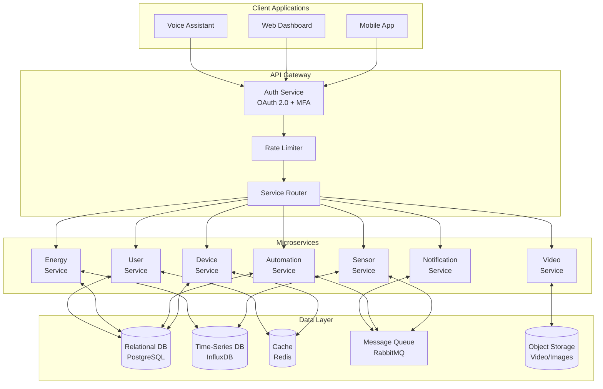

### 5.3 REST API Endpoints

| Service | Method | Endpoint | Description |
|---------|--------|----------|-------------|
| Device Service | GET | `/api/v1/devices` | List all devices |
| Device Service | POST | `/api/v1/devices/{id}/command` | Send command to device |
| Device Service | GET | `/api/v1/devices/{id}/status` | Get device status |
| Sensor Service | GET | `/api/v1/sensors/{id}/readings` | Get sensor readings |
| Automation Service | GET | `/api/v1/rules` | List automation rules |
| Automation Service | POST | `/api/v1/rules` | Create new rule |
| Automation Service | PUT | `/api/v1/rules/{id}` | Update rule |
| Automation Service | DELETE | `/api/v1/rules/{id}` | Delete rule |
| Notification Service | GET | `/api/v1/alerts` | Get recent alerts |
| Energy Service | GET | `/api/v1/energy/report` | Get energy report |
| User Service | POST | `/api/v1/auth/login` | User login |
| Video Service | GET | `/api/v1/cameras/{id}/stream` | Get live stream URL |

### 5.4 MQTT Topic Structure

```
shas/{homeId}/{roomId}/{deviceId}/telemetry     ← Sensor data upload
shas/{homeId}/{roomId}/{deviceId}/command       ← Commands to device
shas/{homeId}/{roomId}/{deviceId}/status        ← Device state changes
shas/{homeId}/alerts                            ← Home-level alerts
shas/{homeId}/energy                            ← Energy consumption data
```

---

## Step 6: IoT Level Specification

### 6.1 IoT Architecture Levels

The system follows a **6-level IoT architecture**:

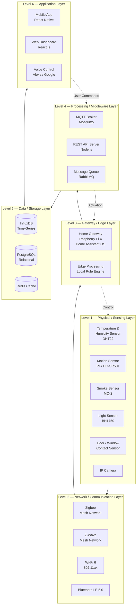

### 6.2 Protocol Selection per Level

| Level | Protocol/Technology | Justification |
|-------|-------------------|---------------|
| Sensing | Zigbee 3.0 / Z-Wave | Low power, mesh network, high reliability |
| Local Network | Wi-Fi 6 / BLE | High throughput for cameras; BLE for wearables |
| Gateway | MQTT (QoS 1 & 2) | Lightweight publish/subscribe, ideal for IoT |
| Cloud | HTTPS REST + WebSocket | Secure, standard, real-time push capability |
| Data Storage | InfluxDB + PostgreSQL | Time-series for sensor data, relational for config |
| Application | React Native / React.js | Cross-platform, responsive UI |

---

## Step 7: Functional View Specification

### 7.1 Functional Blocks Diagram

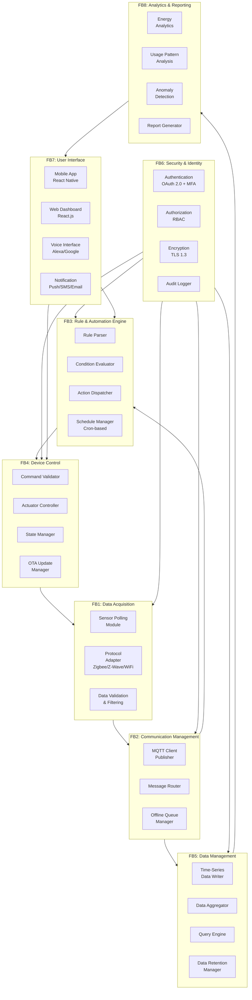

### 7.2 Functional Block Descriptions

| Functional Block | Role | Key Components |
|-----------------|------|---------------|
| **FB1: Data Acquisition** | Collects raw data from all physical sensors using their native protocols | Sensor polling, protocol adapters, data validation |
| **FB2: Communication Management** | Manages all message routing between layers, handles offline queuing | MQTT client, message router, offline queue |
| **FB3: Rule & Automation Engine** | Evaluates trigger conditions and dispatches automated actions | Rule parser, condition evaluator, scheduler |
| **FB4: Device Control** | Validates and sends control commands to actuators; manages device state | Command validator, actuator controller, OTA |
| **FB5: Data Management** | Persists, aggregates and queries all sensor and event data | InfluxDB writer, aggregator, query engine |
| **FB6: Security & Identity** | Ensures all access is authenticated, authorized and encrypted | OAuth 2.0, RBAC, TLS 1.3, audit logs |
| **FB7: User Interface** | Provides all user-facing interfaces for control and monitoring | Mobile app, web dashboard, voice, notifications |
| **FB8: Analytics & Reporting** | Derives insights from historical data; detects anomalies | Energy reports, usage patterns, anomaly detection |

---

## Step 8: Operational View Specification

### 8.1 Performance Considerations

| Metric | Target | Mechanism |
|--------|--------|-----------|
| Sensor data latency | < 500 ms end-to-end | Edge processing, local rule engine |
| Command response time | < 1 second | Direct MQTT command channel |
| App UI response | < 3 seconds | Redis caching, CDN for static assets |
| Video stream latency | < 2 seconds | WebRTC / RTSP with adaptive bitrate |
| System uptime | 99.5% | Redundant cloud deployment, local fallback |

### 8.2 Reliability & Fault Tolerance

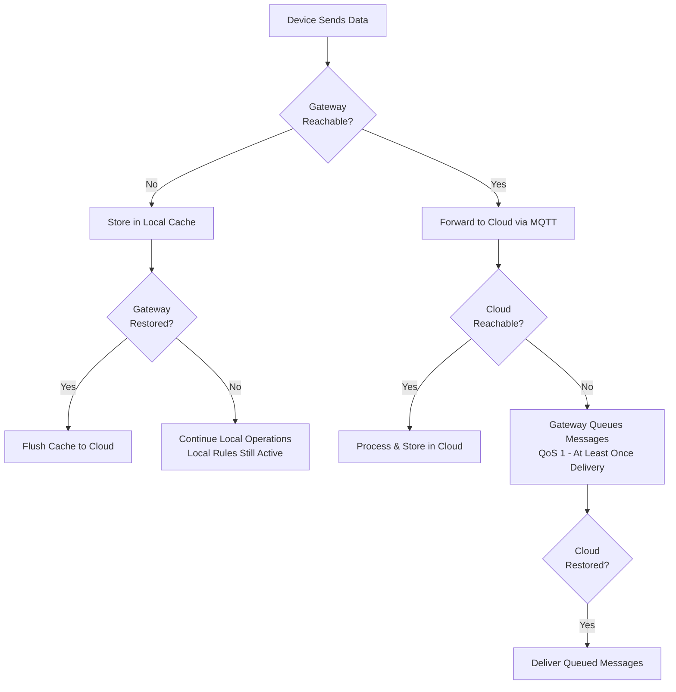

### 8.3 Security Architecture

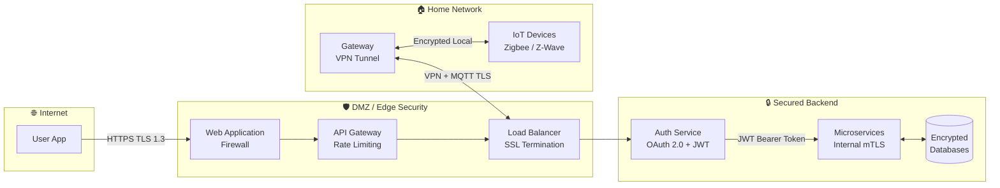

### 8.4 Security Measures Summary

| Threat | Mitigation |
|--------|-----------|
| Unauthorized access | OAuth 2.0, MFA, JWT short-lived tokens |
| Man-in-the-middle | TLS 1.3 on all communications, VPN for gateway |
| Device tampering | Signed firmware, secure boot, OTA validation |
| Data breach | AES-256 encryption at rest, RBAC access control |
| DDoS attacks | Rate limiting at API gateway, WAF rules |
| Replay attacks | MQTT message timestamps + nonce validation |

---

## Step 9: Device & Component Integration

### 9.1 Device Inventory

| # | Device | Model | Protocol | Function |
|---|--------|-------|----------|----------|
| 1 | Temperature & Humidity Sensor | DHT22 / Sonoff SNZB-02 | Zigbee | Monitor room climate |
| 2 | Motion Sensor (PIR) | HC-SR501 / Aqara MS-S02 | Zigbee | Detect movement |
| 3 | Smoke / Gas Sensor | MQ-2 / Heiman HS3SA | Zigbee | Fire/gas detection |
| 4 | Light Level Sensor | BH1750 / Xiaomi GZCGQ01LM | Zigbee | Ambient light monitoring |
| 5 | Door/Window Contact Sensor | Aqara MCCGQ11LM | Zigbee | Open/close detection |
| 6 | Smart Bulb | Philips Hue / IKEA TRÅDFRI | Zigbee | Lighting control |
| 7 | Smart Plug | TP-Link Tapo P115 | Wi-Fi | Appliance power control |
| 8 | Smart Door Lock | Schlage BE489WB | Z-Wave | Entry access control |
| 9 | Smart Thermostat | Google Nest / Honeywell T6R | Wi-Fi | HVAC control |
| 10 | IP Security Camera | Reolink RLC-810A | Wi-Fi (RTSP) | Video surveillance |
| 11 | Home Gateway | Raspberry Pi 4 (4GB RAM) | All protocols | Central hub |
| 12 | Zigbee Coordinator | ConBee II USB Stick | Zigbee | Zigbee mesh coordinator |
| 13 | Z-Wave Controller | Aeotec Z-Stick Gen5 | Z-Wave | Z-Wave mesh controller |

### 9.2 Network Topology Diagram

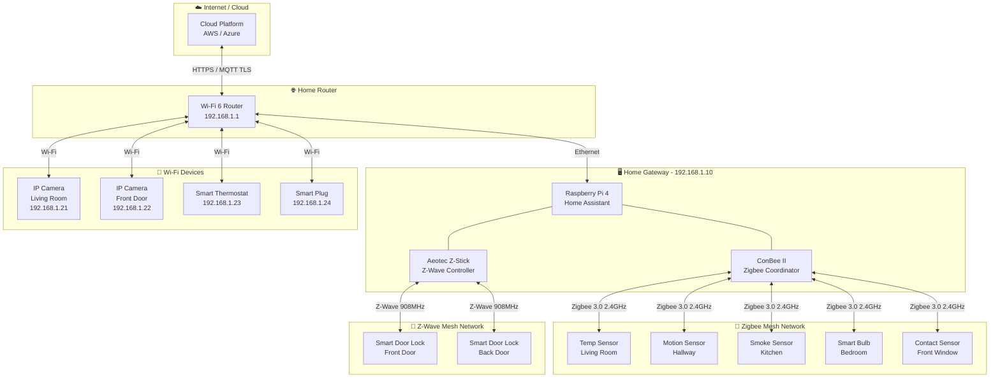

### 9.3 Communication Protocol Stack

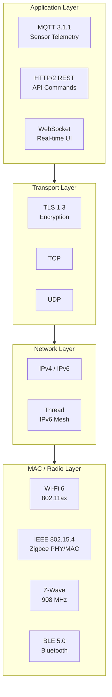

---

## Step 10: Application Development

### 10.1 Application Architecture

The SHAS provides three client applications:
1. **Mobile App** (React Native – iOS & Android)
2. **Web Dashboard** (React.js – Browser)
3. **Voice Interface** (Alexa Skill / Google Action)

### 10.2 Application Component Diagram

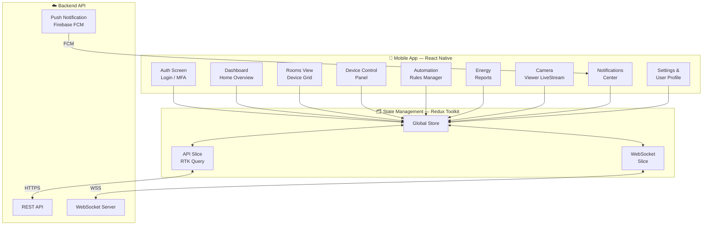

### 10.3 Mobile App Screen Flow

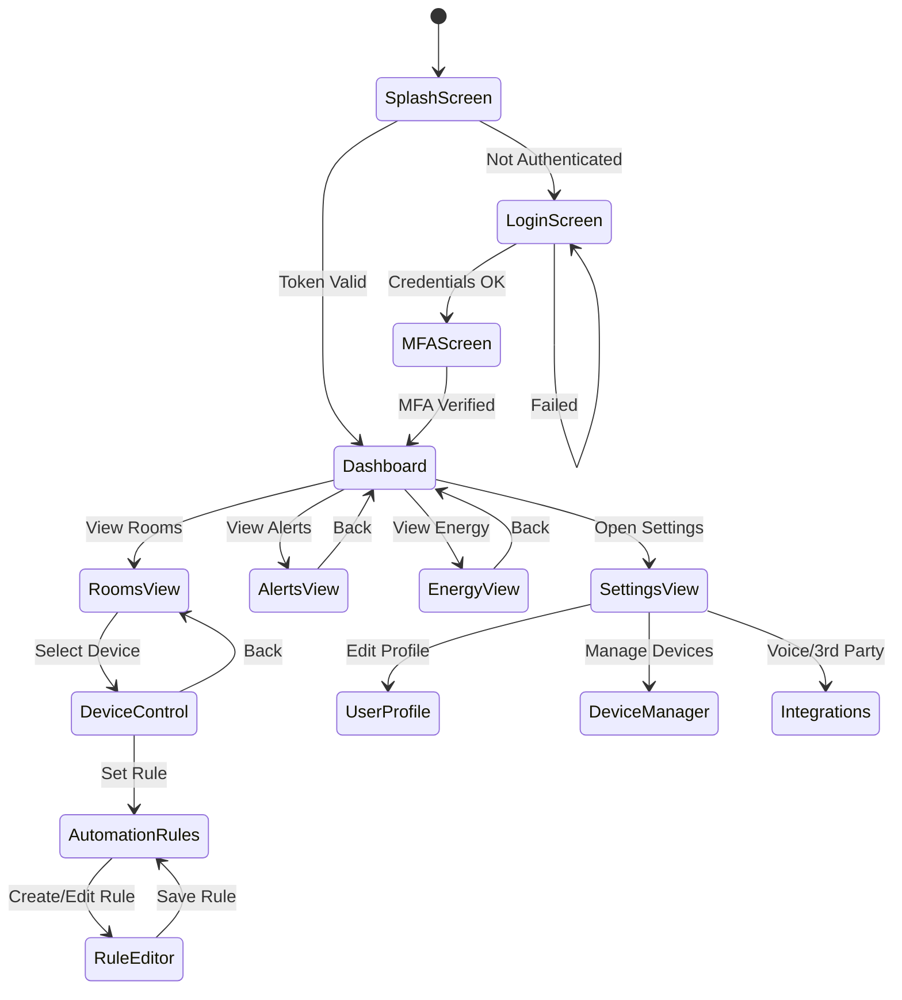

### 10.4 UI Dashboard Layout

```
┌────────────────────────────────────────────────┐
│  🏠 My Smart Home              🔔 3  👤 Profile │
├────────────────────────────────────────────────┤
│  ☀️ Good Morning, Ahmed!    23°C  💧 45% RH    │
│  All systems normal                             │
├─────────────┬──────────────┬───────────────────┤
│  💡 Lights  │  ❄️ Climate  │  🔒 Security      │
│  12 ON      │  22°C Set    │  All Locked        │
│  4 OFF      │  Auto Mode   │  0 Alerts          │
├─────────────┴──────────────┴───────────────────┤
│  ROOMS                                          │
│  [Living Room] [Kitchen] [Bedroom] [Garage] ▶  │
├────────────────────────────────────────────────┤
│  ENERGY TODAY              ⚡ 3.2 kWh / $0.48  │
│  ████████░░░░░░░░░░░░░░░  67% of daily avg     │
├────────────────────────────────────────────────┤
│  RECENT ALERTS                                  │
│  🚪 Front door opened — 07:32 AM               │
│  🌡️ Bedroom temp reached 28°C — 02:15 AM       │
└────────────────────────────────────────────────┘
```

### 10.5 Voice Control Integration Flow

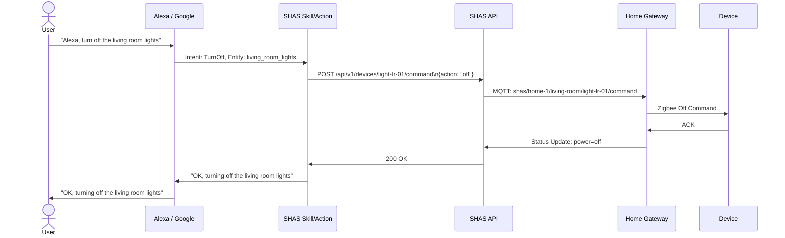

### 10.6 Technology Stack Summary

| Layer | Technology | Justification |
|-------|-----------|---------------|
| Mobile App | React Native 0.73 | Cross-platform iOS & Android from single codebase |
| Web Frontend | React.js 18 + Tailwind CSS | Fast, component-based, responsive UI |
| State Management | Redux Toolkit + RTK Query | Predictable state, efficient API caching |
| Backend API | Node.js + Express | Event-driven, ideal for real-time IoT workloads |
| MQTT Broker | Eclipse Mosquitto | Open-source, lightweight, production proven |
| Time-Series DB | InfluxDB 2.x | Optimized for high-frequency sensor data |
| Relational DB | PostgreSQL 16 | ACID-compliant, robust for user and config data |
| Cache | Redis 7 | Sub-millisecond latency for device state |
| Message Queue | RabbitMQ | Reliable async processing of sensor events |
| Cloud Platform | AWS IoT Core + EC2 | Managed MQTT, auto-scaling, global availability |
| Container Orchestration | Docker + Kubernetes | Portable, scalable microservice deployment |
| CI/CD | GitHub Actions | Automated testing and deployment pipeline |
| Gateway OS | Home Assistant OS (Raspberry Pi 4) | Rich device ecosystem, local processing |

---

## Summary & Conclusion

The **Smart Home Automation System (SHAS)** has been comprehensively designed following the 10-step IoT design methodology. The system:

- **Addresses a real problem:** energy waste, security vulnerabilities, and lack of convenience in traditional homes.
- **Employs a layered architecture:** from physical sensors through edge gateway to cloud services and user applications.
- **Prioritizes security:** with TLS 1.3, OAuth 2.0, MFA, RBAC, and VPN-secured gateway communication.
- **Ensures reliability:** through local fallback mode, MQTT QoS guarantees, and cloud redundancy.
- **Supports scalability:** via containerized microservices and a multi-protocol device ecosystem (Zigbee, Z-Wave, Wi-Fi).
- **Delivers rich user experience:** through a React Native mobile app, web dashboard, and voice assistant integration.

The prototype will be implemented in Cisco Packet Tracer simulating the core components: the home gateway, IoT sensors, actuators, Wi-Fi/LAN network, and cloud connectivity.

---

## References

1. Bahga, A., & Madisetti, V. (2014). *Internet of Things: A Hands-on Approach.* VPT.
2. Rose, K., Eldridge, S., & Chapin, L. (2015). *The Internet of Things: An Overview.* Internet Society.
3. IEEE Xplore: Smart Home Automation Survey – doi:10.1109/ACCESS.2019.2930467
4. Zigbee Alliance. (2023). *Zigbee 3.0 Specification.* CSA.
5. OWASP IoT Security Guidance. (2024). Retrieved from https://owasp.org/www-project-iot-security-verification-standard/
6. InfluxData. (2024). *InfluxDB 2.x Documentation.* Retrieved from https://docs.influxdata.com
7. Home Assistant Documentation. (2024). Retrieved from https://www.home-assistant.io/docs/

---

*Report prepared for CSE356: Internet of Things | CHEP – Spring 2026 | Ain Shams University*
