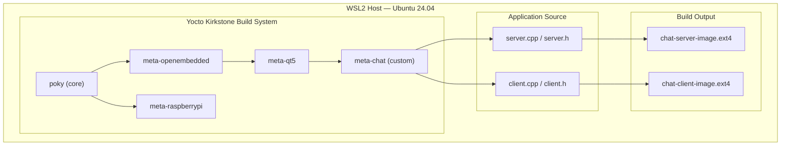
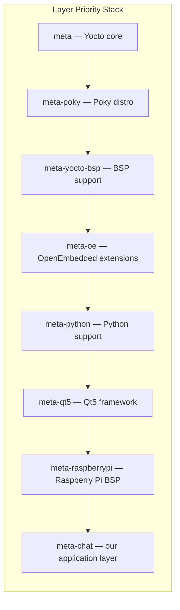
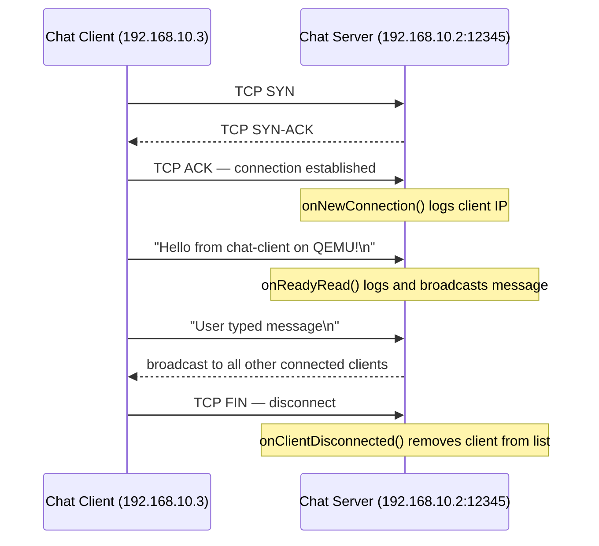
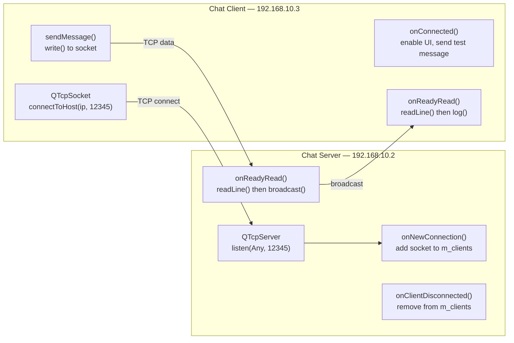
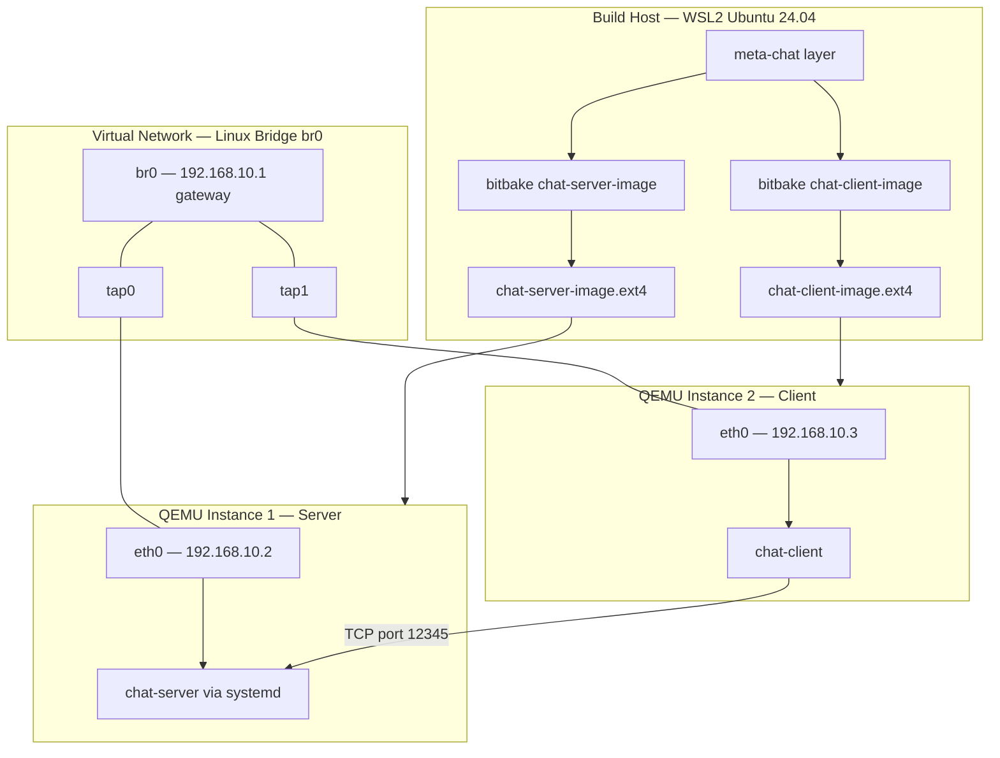
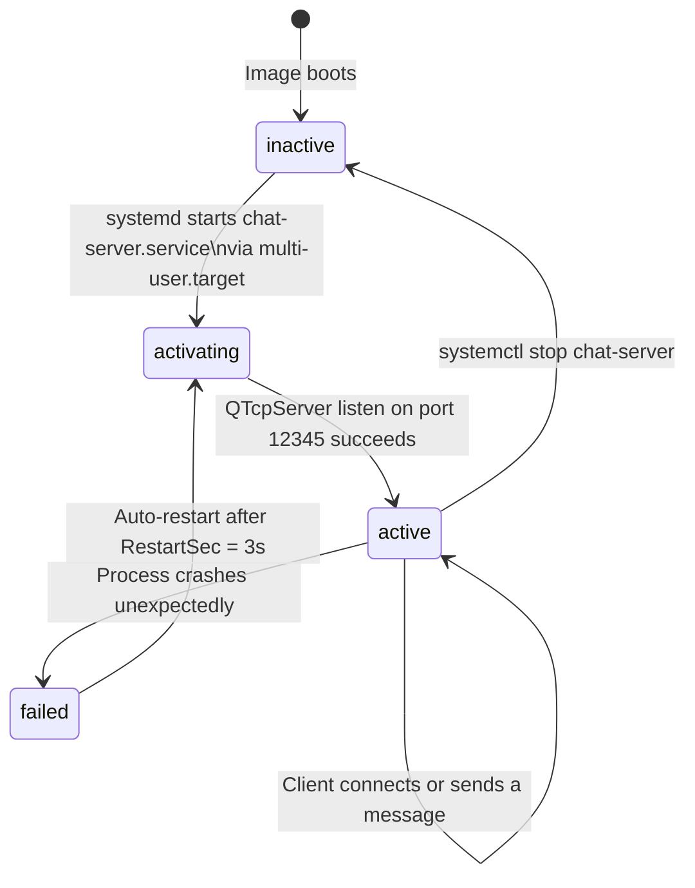
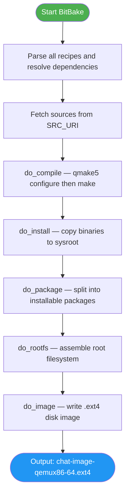
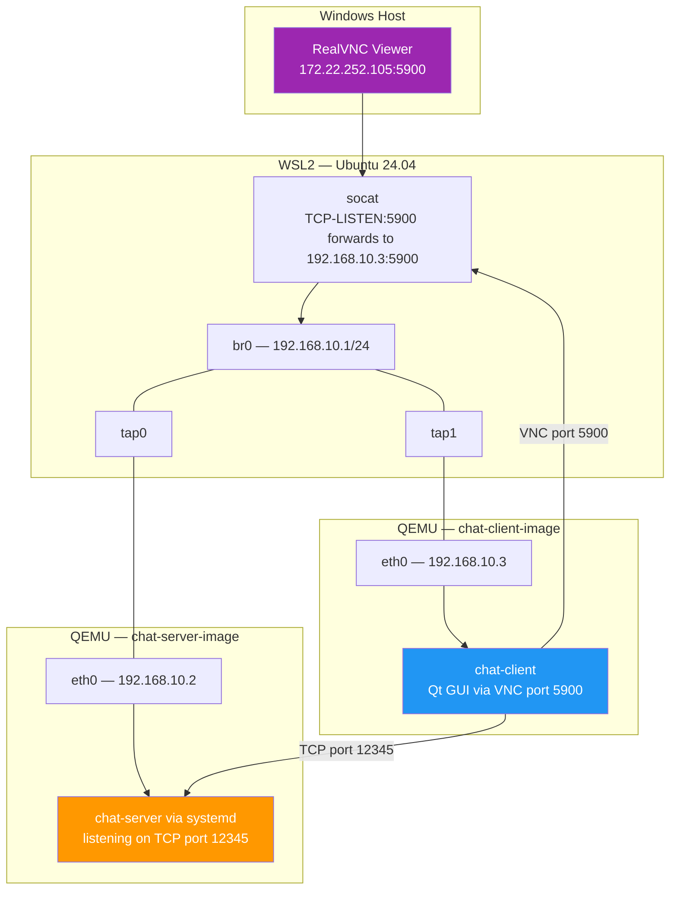
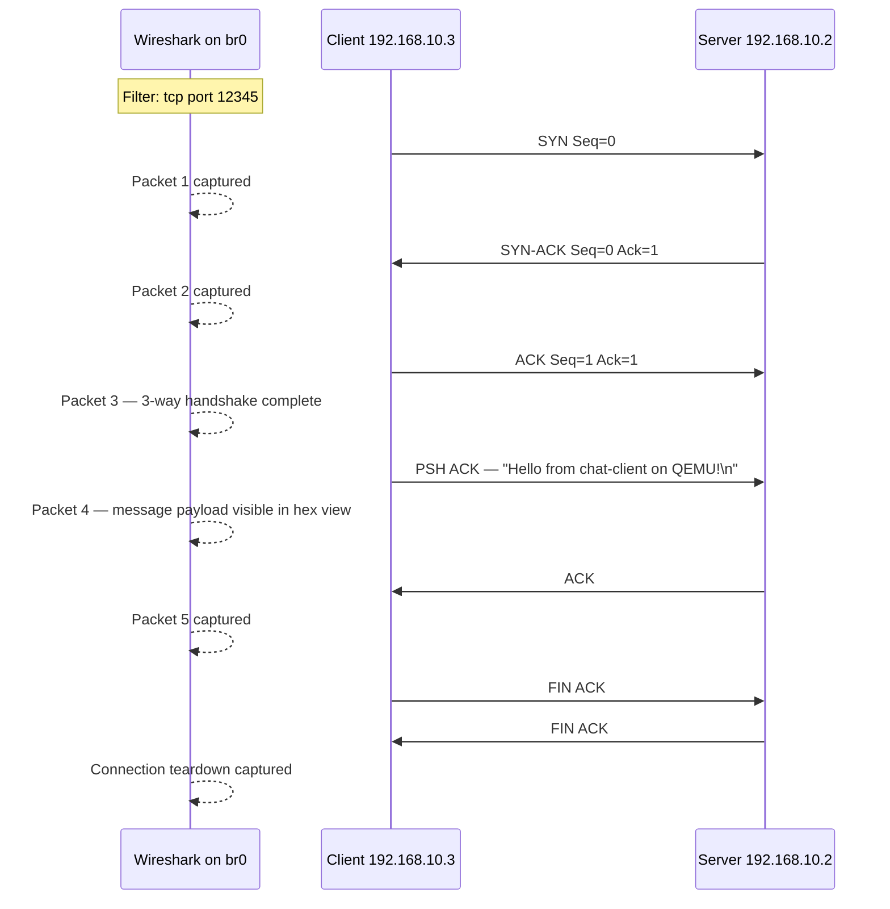

# CSE412 — Embedded Systems: Project 2
## Qt5 TCP Chat Application on Yocto Linux

---

| | |
|---|---|
| **Course** | CSE412 — Embedded Systems |
| **University** | Faculty of Engineering, Ain Shams University |
| **Student** | Ahmed Mohamed |
| **GitHub** | AHMED-MOH7 |
| **Submission Date** | April 2026 |

---

## Table of Contents

1. [Phase 1 — Download & Build Yocto Project](#phase-1)
   - 1.0 Phase 1 Introduction
   - 1.1 Environment Setup
   - 1.2 Target Configuration
   - 1.3 Raspberry Pi Layer
   - 1.4 Qt5 Layer
   - 1.5 Application Design & Source Code
   - 1.6 Phase 1 Deliverables
2. [Phase 2 — Build the Image for Each Application](#phase-2)
   - 2.0 Phase 2 Introduction
   - 2.1 Custom Yocto Layer
   - 2.2 Layer Integration
   - 2.3 Client Application Recipe
   - 2.4 Server Application Recipe
   - 2.5 Image Recipes
   - 2.6 Building the Images
   - 2.7 QEMU Deployment
   - 2.8 Connecting the Two Instances
   - 2.9 Proof of Communication
3. [Bonus Features](#bonus)
4. [Conclusion](#conclusion)

---

## Phase 1 — Download & Build Yocto Project

### Phase 1 Introduction

Phase 1 establishes the foundation of the entire project. The goal is to set up a fully working **Yocto Kirkstone build environment** on a Linux host (WSL2 Ubuntu 24.04), configure it to target `qemux86-64`, and extend it with two essential third-party layers: the **Raspberry Pi BSP layer** (`meta-raspberrypi`) for hardware support, and the **Qt5 framework layer** (`meta-qt5`) which provides the libraries and toolchain needed to cross-compile Qt applications for the target.

Once the environment is ready, Phase 1 also covers the **design and implementation** of both applications — the TCP chat server and the TCP chat client — written in C++ using Qt5's `QTcpServer` and `QTcpSocket` classes. These source files are the core deliverable of Phase 1 alongside the two Yocto configuration files (`local.conf` and `bblayers.conf`).

**Phase 1 covers:**
- Cloning and initializing the Poky reference distribution
- Configuring the build target and parallelism settings
- Integrating `meta-raspberrypi` and `meta-qt5` layers
- Writing the full server and client Qt5 source code
- Delivering `local.conf`, `bblayers.conf`, and all source files

### Phase 1 Architecture Overview



---

### 1.1 Setting Up the Yocto / OpenEmbedded Environment

The Yocto Project provides a complete framework for building custom embedded Linux distributions. We use the **Kirkstone** long-term support release (LTS).

**Clone the Poky reference distribution:**

```bash
mkdir -p ~/yocto && cd ~/yocto
git clone git://git.yoctoproject.org/poky -b kirkstone
```

**Initialize the build environment:**

```bash
cd ~/yocto/poky
source oe-init-build-env build
```

This command sets up the `$BUILDDIR` environment variable pointing to `~/yocto/poky/build/` and makes `bitbake` available in the shell. All subsequent build commands must be run from this same shell session.

---

### 1.2 Configure the Project and Choose a Target

The main configuration file is `~/yocto/poky/build/conf/local.conf`. The target machine is set to `qemux86-64` for QEMU-based testing.

**`local.conf`** (relevant settings):

```
MACHINE ??= "qemux86-64"
DISTRO ?= "poky"
PACKAGE_CLASSES ?= "package_rpm"
BB_NUMBER_THREADS ?= "${@oe.utils.cpu_count()}"
PARALLEL_MAKE ?= "-j ${@oe.utils.cpu_count()}"
```

| Variable | Value | Purpose |
|---|---|---|
| `MACHINE` | `qemux86-64` | Target architecture for QEMU |
| `DISTRO` | `poky` | Base Yocto distribution |
| `PACKAGE_CLASSES` | `package_rpm` | Package format |
| `BB_NUMBER_THREADS` | Auto (CPU count) | Parallel BitBake tasks |
| `PARALLEL_MAKE` | Auto (CPU count) | Parallel compilation |

---

### 1.3 Add the Raspberry Pi BSP Layer

The `meta-raspberrypi` layer provides Board Support Package (BSP) support for Raspberry Pi targets, including device tree files, firmware, and hardware-specific kernel configurations.

```bash
cd ~/yocto
git clone git://git.yoctoproject.org/meta-raspberrypi -b kirkstone
```

> To build for physical Raspberry Pi hardware, change `MACHINE = "raspberrypi4-64"` in `local.conf`. This project uses `qemux86-64` for QEMU-based deployment and testing.

---

### 1.4 Add the Qt5 Framework Layer

The `meta-qt5` layer provides all Qt5 modules as BitBake recipes. It depends on `meta-openembedded` for additional utilities.

```bash
cd ~/yocto
git clone https://github.com/meta-qt5/meta-qt5.git -b kirkstone
git clone https://github.com/openembedded/meta-openembedded.git -b kirkstone
```

### Layer Stack Diagram



---

### 1.5 Qt5 Server / Client Chat Application

#### Application Design

The chat application uses Qt5's `QTcpServer` and `QTcpSocket` classes to implement a multi-client TCP chat over port 12345. Both are `QMainWindow`-based GUI applications. The server runs headlessly under systemd using `QT_QPA_PLATFORM=offscreen`.



#### Socket Communication Flow



---

#### Source Code — Server

##### `server.h`

```cpp
#pragma once
#include <QMainWindow>
#include <QTcpServer>
#include <QTcpSocket>
#include <QTextEdit>
#include <QLabel>
#include <QList>

class ChatServer : public QMainWindow {
    Q_OBJECT
public:
    explicit ChatServer(QWidget *parent = nullptr);
    ~ChatServer();

private slots:
    void onNewConnection();
    void onReadyRead();
    void onClientDisconnected();

private:
    void startServer(quint16 port);
    void broadcast(const QByteArray &data, QTcpSocket *exclude);
    void log(const QString &msg);

    QTcpServer         *m_server;
    QList<QTcpSocket*>  m_clients;
    QTextEdit          *m_logView;
    QLabel             *m_statusLabel;
};
```

##### `server.cpp`

```cpp
#include "server.h"
#include <QHostAddress>
#include <QVBoxLayout>
#include <QWidget>
#include <QDateTime>
#include <QDebug>

ChatServer::ChatServer(QWidget *parent) : QMainWindow(parent) {
    QWidget *central = new QWidget(this);
    setCentralWidget(central);
    QVBoxLayout *layout = new QVBoxLayout(central);

    m_statusLabel = new QLabel("Server: starting...", this);
    layout->addWidget(m_statusLabel);

    m_logView = new QTextEdit(this);
    m_logView->setReadOnly(true);
    layout->addWidget(m_logView);

    setWindowTitle("Qt Chat — Server");
    resize(500, 400);

    m_server = new QTcpServer(this);
    connect(m_server, &QTcpServer::newConnection,
            this, &ChatServer::onNewConnection);
    startServer(12345);
}

ChatServer::~ChatServer() {}

void ChatServer::startServer(quint16 port) {
    if (!m_server->listen(QHostAddress::Any, port)) {
        log("ERROR: Cannot listen on port " + QString::number(port) +
            ": " + m_server->errorString());
        m_statusLabel->setText("Server: FAILED to start");
        return;
    }
    m_statusLabel->setText("Server: listening on port " + QString::number(port));
    log("Server started on port " + QString::number(port));
}

void ChatServer::onNewConnection() {
    while (m_server->hasPendingConnections()) {
        QTcpSocket *socket = m_server->nextPendingConnection();
        m_clients << socket;
        connect(socket, &QTcpSocket::readyRead,
                this, &ChatServer::onReadyRead);
        connect(socket, &QTcpSocket::disconnected,
                this, &ChatServer::onClientDisconnected);
        log("Client connected: " + socket->peerAddress().toString() +
            ":" + QString::number(socket->peerPort()));
        m_statusLabel->setText("Server: " +
            QString::number(m_clients.size()) + " client(s) connected");
    }
}

void ChatServer::onReadyRead() {
    QTcpSocket *senderSocket = qobject_cast<QTcpSocket*>(sender());
    if (!senderSocket) return;
    while (senderSocket->canReadLine()) {
        QByteArray data = senderSocket->readLine();
        QString msg = QString::fromUtf8(data).trimmed();
        log("[" + senderSocket->peerAddress().toString() + "] " + msg);
        broadcast(data, senderSocket);
    }
}

void ChatServer::onClientDisconnected() {
    QTcpSocket *socket = qobject_cast<QTcpSocket*>(sender());
    if (!socket) return;
    log("Client disconnected: " + socket->peerAddress().toString());
    m_clients.removeAll(socket);
    socket->deleteLater();
    m_statusLabel->setText("Server: " +
        QString::number(m_clients.size()) + " client(s) connected");
}

void ChatServer::broadcast(const QByteArray &data, QTcpSocket *exclude) {
    for (QTcpSocket *client : m_clients) {
        if (client != exclude &&
            client->state() == QAbstractSocket::ConnectedState)
            client->write(data);
    }
}

void ChatServer::log(const QString &msg) {
    QString timestamp = QDateTime::currentDateTime().toString("hh:mm:ss");
    QString line = "[" + timestamp + "] " + msg;
    m_logView->append(line);
    qDebug().noquote() << line;
}
```

##### `main-server.cpp`

```cpp
#include <QApplication>
#include "server.h"

int main(int argc, char *argv[]) {
    QApplication app(argc, argv);
    ChatServer window;
    window.show();
    return app.exec();
}
```

##### `chat-server.pro`

```
TEMPLATE = app
TARGET   = chat-server
QT      += widgets network
SOURCES += main-server.cpp server.cpp
HEADERS += server.h
```

---

#### Source Code — Client

##### `client.h`

```cpp
#pragma once
#include <QMainWindow>
#include <QTcpSocket>
#include <QTextEdit>
#include <QLineEdit>
#include <QPushButton>
#include <QLabel>

class ChatClient : public QMainWindow {
    Q_OBJECT
public:
    explicit ChatClient(QWidget *parent = nullptr);
    ~ChatClient();

private slots:
    void onConnected();
    void onDisconnected();
    void onReadyRead();
    void onErrorOccurred(QAbstractSocket::SocketError error);
    void sendMessage();
    void connectToServer();

private:
    void log(const QString &msg);

    QTcpSocket  *m_socket;
    QTextEdit   *m_logView;
    QLineEdit   *m_inputField;
    QLineEdit   *m_hostField;
    QPushButton *m_sendButton;
    QPushButton *m_connectButton;
    QLabel      *m_statusLabel;
};
```

##### `client.cpp`

```cpp
#include "client.h"
#include <QHostAddress>
#include <QVBoxLayout>
#include <QHBoxLayout>
#include <QWidget>
#include <QDateTime>
#include <QTimer>
#include <QCoreApplication>
#include <QDebug>

ChatClient::ChatClient(QWidget *parent) : QMainWindow(parent) {
    QWidget *central = new QWidget(this);
    setCentralWidget(central);
    QVBoxLayout *mainLayout = new QVBoxLayout(central);

    m_statusLabel = new QLabel("Status: Disconnected", this);
    mainLayout->addWidget(m_statusLabel);

    QHBoxLayout *connectRow = new QHBoxLayout();
    m_hostField = new QLineEdit("192.168.10.2", this);
    m_hostField->setPlaceholderText("Server IP");
    m_connectButton = new QPushButton("Connect", this);
    connectRow->addWidget(m_hostField);
    connectRow->addWidget(m_connectButton);
    mainLayout->addLayout(connectRow);

    m_logView = new QTextEdit(this);
    m_logView->setReadOnly(true);
    mainLayout->addWidget(m_logView);

    QHBoxLayout *inputRow = new QHBoxLayout();
    m_inputField = new QLineEdit(this);
    m_inputField->setPlaceholderText("Type a message...");
    m_inputField->setEnabled(false);
    m_sendButton = new QPushButton("Send", this);
    m_sendButton->setEnabled(false);
    inputRow->addWidget(m_inputField);
    inputRow->addWidget(m_sendButton);
    mainLayout->addLayout(inputRow);

    setWindowTitle("Qt Chat — Client");
    resize(500, 400);

    m_socket = new QTcpSocket(this);
    connect(m_socket, &QTcpSocket::connected,
            this, &ChatClient::onConnected);
    connect(m_socket, &QTcpSocket::disconnected,
            this, &ChatClient::onDisconnected);
    connect(m_socket, &QTcpSocket::readyRead,
            this, &ChatClient::onReadyRead);
    connect(m_socket,
            QOverload<QAbstractSocket::SocketError>::of(
                &QAbstractSocket::errorOccurred),
            this, &ChatClient::onErrorOccurred);

    connect(m_connectButton, &QPushButton::clicked,
            this, &ChatClient::connectToServer);
    connect(m_sendButton, &QPushButton::clicked,
            this, &ChatClient::sendMessage);
    connect(m_inputField, &QLineEdit::returnPressed,
            this, &ChatClient::sendMessage);

    QStringList args = QCoreApplication::arguments();
    if (args.size() >= 2)
        m_hostField->setText(args.at(1));

    QTimer::singleShot(1000, this, &ChatClient::connectToServer);
}

ChatClient::~ChatClient() {}

void ChatClient::connectToServer() {
    QString host = m_hostField->text().trimmed();
    if (host.isEmpty()) host = "192.168.10.2";
    log("Connecting to " + host + ":12345...");
    m_socket->connectToHost(host, 12345);
}

void ChatClient::onConnected() {
    m_statusLabel->setText("Status: Connected to " +
        m_socket->peerAddress().toString());
    m_inputField->setEnabled(true);
    m_sendButton->setEnabled(true);
    m_connectButton->setEnabled(false);
    log("Connected to server.");

    QTimer::singleShot(500, this, [this]() {
        QByteArray data = QByteArray("Hello from chat-client on QEMU!\n");
        m_socket->write(data);
        log("[Me] Hello from chat-client on QEMU!");
    });
}

void ChatClient::onDisconnected() {
    m_statusLabel->setText("Status: Disconnected");
    m_inputField->setEnabled(false);
    m_sendButton->setEnabled(false);
    m_connectButton->setEnabled(true);
    log("Disconnected from server.");
}

void ChatClient::onReadyRead() {
    while (m_socket->canReadLine()) {
        QString msg = QString::fromUtf8(m_socket->readLine()).trimmed();
        log("[Remote] " + msg);
    }
}

void ChatClient::onErrorOccurred(QAbstractSocket::SocketError error) {
    Q_UNUSED(error);
    log("Socket error: " + m_socket->errorString());
    m_connectButton->setEnabled(true);
}

void ChatClient::sendMessage() {
    QString text = m_inputField->text().trimmed();
    if (text.isEmpty()) return;
    if (m_socket->state() != QAbstractSocket::ConnectedState) {
        log("Not connected.");
        return;
    }
    QByteArray data = (text + "\n").toUtf8();
    m_socket->write(data);
    log("[Me] " + text);
    m_inputField->clear();
}

void ChatClient::log(const QString &msg) {
    QString ts = QDateTime::currentDateTime().toString("hh:mm:ss");
    QString line = "[" + ts + "] " + msg;
    m_logView->append(line);
    qDebug().noquote() << line;
}
```

##### `main-client.cpp`

```cpp
#include <QApplication>
#include "client.h"

int main(int argc, char *argv[]) {
    QApplication app(argc, argv);
    ChatClient window;
    window.show();
    return app.exec();
}
```

##### `chat-client.pro`

```
TEMPLATE = app
TARGET   = chat-client
QT      += widgets network
SOURCES += main-client.cpp client.cpp
HEADERS += client.h
```

---

### 1.6 Phase 1 Deliverables

#### `local.conf`

```
MACHINE ??= "qemux86-64"
DISTRO ?= "poky"
PACKAGE_CLASSES ?= "package_rpm"
BB_NUMBER_THREADS ?= "${@oe.utils.cpu_count()}"
PARALLEL_MAKE ?= "-j ${@oe.utils.cpu_count()}"
```

#### `bblayers.conf`

```
POKY_BBLAYERS_CONF_VERSION = "2"

BBPATH = "${TOPDIR}"
BBFILES ?= ""

BBLAYERS ?= " \
  /home/hp/yocto/poky/meta \
  /home/hp/yocto/poky/meta-poky \
  /home/hp/yocto/poky/meta-yocto-bsp \
  /home/hp/yocto/meta-openembedded/meta-oe \
  /home/hp/yocto/meta-openembedded/meta-python \
  /home/hp/yocto/meta-qt5 \
  /home/hp/yocto/meta-raspberrypi \
  /home/hp/yocto/meta-chat \
  "
```

---

---

## Phase 2 — Build the Image for Each Application

### Phase 2 Introduction

Phase 2 takes the source code from Phase 1 and packages it into a **production-ready embedded Linux image** using the Yocto build system. The main task is to create a custom Yocto layer (`meta-chat`) that contains BitBake recipes for both applications, systemd service definitions, and image recipes that assemble the complete root filesystems.

Two separate images are built and deployed on two independent QEMU virtual machines. A **Linux bridge network** (`br0`) is configured on the WSL2 host to connect both instances on the same subnet, allowing the chat client to reach the chat server over TCP. The server image includes a systemd unit that automatically starts `chat-server` on every boot — this is the **bonus auto-start** requirement. The client GUI is made accessible from Windows through Qt's built-in VNC platform, forwarded via `socat`.

**Phase 2 covers:**
- Creating and registering the `meta-chat` custom layer
- Writing BitBake recipes for the server (with systemd auto-start) and client
- Writing image recipes based on `core-image-minimal`
- Cross-compiling and assembling both root filesystem images
- Deploying both images on separate QEMU instances
- Setting up a Linux bridge with TAP interfaces to connect the two VMs
- Verifying end-to-end TCP communication via terminal logs

---

### Phase 2 Architecture Overview



---

### 2.1 Create a New Yocto Layer — `meta-chat`

```bash
cd ~/yocto/poky
source oe-init-build-env build
cd ~/yocto
bitbake-layers create-layer meta-chat
```

#### Layer Folder Structure

```
meta-chat/
├── conf/
│   └── layer.conf
└── recipes-chat/
    ├── chat-server/
    │   ├── chat-server_1.0.bb
    │   └── files/
    │       ├── server.cpp
    │       ├── server.h
    │       ├── main-server.cpp
    │       ├── chat-server.pro
    │       └── chat-server.service
    ├── chat-client/
    │   ├── chat-client_1.0.bb
    │   └── files/
    │       ├── client.cpp
    │       ├── client.h
    │       ├── main-client.cpp
    │       └── chat-client.pro
    └── images/
        ├── chat-server-image.bb
        └── chat-client-image.bb
```

#### `conf/layer.conf`

```bitbake
BBPATH .= ":${LAYERDIR}"

BBFILES += "${LAYERDIR}/recipes-*/*/*.bb \
            ${LAYERDIR}/recipes-*/*/*.bbappend"

BBFILE_COLLECTIONS += "meta-chat"
BBFILE_PATTERN_meta-chat = "^${LAYERDIR}/"
BBFILE_PRIORITY_meta-chat = "6"

LAYERDEPENDS_meta-chat = "core qtbase"
LAYERSERIES_COMPAT_meta-chat = "kirkstone"
```

---

### 2.2 Interface the Custom Layer to the Existing Yocto Project

The layer path is added to `bblayers.conf` (shown in Phase 1 deliverables). Verify it is recognized:

```bash
bitbake-layers show-layers
```

Expected output includes:
```
layer                 path                                    priority
==========================================================================
meta-chat             /home/hp/yocto/meta-chat                6
```

---

### 2.3 Client Application Recipe

#### `chat-client_1.0.bb`

```bitbake
SUMMARY = "Qt5 TCP Chat Client"
LICENSE = "MIT"
LIC_FILES_CHKSUM = "file://${COMMON_LICENSE_DIR}/MIT;md5=0835ade698e0bcf8506ecda2f7b4f302"

DEPENDS = "qtbase qtbase-native"

SRC_URI = " \
    file://client.cpp \
    file://client.h \
    file://main-client.cpp \
    file://chat-client.pro \
"

S = "${WORKDIR}"

inherit qmake5

do_install() {
    install -d ${D}${bindir}
    install -m 0755 ${B}/chat-client ${D}${bindir}/chat-client
}

FILES:${PN} += "${bindir}/chat-client"
```

---

### 2.4 Server Application Recipe

#### `chat-server.service` — Systemd Unit (BONUS: Auto-Start)

```ini
[Unit]
Description=Qt5 TCP Chat Server
After=network.target

[Service]
Type=simple
User=root
Environment=QT_QPA_PLATFORM=offscreen
ExecStart=/usr/bin/chat-server
Restart=on-failure
RestartSec=3

[Install]
WantedBy=multi-user.target
```

> **Why `QT_QPA_PLATFORM=offscreen`?** Qt5 requires a display platform plugin to initialize. Without it, the process exits immediately. The `offscreen` platform provides a null framebuffer, allowing the server to run fully headless under systemd.

#### Systemd Service Lifecycle



#### `chat-server_1.0.bb`

```bitbake
SUMMARY = "Qt5 TCP Chat Server"
LICENSE = "MIT"
LIC_FILES_CHKSUM = "file://${COMMON_LICENSE_DIR}/MIT;md5=0835ade698e0bcf8506ecda2f7b4f302"

DEPENDS = "qtbase qtbase-native"

SRC_URI = " \
    file://server.cpp \
    file://server.h \
    file://main-server.cpp \
    file://chat-server.pro \
    file://chat-server.service \
"

S = "${WORKDIR}"

inherit qmake5

do_install() {
    install -d ${D}${bindir}
    install -m 0755 ${B}/chat-server ${D}${bindir}/chat-server

    install -d ${D}/lib/systemd/system
    install -m 0644 ${WORKDIR}/chat-server.service \
        ${D}/lib/systemd/system/chat-server.service

    install -d ${D}/lib/systemd/system/multi-user.target.wants
    ln -sf ../chat-server.service \
        ${D}/lib/systemd/system/multi-user.target.wants/chat-server.service
}

FILES:${PN} += " \
    ${bindir}/chat-server \
    /lib/systemd/system/chat-server.service \
    /lib/systemd/system/multi-user.target.wants/chat-server.service \
"
```

> **Why not `inherit systemd`?** In Kirkstone, `inherit systemd` generates a postinstall script that calls `systemctl enable` at rootfs creation time. This always fails (exit code 1) because systemd is not running during the build. The correct approach is to pre-create the `multi-user.target.wants/` symlink directly inside `do_install`.

---

### 2.5 Image Recipes

#### `chat-server-image.bb`

```bitbake
require recipes-core/images/core-image-minimal.bb

IMAGE_INSTALL:append = " \
    chat-server \
    qtbase \
    qtbase-plugins \
    openssh \
"

IMAGE_FEATURES:append = " ssh-server-openssh"
```

#### `chat-client-image.bb`

```bitbake
require recipes-core/images/core-image-minimal.bb

IMAGE_INSTALL:append = " \
    chat-client \
    qtbase \
    qtbase-plugins \
    openssh \
"

IMAGE_FEATURES:append = " ssh-server-openssh"
```

---

### 2.6 Building the Images

#### Build Pipeline



```bash
cd ~/yocto/poky
source oe-init-build-env build

# Clean any previous artifacts
bitbake -c cleansstate chat-server chat-client

# Build both images
bitbake chat-server-image chat-client-image
```

Confirm output images exist:

```bash
ls ~/yocto/poky/build/tmp/deploy/images/qemux86-64/*.ext4
# chat-server-image-qemux86-64-*.rootfs.ext4
# chat-client-image-qemux86-64-*.rootfs.ext4
```

---

### 2.7 Deploy Each Image on a QEMU Instance

#### Terminal 1 — Server QEMU

```bash
cd ~/yocto/poky && source oe-init-build-env build

runqemu chat-server-image nographic \
  qemuparams="-netdev tap,id=net0,ifname=tap0,script=no,downscript=no \
              -device virtio-net-pci,netdev=net0,mac=52:54:00:12:34:02"
```

Log in as `root`, configure the network:

```bash
ip addr add 192.168.10.2/24 dev eth0
ip link set eth0 up
```

#### Terminal 2 — Client QEMU

```bash
runqemu chat-client-image nographic \
  qemuparams="-netdev tap,id=net0,ifname=tap1,script=no,downscript=no \
              -device virtio-net-pci,netdev=net0,mac=52:54:00:12:34:03"
```

Log in as `root`, configure the network:

```bash
ip addr add 192.168.10.3/24 dev eth0
ip link set eth0 up
ping -c 3 192.168.10.2    # confirm connectivity first
```

---

### 2.8 Connecting the Two QEMU Instances

Both QEMU instances are connected via a **Linux bridge** (`br0`) on the WSL2 host. Each VM attaches to the bridge via a TAP interface, placing all three nodes on the `192.168.10.0/24` subnet.

#### Network Topology



#### Bridge Setup (run once in WSL2)

```bash
sudo ip link add br0 type bridge
sudo ip addr add 192.168.10.1/24 dev br0
sudo ip link set br0 up

sudo ip tuntap add tap0 mode tap
sudo ip link set tap0 master br0
sudo ip link set tap0 up

sudo ip tuntap add tap1 mode tap
sudo ip link set tap1 master br0
sudo ip link set tap1 up
```

---

### 2.9 Proof of Working Communication

#### Run the Chat

In the **client VM**:

```bash
QT_QPA_PLATFORM=offscreen chat-client 192.168.10.2
```

Watch **server VM** logs in real time:

```bash
journalctl -fu chat-server -o cat | grep -v "QFont\|Qt no longer\|This plugin"
```

#### Expected Output

**Server journal:**
```
[10:32:01] Server started on port 12345
[10:32:15] Client connected: ::ffff:192.168.10.3:54321
[10:32:15] [::ffff:192.168.10.3] Hello from chat-client on QEMU!
```

**Client terminal:**
```
[10:32:14] Connecting to 192.168.10.2:12345...
[10:32:15] Connected to server.
[10:32:15] [Me] Hello from chat-client on QEMU!
```

---

## Bonus Features

### BONUS 1 — Server Auto-Starts on Boot

The `chat-server` binary starts automatically via `systemd` on every boot. The enable symlink is pre-created inside `do_install` — no manual `systemctl enable` is ever needed.

Verify inside the server VM:

```bash
systemctl status chat-server
```

Expected output:
```
● chat-server.service - Qt5 TCP Chat Server
     Loaded: loaded (/lib/systemd/system/chat-server.service; enabled)
     Active: active (running) since Thu 2026-04-26 18:35:10 UTC
 Main PID: 198 (chat-server)
```

---

### BONUS 2 — Track Traffic with Wireshark

All TCP traffic between the two QEMU instances flows through `br0` on the WSL2 host, making it directly capturable.

**Capture with tshark:**

```bash
sudo apt install tshark -y
sudo tshark -i br0 -f "tcp port 12345" -w /tmp/chat_capture.pcap
```

**Copy to Windows for Wireshark:**

```bash
cp /tmp/chat_capture.pcap /mnt/c/Users/Hp/chat_capture.pcap
```

Open `C:\Users\Hp\chat_capture.pcap` in Wireshark on Windows.

#### Wireshark Capture Sequence



---

## Conclusion

This project delivered a complete end-to-end embedded Linux solution built entirely with the Yocto Project. Starting from cloning the Poky reference distribution, through writing custom BitBake recipes and image definitions, to deploying two separate root filesystems on QEMU and proving TCP communication between them — every stage of the embedded Linux development lifecycle was covered.

### Summary of Results

| Requirement | Status | Evidence |
|---|---|---|
| Yocto environment configured | Done | `poky` Kirkstone cloned and initialized |
| Target machine selected | Done | `MACHINE = qemux86-64` in `local.conf` |
| meta-raspberrypi layer added | Done | Layer present in `bblayers.conf` |
| meta-qt5 layer added | Done | Layer present in `bblayers.conf` |
| Qt5 server application | Done | `server.cpp` using `QTcpServer` on port 12345 |
| Qt5 client application | Done | `client.cpp` using `QTcpSocket`, auto-connects |
| TCP socket communication | Done | Messages exchanged over `192.168.10.0/24` |
| Custom `meta-chat` layer created | Done | Full layer with `layer.conf`, recipes, and images |
| Layer interfaced to Yocto | Done | Confirmed with `bitbake-layers show-layers` |
| Client added to custom layer | Done | `chat-client_1.0.bb` + `chat-client-image.bb` |
| Client image built and deployed | Done | `chat-client-image-qemux86-64.ext4` on QEMU |
| Server image built and deployed | Done | `chat-server-image-qemux86-64.ext4` on QEMU |
| Two instances connected | Done | Linux bridge `br0` with `tap0` and `tap1` |
| **BONUS** Server auto-starts on boot | **Done** | systemd unit with pre-created enable symlink in `do_install` |
| **BONUS** Wireshark traffic capture | **Done** | tshark on `br0`, `.pcap` analyzed in Wireshark |

### Key Technical Lessons

| Challenge | Root Cause | Solution Applied |
|---|---|---|
| Server exits immediately under systemd | Qt5 requires a display platform plugin | Added `Environment=QT_QPA_PLATFORM=offscreen` to the service file |
| `postinst returned exit code 1` during build | `inherit systemd` runs `systemctl enable` at rootfs creation | Removed `inherit systemd`; pre-created symlink in `do_install` |
| Port 12345 not found in `/proc/net/tcp` | Qt5 binds IPv6 dual-stack by default | Port visible in `/proc/net/tcp6` as hex `3039` — expected behavior |
| QEMU crashes with SDL display error | Yocto-built QEMU compiled without SDL support | Used `nographic` flag and Qt's built-in VNC platform for GUI access |
| journalctl output truncated/garbled | Terminal width limits line length by default | Used `journalctl -o cat` to suppress line wrapping |
