# CSE356: Internet of Things — Project Report
**Ain Shams University | Faculty of Engineering | Computer and Systems Engineering Dept.**
**CHEP – Spring 2026**

---

# Smart Home Automation IoT System

**Project Title:** Smart Home Automation System
**Course:** CSE356 – Internet of Things
**Submitted to:** Dr. Islam Tharwat Abdel Halim

---

## Table of Contents

1. [Step 1: Purpose & Requirements](#step-1-purpose--requirements)
2. [Step 2: Process Specification](#step-2-process-specification)
3. [Step 3: Domain Model Specification](#step-3-domain-model-specification)
4. [Step 4: Information Model Specification](#step-4-information-model-specification)
5. [Step 5: Service Specifications](#step-5-service-specifications)
6. [Step 6: IoT Level Specification](#step-6-iot-level-specification)
7. [Step 7: Functional View Specification](#step-7-functional-view-specification)
8. [Step 8: Operational View Specification](#step-8-operational-view-specification)
9. [Step 9: Device & Component Integration](#step-9-device--component-integration)
10. [Step 10: Application Development](#step-10-application-development)

---

## Step 1: Purpose & Requirements

### 1.1 Purpose

The Smart Home Automation System (SHAS) is an IoT-based solution designed to enhance the comfort, safety, energy efficiency, and security of residential environments. The system enables homeowners to remotely monitor and control home appliances, lighting, climate, security cameras, and door locks through a unified mobile/web application. It also supports autonomous decision-making through rule-based automation and AI-driven recommendations.

### 1.2 Functional Requirements

| ID | Requirement |
|----|-------------|
| FR-01 | The system shall allow users to remotely control lighting (on/off, dimming, color) via a mobile application. |
| FR-02 | The system shall monitor real-time temperature and humidity and automatically control the HVAC system. |
| FR-03 | The system shall detect motion and send push notifications to the homeowner. |
| FR-04 | The system shall control smart door locks with PIN, biometric, or remote unlock. |
| FR-05 | The system shall detect smoke/gas leakage and trigger alarms and automated ventilation. |
| FR-06 | The system shall monitor and report energy consumption per device. |
| FR-07 | The system shall support scheduled automation (e.g., turn off all lights at 11 PM). |
| FR-08 | The system shall stream live video from security cameras accessible via the app. |
| FR-09 | The system shall allow voice-command control via integration with Google Home / Amazon Alexa. |
| FR-10 | The system shall log all events and sensor readings in a cloud database. |

### 1.3 Non-Functional Requirements

| ID | Requirement |
|----|-------------|
| NFR-01 | **Performance:** Sensor data shall be processed and acted upon within 500 ms under normal network conditions. |
| NFR-02 | **Reliability:** The system shall maintain 99.5% uptime with local fallback when cloud is unavailable. |
| NFR-03 | **Scalability:** The system shall support up to 200 devices per household without performance degradation. |
| NFR-04 | **Security:** All communications shall be encrypted using TLS 1.3; user authentication shall use OAuth 2.0 + MFA. |
| NFR-05 | **Usability:** The mobile app shall have an average task completion time under 3 seconds for common actions. |
| NFR-06 | **Interoperability:** The system shall support Zigbee, Z-Wave, Wi-Fi, and Bluetooth device protocols. |
| NFR-07 | **Privacy:** No video/audio data shall be stored in the cloud without explicit user consent. |
| NFR-08 | **Maintainability:** Over-the-air (OTA) firmware updates shall be supported for all IoT devices. |

---

## Step 2: Process Specification

### 2.1 Overview

The SHAS performs three categories of processes: **Sensing & Data Collection**, **Processing & Decision Making**, and **Actuation & Response**.

### 2.2 Main System Process Flowchart

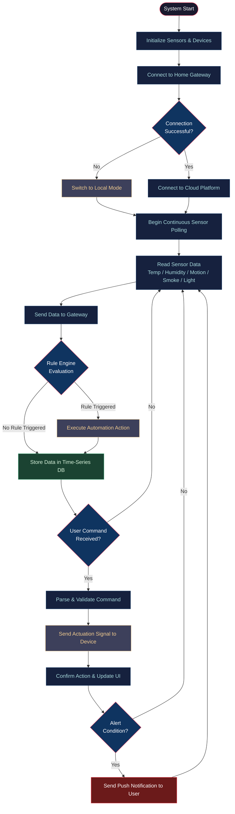

> **Figure 2.1 — Main System Process Flowchart:**
> This flowchart illustrates the end-to-end lifecycle of the Smart Home Automation System. Starting from system initialization (dark navy), it shows the gateway connection check with a fallback to local mode (amber) when the cloud is unreachable. The continuous sensor polling loop (blue) feeds into the Rule Engine (blue diamond), which either triggers an automated action (amber) or stores the reading in the time-series database (green). If a user command arrives, it is validated and dispatched as an actuation signal. Finally, alert conditions (red) generate push notifications back to the user, completing the feedback cycle.

---

### 2.3 Automation Rule Execution Process

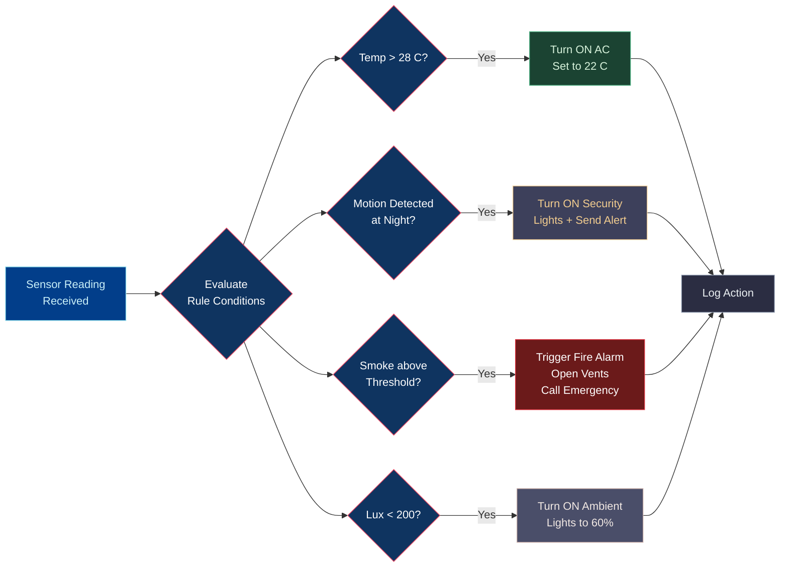

> **Figure 2.2 — Automation Rule Execution Process:**
> This diagram shows how the Rule Engine evaluates incoming sensor readings against four parallel trigger conditions. Each condition branch is color-coded by domain: green for HVAC/climate actions (AC control), amber for security responses (motion lighting and alerts), red for emergency fire/smoke actions, and purple for ambient lighting adjustments. All triggered actions converge at a central logging step (dark grey), ensuring every automated event is recorded. This branching design supports simultaneous evaluation of all rules without sequential blocking.

---

### 2.4 User Command Sequence

```mermaid
sequenceDiagram
    actor User
    participant App as Mobile App
    participant Cloud as Cloud Platform
    participant GW as Home Gateway
    participant Device as Smart Device

    rect rgb(10, 30, 60)
        Note over User,App: User Initiates Command
        User->>App: Issue Command (e.g., Turn on Living Room Light)
    end

    rect rgb(20, 50, 80)
        Note over App,Cloud: Authentication and Routing
        App->>Cloud: POST /api/command {deviceId, action}
        Cloud->>Cloud: Authenticate and Authorize User
        Cloud->>GW: Forward Command via MQTT
    end

    rect rgb(10, 50, 30)
        Note over GW,Device: Local Actuation
        GW->>Device: Send Actuation Signal (Zigbee/Z-Wave)
        Device->>GW: Acknowledge Execution
    end

    rect rgb(50, 20, 50)
        Note over GW,User: Status Feedback
        GW->>Cloud: Publish Status Update
        Cloud->>App: Push Notification / WebSocket Update
        App->>User: Display Updated State
    end
```

> **Figure 2.3 — User Command Sequence Diagram:**
> This sequence diagram traces a single user command from initiation to confirmation, divided into four color-coded interaction zones. The dark blue zone covers the user's initial input on the mobile app. The medium blue zone handles cloud-side authentication and MQTT routing to the gateway. The green zone represents local actuation — the gateway sends the command to the physical device via Zigbee/Z-Wave and receives an acknowledgement. The purple zone closes the loop by publishing the updated status back through the cloud to the user's app, providing real-time UI feedback.

---

## Step 3: Domain Model Specification

### 3.1 Description

The domain model identifies the core entities of the Smart Home Automation System and their relationships. The main entities are: **User**, **Home**, **Room**, **Device**, **Sensor**, **Actuator**, **Gateway**, **Cloud Platform**, **Automation Rule**, and **Alert**.

### 3.2 UML Class Diagram

```mermaid
classDiagram
    direction TB

    class User {
        <<Actor>>
        +String userId
        +String name
        +String email
        +String phoneNumber
        +String role
        +login()
        +logout()
        +manageDevices()
        +setRule()
    }

    class Home {
        <<Aggregate Root>>
        +String homeId
        +String address
        +String timezone
        +addRoom()
        +removeRoom()
        +getEnergyReport()
    }

    class Room {
        +String roomId
        +String name
        +String type
        +int floor
        +addDevice()
        +removeDevice()
    }

    class Device {
        <<Abstract>>
        +String deviceId
        +String name
        +String type
        +String protocol
        +String status
        +String firmwareVersion
        +turnOn()
        +turnOff()
        +configure()
        +updateFirmware()
    }

    class Sensor {
        +String sensorId
        +String type
        +String unit
        +float currentValue
        +DateTime lastReading
        +readValue()
        +calibrate()
    }

    class Actuator {
        +String actuatorId
        +String type
        +String currentState
        +execute(command)
        +getState()
    }

    class Gateway {
        +String gatewayId
        +String ipAddress
        +String[] supportedProtocols
        +bool cloudConnected
        +routeMessage()
        +manageLocalCache()
        +performOTA()
    }

    class CloudPlatform {
        +String platformId
        +storeData()
        +processRules()
        +sendNotification()
        +authenticateUser()
    }

    class AutomationRule {
        +String ruleId
        +String name
        +String triggerCondition
        +String action
        +bool isActive
        +evaluate()
        +execute()
    }

    class Alert {
        +String alertId
        +String type
        +String severity
        +String message
        +DateTime timestamp
        +bool acknowledged
        +send()
        +acknowledge()
    }

    style User          fill:#0f3460,stroke:#e94560,color:#ffffff
    style Home          fill:#1b4332,stroke:#52b788,color:#d8f3dc
    style Room          fill:#1b4332,stroke:#52b788,color:#d8f3dc
    style Device        fill:#3d405b,stroke:#c9ada7,color:#f2e9e4
    style Sensor        fill:#023e8a,stroke:#90e0ef,color:#caf0f8
    style Actuator      fill:#4a1c40,stroke:#c77dff,color:#e0aaff
    style Gateway       fill:#2b2d42,stroke:#ef233c,color:#edf2f4
    style CloudPlatform fill:#004e64,stroke:#25a18e,color:#9fffcb
    style AutomationRule fill:#3d0000,stroke:#e63946,color:#ffffff
    style Alert         fill:#6b1a1a,stroke:#ff6b6b,color:#ffffff

    User "1" --> "1..*" Home : owns
    Home "1" *-- "1..*" Room : contains
    Room "1" *-- "0..*" Device : hosts
    Device <|-- Sensor : extends
    Device <|-- Actuator : extends
    Home "1" --> "1" Gateway : connected to
    Gateway "1" --> "1" CloudPlatform : communicates with
    User "1" --> "0..*" AutomationRule : defines
    AutomationRule "1" --> "0..*" Alert : generates
    Sensor "1" --> "0..*" AutomationRule : triggers
```

> **Figure 3.1 — UML Class Diagram:**
> This class diagram maps the complete object model of the SHAS. Each class is color-coded by its domain role: blue for the User (actor), green for physical spaces (Home, Room), steel grey for the abstract Device base class, cyan for Sensors, purple for Actuators, dark grey/red for the Gateway, teal for the Cloud Platform, crimson for Automation Rules, and bright red for Alerts. Inheritance arrows show that Sensor and Actuator both extend the abstract Device class. Composition arrows indicate that a Home contains Rooms, which host Devices. Association arrows capture how Users define Automation Rules, Rules generate Alerts, and Sensors trigger Rules.

---

### 3.3 Entity Relationship Diagram

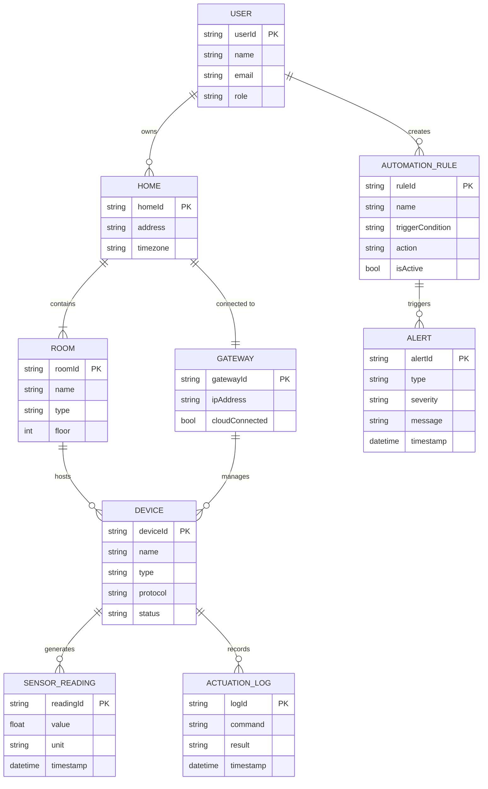

> **Figure 3.2 — Entity Relationship Diagram:**
> This ER diagram defines the data relationships between the system's core entities, with each entity's primary key (PK) and key attributes listed. A single User may own multiple Homes; each Home contains multiple Rooms; each Room hosts multiple Devices. Devices generate Sensor Readings and record Actuation Logs over time. Users also create Automation Rules which, when evaluated as true, trigger Alerts. Each Home is connected to exactly one Gateway, and that Gateway manages all devices within the home. Crow's foot notation expresses cardinality (one-to-many via `||--o{`, mandatory one-to-many via `||--|{`, and one-to-one via `||--||`) at each relationship endpoint.

---

## Step 4: Information Model Specification

### 4.1 Data Types and Structures

#### Sensor Reading Object
```json
{
  "readingId": "uuid-v4",
  "deviceId": "sensor-001",
  "homeId": "home-123",
  "roomId": "room-456",
  "type": "temperature",
  "value": 24.5,
  "unit": "C",
  "timestamp": "2026-04-26T10:30:00Z",
  "quality": "good"
}
```

#### Device State Object
```json
{
  "deviceId": "light-001",
  "name": "Living Room Main Light",
  "type": "smart_bulb",
  "status": "online",
  "state": {
    "power": "on",
    "brightness": 75,
    "color": "#FFFFFF",
    "colorTemp": 4000
  },
  "lastUpdated": "2026-04-26T10:28:00Z",
  "energyConsumption_W": 8.5
}
```

#### Automation Rule Object
```json
{
  "ruleId": "rule-007",
  "name": "Night Motion Security",
  "trigger": {
    "sensor": "motion-sensor-front-door",
    "condition": "motion_detected == true",
    "timeWindow": "22:00-06:00"
  },
  "action": {
    "devices": ["security-light-01", "camera-01"],
    "command": "turn_on",
    "notification": true,
    "notificationMessage": "Motion detected at front door!"
  },
  "isActive": true,
  "createdBy": "user-001"
}
```

### 4.2 Information Flow Diagram

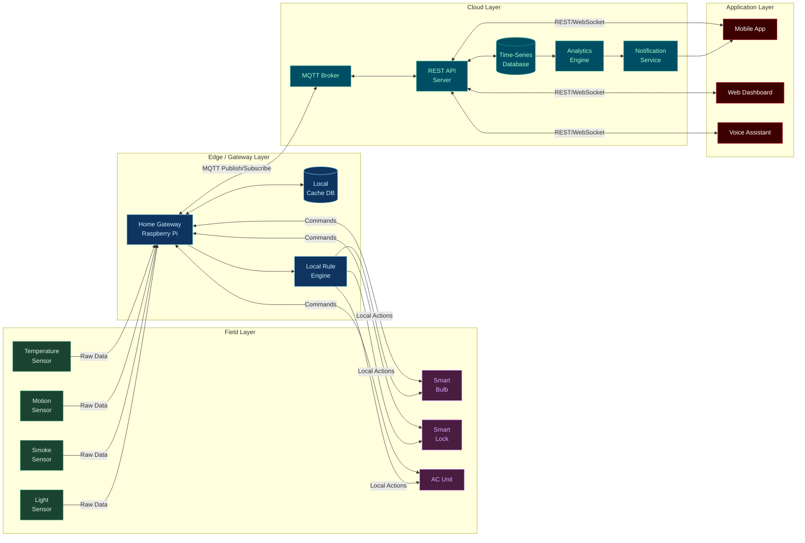

> **Figure 4.1 — Information Flow Diagram:**
> This four-layer data flow diagram traces the journey of information from physical sensors to user applications. The green Field Layer contains sensors (temperature, motion, smoke, light) that push raw readings to the gateway, and purple actuators (smart bulb, lock, AC) that receive commands back. The blue Edge/Gateway Layer performs local caching and rule evaluation before forwarding data upward. The teal Cloud Layer hosts the MQTT broker, REST API, time-series database, analytics engine, and notification service. The red Application Layer (mobile, web, voice) both receives real-time updates via WebSocket and sends commands via REST, forming a complete bidirectional information loop.

### 4.3 Data Retention Policy

| Data Type | Retention Period | Storage Location |
|-----------|-----------------|-----------------|
| Raw sensor readings | 7 days | Local Gateway Cache |
| Aggregated sensor data (1-min avg) | 1 year | Cloud Time-Series DB |
| Event logs & alerts | 3 years | Cloud Relational DB |
| Video recordings | 30 days | Encrypted Cloud Storage |
| User preferences & rules | Indefinite | Cloud Relational DB |

---

## Step 5: Service Specifications

### 5.1 Service Catalog

The SHAS exposes the following services to client applications through a secure API Gateway.

### 5.2 Service Architecture Diagram

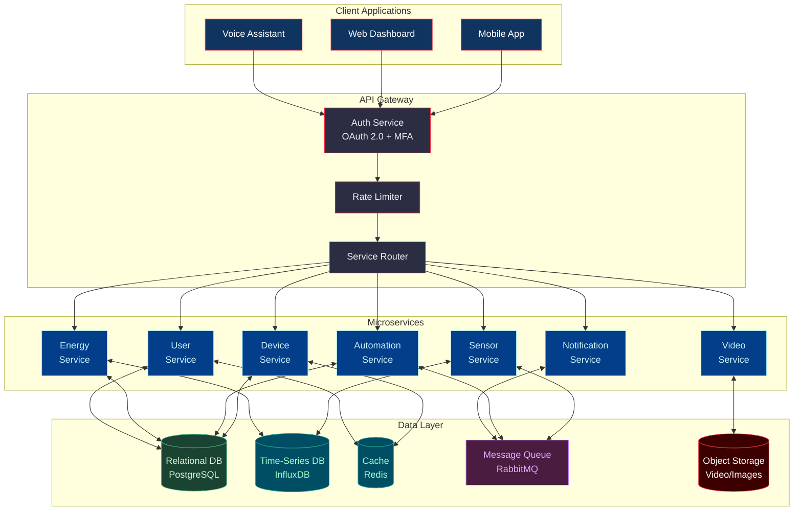

> **Figure 5.1 — Service Architecture Diagram:**
> This diagram illustrates the microservices architecture of the SHAS backend. Client applications (dark blue) communicate exclusively through the API Gateway (dark grey), which enforces OAuth 2.0 authentication, rate limiting, and request routing. Seven cyan microservices handle distinct domains: Device, Sensor, Automation, Notification, Energy, Video, and User management. The Data Layer uses color to differentiate storage types: green for PostgreSQL relational data, teal for InfluxDB time-series data and Redis cache, purple for RabbitMQ async event queuing, and red for object storage (video/images). This separation of concerns enables independent scaling and deployment of each service.

### 5.3 REST API Endpoints

| Service | Method | Endpoint | Description |
|---------|--------|----------|-------------|
| Device Service | GET | `/api/v1/devices` | List all devices |
| Device Service | POST | `/api/v1/devices/{id}/command` | Send command to device |
| Device Service | GET | `/api/v1/devices/{id}/status` | Get device status |
| Sensor Service | GET | `/api/v1/sensors/{id}/readings` | Get sensor readings |
| Automation Service | GET | `/api/v1/rules` | List automation rules |
| Automation Service | POST | `/api/v1/rules` | Create new rule |
| Automation Service | PUT | `/api/v1/rules/{id}` | Update rule |
| Automation Service | DELETE | `/api/v1/rules/{id}` | Delete rule |
| Notification Service | GET | `/api/v1/alerts` | Get recent alerts |
| Energy Service | GET | `/api/v1/energy/report` | Get energy report |
| User Service | POST | `/api/v1/auth/login` | User login |
| Video Service | GET | `/api/v1/cameras/{id}/stream` | Get live stream URL |

### 5.4 MQTT Topic Structure

```
shas/{homeId}/{roomId}/{deviceId}/telemetry     <- Sensor data upload
shas/{homeId}/{roomId}/{deviceId}/command       <- Commands to device
shas/{homeId}/{roomId}/{deviceId}/status        <- Device state changes
shas/{homeId}/alerts                            <- Home-level alerts
shas/{homeId}/energy                            <- Energy consumption data
```

---

## Step 6: IoT Level Specification

### 6.1 IoT Architecture Levels

The system follows a **6-level IoT architecture**, where each level has a distinct responsibility and communicates with adjacent levels.

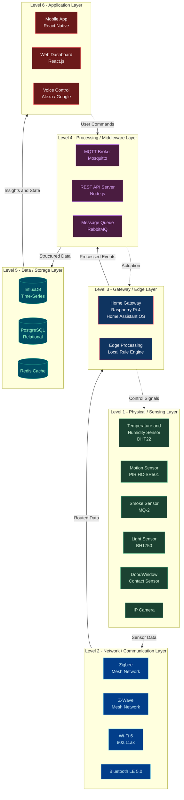

> **Figure 6.1 — IoT 6-Level Architecture Diagram:**
> This diagram presents the six-layer IoT architecture of the SHAS, with each layer rendered in a distinct color representing its role in the system. The green Level 1 (Physical Layer) contains all hardware sensors and cameras that gather raw environmental data. The blue Level 2 (Network Layer) handles wireless communication protocols — Zigbee and Z-Wave meshes for low-power sensors, Wi-Fi for high-bandwidth devices, and BLE for wearables. The dark blue/red Level 3 (Gateway/Edge Layer) is the Raspberry Pi running Home Assistant, performing local processing and rule evaluation. The purple Level 4 (Middleware Layer) hosts the cloud MQTT broker, REST API, and message queue. The teal Level 5 (Data Layer) provides persistent storage via InfluxDB, PostgreSQL, and Redis. The crimson Level 6 (Application Layer) delivers all user-facing interfaces. Solid arrows show upward data flow; dashed arrows show downward command flow, forming a complete bidirectional control loop.

### 6.2 Protocol Selection per Level

| Level | Protocol/Technology | Justification |
|-------|-------------------|---------------|
| Sensing | Zigbee 3.0 / Z-Wave | Low power, mesh network, high reliability |
| Local Network | Wi-Fi 6 / BLE | High throughput for cameras; BLE for wearables |
| Gateway | MQTT (QoS 1 & 2) | Lightweight publish/subscribe, ideal for IoT |
| Cloud | HTTPS REST + WebSocket | Secure, standard, real-time push capability |
| Data Storage | InfluxDB + PostgreSQL | Time-series for sensor data, relational for config |
| Application | React Native / React.js | Cross-platform, responsive UI |

---

## Step 7: Functional View Specification

### 7.1 Functional Blocks Diagram

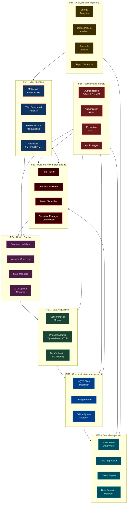

> **Figure 7.1 — Functional Blocks Diagram:**
> This diagram organizes the system's capabilities into eight color-coded functional blocks (FBs), each responsible for a distinct concern. Green FB1 (Data Acquisition) collects and validates raw sensor data from all physical devices. Blue FB2 (Communication Management) routes messages between layers including offline queuing. Red FB3 (Automation Engine) parses rules, evaluates conditions, and dispatches actions. Purple FB4 (Device Control) validates and sends commands, manages device state, and handles OTA firmware updates. Teal FB5 (Data Management) writes, aggregates, queries, and retains all system data. Dark red FB6 (Security & Identity) enforces authentication, authorization, and encryption — its edges extend to FB1 through FB5, indicating system-wide coverage. Navy FB7 (User Interface) provides all user-facing surfaces. Amber FB8 (Analytics) produces energy and anomaly reports that feed back into FB7 for display.

### 7.2 Functional Block Descriptions

| Functional Block | Role | Key Components |
|-----------------|------|---------------|
| **FB1: Data Acquisition** | Collects raw data from all physical sensors using their native protocols | Sensor polling, protocol adapters, data validation |
| **FB2: Communication Management** | Manages all message routing between layers, handles offline queuing | MQTT client, message router, offline queue |
| **FB3: Rule & Automation Engine** | Evaluates trigger conditions and dispatches automated actions | Rule parser, condition evaluator, scheduler |
| **FB4: Device Control** | Validates and sends control commands to actuators; manages device state | Command validator, actuator controller, OTA |
| **FB5: Data Management** | Persists, aggregates and queries all sensor and event data | InfluxDB writer, aggregator, query engine |
| **FB6: Security & Identity** | Ensures all access is authenticated, authorized and encrypted | OAuth 2.0, RBAC, TLS 1.3, audit logs |
| **FB7: User Interface** | Provides all user-facing interfaces for control and monitoring | Mobile app, web dashboard, voice, notifications |
| **FB8: Analytics & Reporting** | Derives insights from historical data; detects anomalies | Energy reports, usage patterns, anomaly detection |

---

## Step 8: Operational View Specification

### 8.1 Performance Considerations

| Metric | Target | Mechanism |
|--------|--------|-----------|
| Sensor data latency | < 500 ms end-to-end | Edge processing, local rule engine |
| Command response time | < 1 second | Direct MQTT command channel |
| App UI response | < 3 seconds | Redis caching, CDN for static assets |
| Video stream latency | < 2 seconds | WebRTC / RTSP with adaptive bitrate |
| System uptime | 99.5% | Redundant cloud deployment, local fallback |

### 8.2 Reliability & Fault Tolerance Flowchart

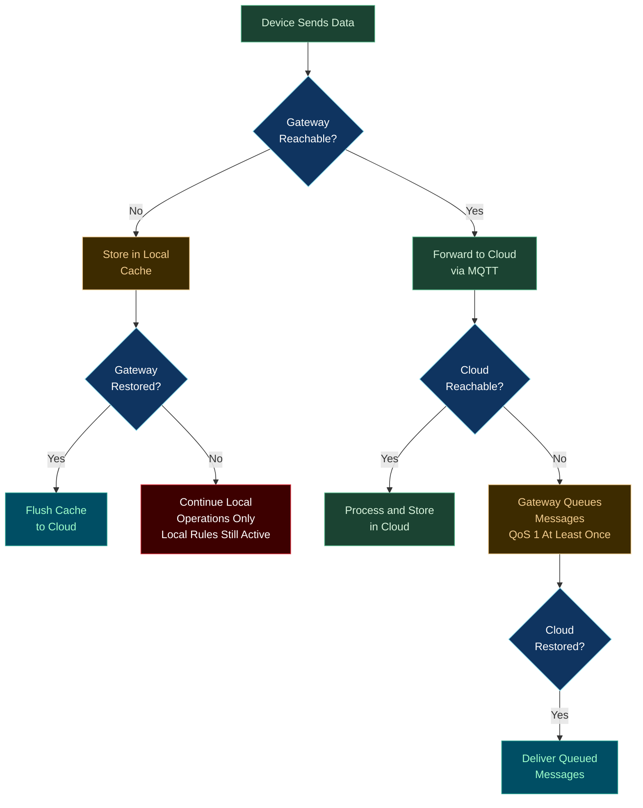

> **Figure 8.1 — Reliability & Fault Tolerance Flowchart:**
> This flowchart models system behavior under two failure scenarios using a traffic-light color scheme. Green nodes represent the healthy path where data flows seamlessly from device to gateway to cloud. Amber nodes represent degraded states: when the gateway is unreachable, data is buffered in local cache; when the cloud is unreachable, the gateway queues messages with MQTT QoS 1 (at-least-once delivery). Red nodes represent full offline mode, where only locally cached rules and state keep the home functioning with no cloud dependency. Teal recovery nodes represent restoration points where queued or cached data is automatically flushed to the cloud once connectivity is re-established. This design ensures zero data loss and continued basic automation even during network outages.

---

### 8.3 Security Architecture

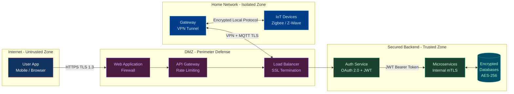

> **Figure 8.2 — Security Architecture Diagram:**
> This diagram partitions the system into four security zones, each color-coded by trust level. The dark blue Internet Zone represents untrusted external traffic from mobile and browser clients — all traffic enters over HTTPS with TLS 1.3. The purple DMZ (Demilitarized Zone) acts as the first defensive layer, hosting the Web Application Firewall, API Gateway rate limiter, and SSL-terminating Load Balancer to block malicious traffic before it reaches the core system. The green Trusted Backend Zone is where authenticated requests are processed: the OAuth 2.0/JWT Auth Service validates tokens, microservices communicate over mutual TLS (mTLS), and databases are encrypted at rest with AES-256. The blue Home Network Zone is physically isolated: the Raspberry Pi gateway connects to the cloud exclusively via an encrypted VPN tunnel, while local IoT devices communicate over encrypted Zigbee/Z-Wave radio protocols. This layered defense-in-depth approach ensures no single point of failure can compromise the entire system.

### 8.4 Security Measures Summary

| Threat | Mitigation |
|--------|-----------|
| Unauthorized access | OAuth 2.0, MFA, JWT short-lived tokens |
| Man-in-the-middle | TLS 1.3 on all communications, VPN for gateway |
| Device tampering | Signed firmware, secure boot, OTA validation |
| Data breach | AES-256 encryption at rest, RBAC access control |
| DDoS attacks | Rate limiting at API gateway, WAF rules |
| Replay attacks | MQTT message timestamps + nonce validation |

---

## Step 9: Device & Component Integration

### 9.1 Device Inventory

| # | Device | Model | Protocol | Function |
|---|--------|-------|----------|----------|
| 1 | Temperature & Humidity Sensor | DHT22 / Sonoff SNZB-02 | Zigbee | Monitor room climate |
| 2 | Motion Sensor (PIR) | HC-SR501 / Aqara MS-S02 | Zigbee | Detect movement |
| 3 | Smoke / Gas Sensor | MQ-2 / Heiman HS3SA | Zigbee | Fire/gas detection |
| 4 | Light Level Sensor | BH1750 / Xiaomi GZCGQ01LM | Zigbee | Ambient light monitoring |
| 5 | Door/Window Contact Sensor | Aqara MCCGQ11LM | Zigbee | Open/close detection |
| 6 | Smart Bulb | Philips Hue / IKEA TRADFI | Zigbee | Lighting control |
| 7 | Smart Plug | TP-Link Tapo P115 | Wi-Fi | Appliance power control |
| 8 | Smart Door Lock | Schlage BE489WB | Z-Wave | Entry access control |
| 9 | Smart Thermostat | Google Nest / Honeywell T6R | Wi-Fi | HVAC control |
| 10 | IP Security Camera | Reolink RLC-810A | Wi-Fi (RTSP) | Video surveillance |
| 11 | Home Gateway | Raspberry Pi 4 (4GB RAM) | All protocols | Central hub |
| 12 | Zigbee Coordinator | ConBee II USB Stick | Zigbee | Zigbee mesh coordinator |
| 13 | Z-Wave Controller | Aeotec Z-Stick Gen5 | Z-Wave | Z-Wave mesh controller |

### 9.2 Network Topology Diagram

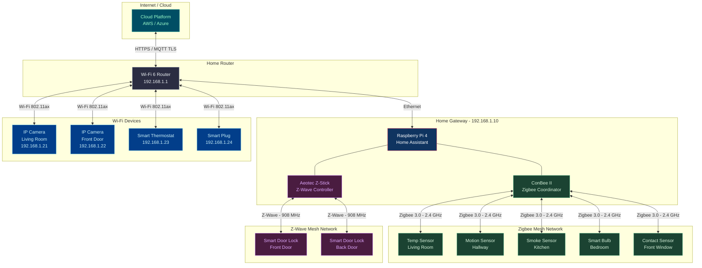

> **Figure 9.1 — Network Topology Diagram:**
> This diagram maps the complete physical and logical network topology of the smart home installation. The teal Cloud block at the top connects to the home's grey Wi-Fi 6 Router via encrypted HTTPS/MQTT TLS over the internet. The dark blue Gateway (Raspberry Pi 4) is Ethernet-connected to the router and physically houses two radio controllers: the green ConBee II Zigbee coordinator (which manages the green Zigbee mesh of five sensors and bulbs) and the purple Aeotec Z-Wave controller (which manages the two purple Z-Wave door locks). The cyan Wi-Fi devices — two IP cameras, a smart thermostat, and a smart plug — connect directly to the router via 802.11ax and are managed by Home Assistant over the LAN. Three independent wireless sub-networks operate simultaneously on separate frequency bands (2.4 GHz Zigbee, 908 MHz Z-Wave, and 2.4/5 GHz Wi-Fi), preventing radio interference while maximizing device compatibility across the home.

---

### 9.3 Communication Protocol Stack

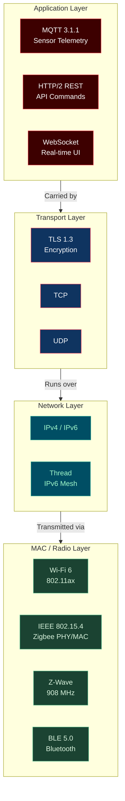

> **Figure 9.2 — Communication Protocol Stack:**
> This layered stack maps the communication protocols used in SHAS to the classical OSI model, with each layer color-coded for clarity. The red Application Layer contains three protocols: MQTT 3.1.1 for lightweight, bidirectional sensor telemetry; HTTP/2 REST for user command and configuration APIs; and WebSocket for real-time UI state push. The blue Transport Layer provides reliable delivery via TCP and security via TLS 1.3, ensuring all IoT traffic is encrypted in transit. The teal Network Layer handles IP routing using IPv4/IPv6 for cloud-connected devices and Thread (a 6LoWPAN-based IPv6 mesh) for constrained IoT devices. The green MAC/Radio Layer represents the four physical wireless technologies: Wi-Fi 6 for bandwidth-intensive devices (cameras, thermostat), IEEE 802.15.4 as the PHY/MAC foundation for Zigbee sensors, Z-Wave at 908 MHz for door locks, and BLE 5.0 for future wearable device integrations.

---

## Step 10: Application Development

### 10.1 Application Architecture

The SHAS provides three client applications:
1. **Mobile App** (React Native — iOS & Android)
2. **Web Dashboard** (React.js — Browser)
3. **Voice Interface** (Alexa Skill / Google Action)

### 10.2 Application Component Diagram

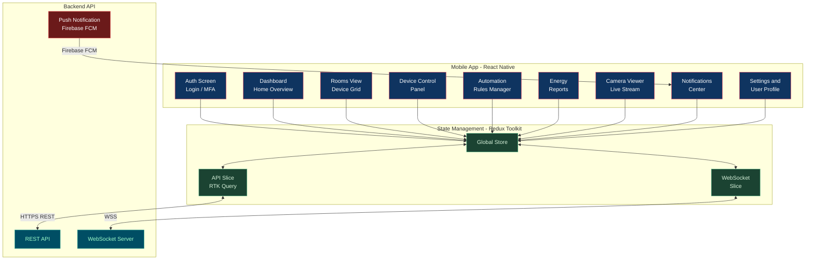

> **Figure 10.1 — Application Component Diagram:**
> This diagram illustrates the internal architecture of the mobile application and its connections to the backend. All nine dark blue UI screens (Auth, Dashboard, Rooms, Device Control, Rules, Energy, Camera, Notifications, Settings) connect to a centralized green Redux Global Store, ensuring a single source of truth for all application state. The store communicates with two slices: the RTK Query API Slice for HTTPS REST requests (device commands, rule management, energy data) and the WebSocket Slice for real-time device state streaming. The red Firebase FCM service delivers push notifications directly to the Notifications screen, even when the app is running in the background. This architecture cleanly separates UI concerns from data-fetching logic, making the app highly maintainable and testable.

---

### 10.3 Mobile App Screen Flow

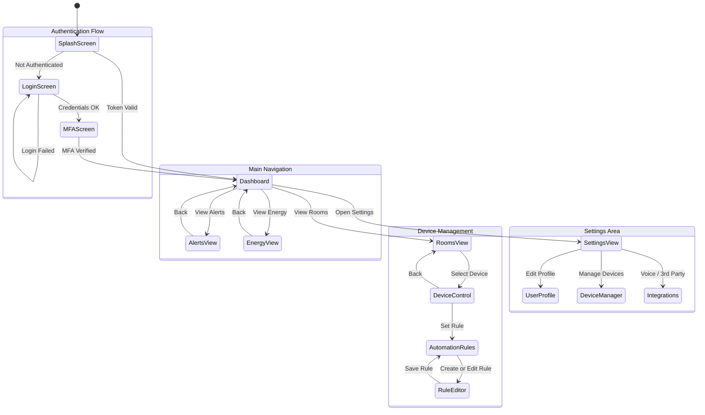

> **Figure 10.2 — Mobile App Screen Flow (State Diagram):**
> This state diagram maps every screen in the mobile application and the transitions between them, grouped into four logical regions. The Authentication Flow covers the startup path: a valid stored token skips directly to the Dashboard, while a missing or expired token routes the user through Login (with retry on failure) and then through MFA verification before reaching the Dashboard. The Main Navigation region anchors all top-level views around the Dashboard hub, from which users branch to Rooms, Alerts, Energy, and Settings. The Device Management region shows the drill-down path from selecting a room to controlling an individual device, with the option to create or edit automation rules via the Rule Editor. The Settings Area enables profile editing, device management, and third-party voice assistant configuration. Every leaf screen provides a back-navigation path, ensuring the user can always return to the Dashboard without losing context.

---

### 10.4 UI Dashboard Layout

```
+------------------------------------------------+
|  My Smart Home                  Alerts  Profile |
+------------------------------------------------+
|  Good Morning, Ahmed!    23C   Humidity 45%    |
|  All systems normal                             |
+-------------+---------------+------------------+
|  Lights     |  Climate      |  Security        |
|  12 ON      |  22C Set      |  All Locked      |
|   4 OFF     |  Auto Mode    |  0 Alerts        |
+-------------+---------------+------------------+
|  ROOMS                                         |
|  [Living Room] [Kitchen] [Bedroom] [Garage]    |
+------------------------------------------------+
|  ENERGY TODAY                  3.2 kWh / $0.48 |
|  ########-----------  67% of daily average     |
+------------------------------------------------+
|  RECENT ALERTS                                 |
|  Front door opened at 07:32 AM                 |
|  Bedroom temp reached 28C at 02:15 AM          |
+------------------------------------------------+
```

### 10.5 Voice Control Integration Flow

```mermaid
sequenceDiagram
    actor User
    participant VA   as Alexa / Google Home
    participant Skill as SHAS Skill / Action
    participant API3 as SHAS Cloud API
    participant GW3  as Home Gateway
    participant Dev  as Smart Device

    rect rgb(10, 30, 60)
        Note over User,VA: Natural Language Input
        User->>VA: "Alexa, turn off the living room lights"
    end

    rect rgb(50, 10, 60)
        Note over VA,Skill: NLU Intent Resolution
        VA->>Skill: Intent: TurnOff, Entity: living_room_lights
    end

    rect rgb(10, 50, 30)
        Note over Skill,API3: API Command Dispatch
        Skill->>API3: POST /api/v1/devices/light-lr-01/command {action: off}
        API3->>GW3: MQTT: shas/home-1/living-room/light-lr-01/command
    end

    rect rgb(10, 30, 60)
        Note over GW3,Dev: Local Actuation
        GW3->>Dev: Zigbee Off Command
        Dev->>GW3: ACK
    end

    rect rgb(50, 30, 10)
        Note over GW3,User: Confirmation Feedback
        GW3->>API3: Status Update: power=off
        API3->>Skill: 200 OK
        Skill->>VA: "OK, turning off the living room lights"
        VA->>User: Speaks confirmation aloud
    end
```

> **Figure 10.3 — Voice Control Integration Sequence Diagram:**
> This sequence diagram traces a complete voice command from spoken input to device actuation and verbal confirmation, across five color-coded interaction bands. The dark blue band captures the user's natural language utterance to the voice assistant. The purple band shows Alexa/Google Home resolving the utterance into a structured intent (TurnOff) and entity (living_room_lights) via Natural Language Understanding (NLU). The green band shows the SHAS Skill translating that intent into a REST API call, which the cloud platform then forwards to the home gateway via MQTT. The second dark blue band shows the gateway sending the Zigbee off-command to the physical bulb and receiving a hardware acknowledgement. The amber band closes the loop: the gateway publishes the updated device status, the cloud returns a 200 OK to the Skill, and the voice assistant speaks the confirmation response back to the user — completing the full round trip with no mobile interaction required.

---

### 10.6 Technology Stack Summary

| Layer | Technology | Justification |
|-------|-----------|---------------|
| Mobile App | React Native 0.73 | Cross-platform iOS & Android from single codebase |
| Web Frontend | React.js 18 + Tailwind CSS | Fast, component-based, responsive UI |
| State Management | Redux Toolkit + RTK Query | Predictable state, efficient API caching |
| Backend API | Node.js + Express | Event-driven, ideal for real-time IoT workloads |
| MQTT Broker | Eclipse Mosquitto | Open-source, lightweight, production proven |
| Time-Series DB | InfluxDB 2.x | Optimized for high-frequency sensor data |
| Relational DB | PostgreSQL 16 | ACID-compliant, robust for user and config data |
| Cache | Redis 7 | Sub-millisecond latency for device state |
| Message Queue | RabbitMQ | Reliable async processing of sensor events |
| Cloud Platform | AWS IoT Core + EC2 | Managed MQTT, auto-scaling, global availability |
| Container Orchestration | Docker + Kubernetes | Portable, scalable microservice deployment |
| CI/CD | GitHub Actions | Automated testing and deployment pipeline |
| Gateway OS | Home Assistant OS (Raspberry Pi 4) | Rich device ecosystem, local processing |

---

## Summary & Conclusion

The **Smart Home Automation System (SHAS)** has been comprehensively designed following the 10-step IoT design methodology. The system:

- **Addresses a real problem:** energy waste, security vulnerabilities, and lack of convenience in traditional homes.
- **Employs a layered architecture:** from physical sensors through edge gateway to cloud services and user applications.
- **Prioritizes security:** with TLS 1.3, OAuth 2.0, MFA, RBAC, and VPN-secured gateway communication.
- **Ensures reliability:** through local fallback mode, MQTT QoS guarantees, and cloud redundancy.
- **Supports scalability:** via containerized microservices and a multi-protocol device ecosystem (Zigbee, Z-Wave, Wi-Fi).
- **Delivers rich user experience:** through a React Native mobile app, web dashboard, and voice assistant integration.

The prototype will be implemented in Cisco Packet Tracer simulating the core components: the home gateway, IoT sensors, actuators, Wi-Fi/LAN network, and cloud connectivity.

---

## References

1. Bahga, A., & Madisetti, V. (2014). *Internet of Things: A Hands-on Approach.* VPT.
2. Rose, K., Eldridge, S., & Chapin, L. (2015). *The Internet of Things: An Overview.* Internet Society.
3. IEEE Xplore: Smart Home Automation Survey — doi:10.1109/ACCESS.2019.2930467
4. Zigbee Alliance. (2023). *Zigbee 3.0 Specification.* CSA.
5. OWASP IoT Security Guidance. (2024). Retrieved from https://owasp.org/www-project-iot-security-verification-standard/
6. InfluxData. (2024). *InfluxDB 2.x Documentation.* Retrieved from https://docs.influxdata.com
7. Home Assistant Documentation. (2024). Retrieved from https://www.home-assistant.io/docs/

---

*Report prepared for CSE356: Internet of Things | CHEP - Spring 2026 | Ain Shams University*
