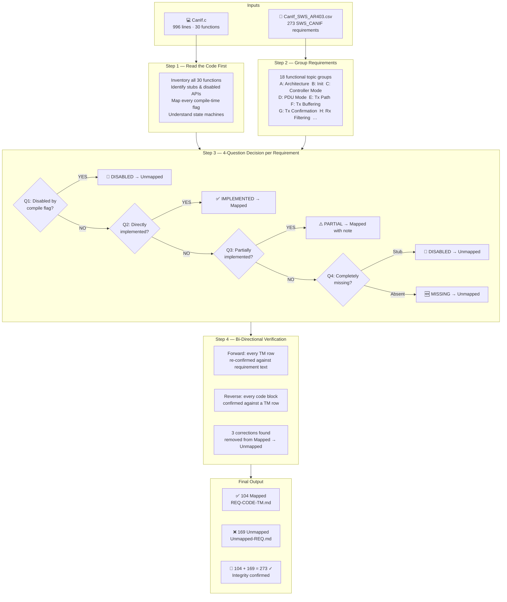
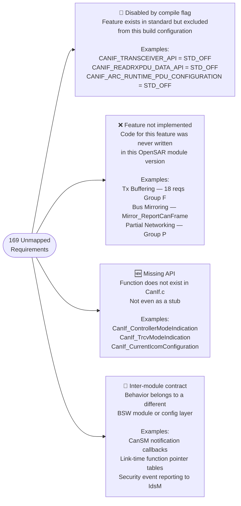
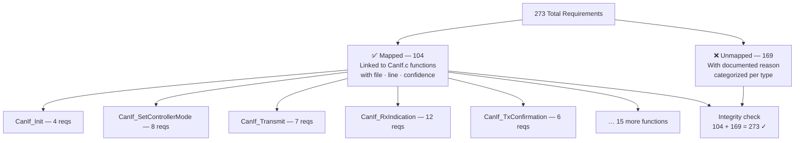
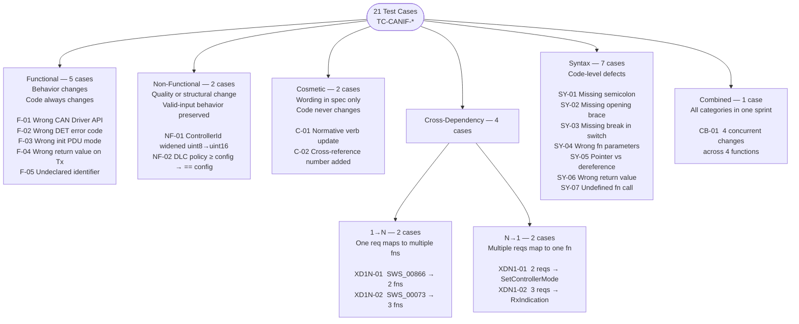
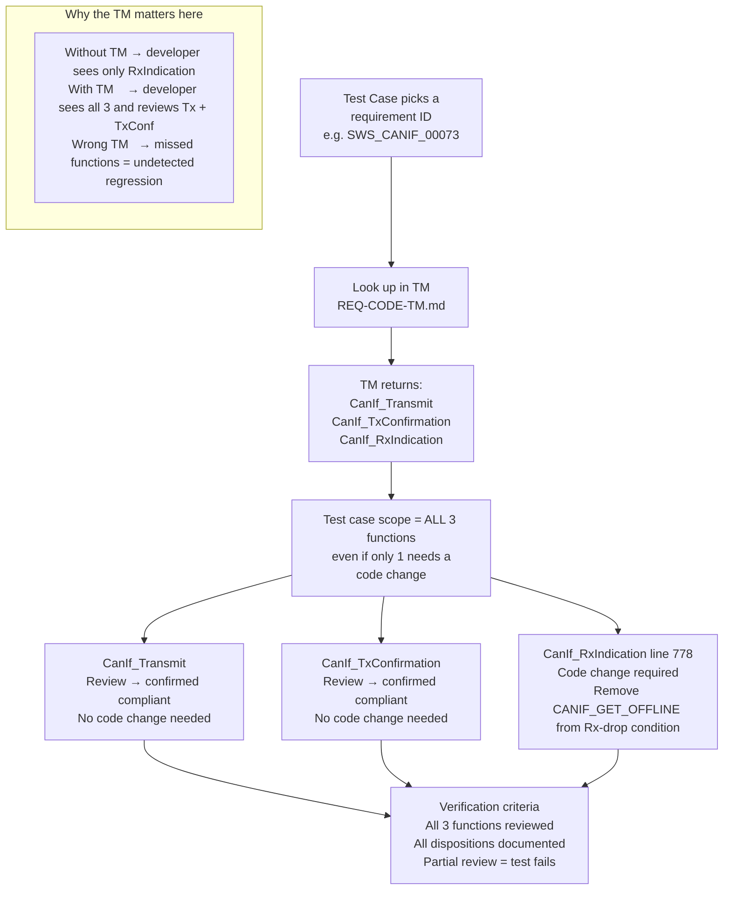

# How the Traceability Matrix and Test Cases Were Made
**Module:** AUTOSAR CanIf AR 4.0.3 (OpenSAR)  
**Author:** Ahmed Mohamed

---

## Part 1 — The Traceability Matrix

---

### 1.1 What a Traceability Matrix Is (The Concept)

A **Requirement-to-Code Traceability Matrix** is a table that answers one question:

> *"For every requirement in the specification, which exact function(s) in the source code implement it?"*

The table looks like this:

| Req ID | CanIf.c Function(s) |
|:---|:---|
| SWS_CANIF_00085 | CanIf_Init |
| SWS_CANIF_00308 | CanIf_SetControllerMode |
| SWS_CANIF_00073 | CanIf_Transmit, CanIf_TxConfirmation, CanIf_RxIndication |

But not every requirement has a function. Some requirements describe features that are disabled, missing, or intentionally not implemented. Those go into a second file called **Unmapped**.

The most important invariant:

```
Mapped rows + Unmapped rows = Total requirements
    104     +     169       =      273          ✓
```

If this equation doesn't hold, you made a mistake.

---

### 1.2 The Two Inputs

**Input 1 — Requirements CSV** (`CanIf_SWS_AR403.csv`)  
This file contains **273 rows**. Each row has:
- An ID like `SWS_CANIF_00308`
- A plain-English description of what the module must do

Example row:
```
ID:          SWS_CANIF_00308
Description: The service CanIf_SetControllerMode() shall call
             Can_SetControllerMode(Controller, Transition) for
             the requested CAN controller.
```

**Input 2 — Source Code** (`OpenSAR/communication/CanIf/CanIf.c`)  
This file is **996 lines of C code** containing **30 functions**. It is the actual AUTOSAR CanIf implementation.

---

### 1.3 Step 1 — Read and Fully Understand the Code First

Before touching any requirements, I read the entire `CanIf.c` from line 1 to line 996.

**Why code first, requirements second?**  
Because when you read a requirement, you need to immediately visualize whether its behavior exists in code. If you have not read the code yet, you are guessing. Reading the code first gives you a mental map so that when you read "CanIf shall call Can_SetControllerMode()" you can instantly picture the exact switch-case on line 226.

**What I extracted from the code:**

For every function, I noted:
- Name and line range
- Is it a public API, an internal helper, or a callback from the CAN driver?
- Is it fully implemented, a stub that does nothing, or guarded by a compile flag?
- What does it call, and who calls it?

This produced the full function inventory in `New/CanIf_explain.md`.

The most critical thing I learned: **not all functions are real implementations**. Some functions exist in the file but always return `E_NOT_OK` immediately. For example:

```c
// CanIf.c line 487 — CanIf_ReadRxPduData()
Std_ReturnType CanIf_ReadRxPduData(...) {
    VALIDATE(FALSE, ...);   // always fails — this is a dead-end stub
    return E_NOT_OK;
}
```

This function exists, but it implements nothing. If I had not read the code first, I might have wrongly mapped requirements to it.

**I also identified all compile-time flags in `CanIf_Cfg.h`:**

| Flag | Value | Meaning |
|:---|:---:|:---|
| `CANIF_DLC_CHECK` | STD_ON | DLC check is active |
| `CANIF_TRANSCEIVER_API` | STD_OFF | Transceiver functions are excluded from compilation |
| `CANIF_READRXPDU_DATA_API` | STD_OFF | `ReadRxPduData` is excluded |
| `CANIF_ARC_RUNTIME_PDU_CONFIGURATION` | STD_OFF | Dynamic PDU config is excluded |

This matters because if a flag is STD_OFF, the code inside `#if` guards is never compiled. Requirements for those features are not "not implemented" — they are **intentionally disabled** by configuration. This is a different classification.

---

### 1.4 Step 2 — Read and Group All Requirements

With the code fully understood, I read all 273 requirements from the CSV.

The CSV has no grouping — all requirements appear in a flat list in random order. I grouped them by **functional topic** — putting each requirement in the group of the primary feature it describes.

**18 groups were identified:**

| Group | Topic | # of Reqs |
|:---:|:---|:---:|
| A | Architecture & Hardware Abstraction | 17 |
| B | Initialization | 6 |
| C | Controller Mode Management | 8 |
| D | PDU Channel Mode Management | 13 |
| E | Transmission (Tx Path) | 12 |
| F | Tx Buffering | 18 |
| G | Tx Confirmation Callback | 17 |
| H | Reception & Software Filtering | 15 |
| I | Rx Indication Callback Routing | 19 |
| J | Rx Buffering & Notification Status | 18 |
| K | Dynamic PDU (Runtime CAN ID) | 13 |
| L | BusOff Handling | 11 |
| M | Controller & Transceiver Mode Indications | 16 |
| N | Wakeup | 13 |
| O | Transceiver Management | 26 |
| P | Partial Networking | ~40 |
| Q | Security Events | 8 |
| R | Advanced APIs | ~20 |

**Grouping rule used:** Put a requirement in the group of the primary function or feature it describes. If a requirement is about error-checking for a specific function, it goes in that function's group.

For example, `SWS_CANIF_00311` says "If ControllerId is invalid in SetControllerMode(), report an error." This goes in Group C (Controller Mode Management) because it is about `CanIf_SetControllerMode` — not about error handling in general.

---

### 1.5 Step 3 — The 4-Question Decision Process

For every single requirement, I asked exactly these 4 questions in order:

```
Q1: Is this requirement's feature disabled by a compile-time flag?
         │
         YES ──→ Status = 🔧 DISABLED  →  Goes to Unmapped file
         │
         NO ↓

Q2: Is there a function in CanIf.c that directly implements this behavior?
         │
         YES ──→ Status = ✅ IMPLEMENTED  →  Goes to TM Mapped
         │       (record function + line numbers)
         NO ↓

Q3: Is the function present but only partially implements this requirement?
         │       (main case works, but one sub-condition is missing)
         YES ──→ Status = ⚠️ PARTIAL  →  Goes to TM Mapped with note
         │
         NO ↓

Q4: Is there literally no code for this requirement?
         │
         YES, function exists but is a stub  ──→ Status = 🔧 DISABLED  →  Unmapped
         YES, function does not exist at all  ──→ Status = ❌ NOT DONE / 🆕 MISSING  →  Unmapped
```

---

### 1.6 Concrete Examples of Each Decision

#### Example of ✅ IMPLEMENTED — SWS_CANIF_00308

**Requirement text:**  
*"The service CanIf_SetControllerMode() shall call Can_SetControllerMode(Controller, Transition) for the requested CAN controller."*

**Question Q1:** Is this disabled by a flag? → NO, there is no flag guarding `CanIf_SetControllerMode`.

**Question Q2:** Is there a function that implements this? → YES. In `CanIf.c` starting at line 226, `CanIf_SetControllerMode` contains exactly this call:

```c
// CanIf.c line 253 (inside CanIf_SetControllerMode)
if (Can_SetControllerMode(canControllerId, CAN_T_STOP) == CAN_NOT_OK)
```

And again at lines 263, 275, 287, 295, 306 — 6 call sites for different mode transitions.

**Decision:** ✅ IMPLEMENTED → TM row: `SWS_CANIF_00308 | CanIf_SetControllerMode`

---

#### Example of 🔧 DISABLED — SWS_CANIF_00358

**Requirement text:**  
*"The service CanIf_SetTransceiverMode() shall call CanTrcv_SetOpMode() for the referenced CAN transceiver."*

**Question Q1:** Is this disabled by a flag?  
Check `CanIf_Cfg.h`: `CANIF_TRANSCEIVER_API = STD_OFF`

The entire `CanIf_SetTransceiverMode` function body is inside `#if (CANIF_TRANSCEIVER_API == STD_ON)`. Since this is STD_OFF, the real implementation never compiles.

**Decision:** 🔧 DISABLED → Unmapped file

This is NOT a bug. The project deliberately does not include a transceiver driver. The code correctly excludes it.

---

#### Example of ❌ NOT DONE — SWS_CANIF_00063

**Requirement text:**  
*"CanIf shall support a CanIf Tx L-PDU buffer if CanIfPublicTxBuffering is enabled."*

**Question Q1:** Flag? → There is no `CanIfPublicTxBuffering` flag defined in `CanIf_Cfg.h` at all.

**Question Q2:** Function? → There is no Tx buffer data structure, no buffer management function, nothing.

**Question Q3:** Partial? → No, there is zero code for Tx buffering.

**Question Q4:** The code comment in `CanIf_Transmit()` line 477 explicitly says `/* Tx buffering not supported */` and returns `E_NOT_OK` on `CAN_BUSY` instead of buffering.

**Decision:** ❌ NOT DONE → Unmapped file

This is Group F (Tx Buffering) — 18 requirements all go to Unmapped for this reason.

---

#### Example of ⚠️ PARTIAL — SWS_CANIF_00774

**Requirement text:**  
*"If parameter ControllerMode of CanIf_SetControllerMode() has an invalid value (not CAN_CS_STARTED, CAN_CS_SLEEP or CAN_CS_STOPPED), CanIf shall report development error code CANIF_E_PARAM_CTRLMODE."*

**Question Q2:** Is there code for this? Look at `CanIf_SetControllerMode()` lines 238–315. The function has a switch-case on `ControllerMode`:
```c
switch (ControllerMode) {
    case CANIF_CS_STARTED:  ...  break;
    case CANIF_CS_SLEEP:    ...  break;
    case CANIF_CS_STOPPED:  ...  break;
    case CANIF_CS_UNINIT:
        // Just fall through
        break;
}
```

The `CANIF_CS_UNINIT` case falls through silently. There is **no** `VALIDATE(FALSE, ..., CANIF_E_PARAM_CTRLMODE)` call. The requirement says invalid mode must be reported — the code just ignores it.

**Decision:** This goes in the TM as MAPPED (the function exists and handles all valid modes correctly), but it is noted as a gap. The requirement is mapped to `CanIf_SetControllerMode` because that is where the implementation partially lives.

---

#### Example of 🆕 MISSING API — Group M (SWS_CANIF_00711)

**Requirement text:**  
*"When CanIf_ControllerModeIndication() is called, CanIf shall call CanSM_ControllerModeIndication()."*

**Question Q4:** Search for `CanIf_ControllerModeIndication` anywhere in `CanIf.c`. It does not exist — not even as a stub. The function is completely absent from the file.

**Decision:** 🆕 MISSING API → Unmapped file. This is different from DISABLED — a disabled function exists in code but does nothing. A missing API does not exist at all.

---

### 1.7 Step 4 — The Hardest Decision: Which Function Does a Requirement Belong To?

Some requirements are clearly about one function (e.g., "CanIf_Init shall..."). But many requirements describe **behavior that exists in multiple functions**. This is where careful reading is critical.

**Example — SWS_CANIF_00073:**

Requirement text: *"For Physical Channels switching to CANIF_OFFLINE mode CanIf shall: prevent forwarding of transmit requests, clear transmit buffers, prevent Rx indication callbacks, prevent Tx confirmation callbacks."*

This requirement touches **three functions**:
- `CanIf_Transmit()` — has the mode check that prevents forwarding
- `CanIf_TxConfirmation()` — has the mode check that prevents the confirmation callback
- `CanIf_RxIndication()` — has the mode check that drops received frames

**TM row:** `SWS_CANIF_00073 | CanIf_Transmit, CanIf_TxConfirmation, CanIf_RxIndication`

**How did I find all three?** By searching for `CANIF_GET_OFFLINE` in the code. Every place where this constant appears in a mode check is potentially implementing this requirement. I found it in all three functions and verified each one against the requirement text.

**Rule applied:** Map a requirement to ALL functions that directly enforce its behavioral constraint — not just the most obvious one.

---

### 1.8 Step 5 — Bi-Directional Verification

After building the TM group by group, I did a final cross-check in both directions to find mistakes:

**Direction 1 — Requirement → Code (forward check):**  
For every row in the TM, I re-read the requirement and confirmed the mapped function actually enforces that constraint. If the function only indirectly relates, it is not a valid mapping.

**Direction 2 — Code → Requirement (reverse check):**  
For every significant code block in `CanIf.c`, I verified there is at least one requirement in the TM mapped to it.

| Code Block in CanIf.c | Requirement Confirmed |
|:---|:---|
| `VALIDATE_NO_RV(ConfigPtr != 0, ...)` in CanIf_Init | SWS_CANIF_00085 |
| `channelData[i].PduMode = CANIF_GET_OFFLINE` | SWS_CANIF_00864 |
| `Can_SetControllerMode(CAN_T_START)` | SWS_CANIF_00308 |
| `if (CanDlc < entry->CanIfCanRxPduDlc)` | SWS_CANIF_00026 |
| `entry->CanIfUserTxConfirmation(...)` | SWS_CANIF_00383 |
| `CanIf_SetControllerMode(channel, CANIF_CS_STOPPED)` in BusOff | SWS_CANIF_00724 |

**Result:** 6 code elements had no AUTOSAR requirement. These turned out to be **ArcCore vendor extensions** — functions like `CanIf_Arc_FindHrhChannel()` and `CanIf_Arc_Error()` that are not in the AUTOSAR standard but were added by the OpenSAR team. They were documented separately.

---

### 1.9 The Three Corrections Made

During verification, I found **3 requirements that were initially mapped incorrectly** and had to be removed from the TM and moved to Unmapped.

#### Correction 1 — SWS_CANIF_00918

**Was mapped to:** `CanIf_ControllerBusOff`  
**Requirement says:** *"CanIf shall report security event CANIF_SEV_ERRORSTATE_BUSOFF to IdsM."*

**Why the mapping is wrong:**  
`CanIf_ControllerBusOff()` (lines 917–941) does two things: calls `CanIf_SetControllerMode(STOPPED)` and calls `CanIfBusOffNotification`. There is **no IdsM call, no security event, no** `Csm_` **function anywhere** in this function. The requirement demands security event reporting — a completely different subsystem that is not present in this codebase at all.

**Moved to:** Unmapped with reason: "Security event subsystem not implemented."

#### Correction 2 — SWS_CANIF_00920

**Was mapped to:** `CanIf_Arc_Error`  
**Requirement says:** *"If ControllerId in CanIf_ErrorNotification() has invalid value, report error."*

**Why the mapping is wrong:**  
The requirement is about a function named `CanIf_ErrorNotification()` — the AUTOSAR standard API. The code has `CanIf_Arc_Error()` — an **ArcCore vendor extension** with a different function signature and different semantics. These are two different functions. `CanIf_Arc_Error` calls `CanIfErrorNotificaton` (a callback), which is NOT the same as `CanIf_ErrorNotification()` (an AUTOSAR API). The names look similar but they are fundamentally different.

**Moved to:** Unmapped with reason: "AUTOSAR standard ErrorNotification API not implemented; only ArcCore vendor extension exists."

#### Correction 3 — SWS_CANIF_00921

Same reason as SWS_CANIF_00920.

---

### 1.10 Final TM Count and Integrity Check

```
Mapped requirements (TM rows):    104
Unmapped requirements:            169
Total:                            273  ✓  (matches CSV row count)
```

This equation is the final validation. It proves no requirement was missed and none was counted twice.

---

### 1.11 Summary of the TM Building Process

```
READ CanIf.c entirely (996 lines)
  → Know every function, every stub, every compile flag
        │
        ▼
READ all 273 requirements, group them into 18 topics
        │
        ▼
For each requirement apply the 4-question process:
  Q1: Compile flag disabled? → DISABLED → Unmapped
  Q2: Directly implemented?  → IMPLEMENTED → Mapped
  Q3: Partially implemented? → PARTIAL → Mapped with note
  Q4: Missing entirely?      → NOT DONE / MISSING → Unmapped
        │
        ▼
Bi-directional verification:
  Forward: every TM row re-confirmed against requirement text
  Reverse: every code block confirmed against a TM row
        │
        ▼
Fix corrections (3 removed, 3 moved to Unmapped)
        │
        ▼
Final count: 104 + 169 = 273 ✓
```

---

## Part 2 — The Test Cases

---

### 2.1 Why These Test Cases Were Written

The ultimate goal of the project is **change impact propagation** — when a requirement changes, the system should tell the developer exactly what code needs to be updated.

To validate that this system works correctly, we need test cases that cover every possible *type* of requirement change. These test cases are not software test cases (you don't run them with a test framework). They are **engineering scenarios** — each one describes:

1. A requirement as it originally exists
2. What the requirement is changed to
3. Exactly which code must change and how
4. How to verify the change was done correctly

They serve two purposes:
- **Now:** Give me (and leaders) a concrete, reviewable demonstration that I understand the traceability at a deep level
- **Later:** Serve as ground truth to evaluate the Impact Analyzer — if the AI correctly identifies the required code change for each test case, it is working correctly

---

### 2.2 Change Category Classification

Before writing any test case, I defined a taxonomy of requirement change types. Every requirement change in the real world falls into one of these categories:

| Category | Code | What Changes | Does Code Change? |
|:---|:---:|:---|:---:|
| **Functional** | F | The behavior of the system changes — different API called, different return value, different logic path | Always YES |
| **Non-Functional** | NF | Quality or structural constraint changes — type precision, acceptance window strictness — but valid-input behavior is preserved | YES (structural) |
| **Cosmetic** | C | Only the wording in the requirement document changes — the meaning is identical | Never |
| **Cross-Depend 1→N** | XD-1N | One requirement is mapped to N functions — changing it forces review/update of all N | YES in affected functions |
| **Cross-Depend N→1** | XD-N1 | N requirements all map to the same function — multiple changes must be applied together | YES — all at once |
| **Combined** | CB | All categories in the same change sprint | Mixed |

---

### 2.3 How Each Test Case Was Constructed

Every test case was built by answering these questions in order:

**Step 1 — Pick a requirement from the TM**  
Choose a requirement that clearly demonstrates the target category. It must be a real requirement with real code you can point to.

**Step 2 — Write a realistic "modified" version of the requirement**  
The modification must be believable — something that could genuinely happen in a real AUTOSAR version update. Not a nonsense change, but a change that tests a real engineering decision.

**Step 3 — Find the exact code line(s) that must change**  
Using the TM, find which function(s) are mapped to this requirement. Then go to that function and find the specific line(s) where the old behavior lives.

**Step 4 — Write the before/after code change**  
Show exactly what the code looked like before and exactly what it must look like after. No vagueness — specific line numbers, specific constants, specific function names.

**Step 5 — Write verification criteria**  
List 3–5 specific, checkable conditions that prove the change was done correctly. These must be conditions a reviewer can verify without ambiguity.

**Step 6 — Write the AUTOSAR rationale**  
Explain why this change matters in the context of the AUTOSAR specification. Why is doing it wrong dangerous?

---

### 2.4 Functional Test Cases (F) — Deep Walk-Through

#### TC-CANIF-F-01: SWS_CANIF_00308

**Original requirement:**  
`CanIf_SetControllerMode()` shall call `Can_SetControllerMode()` for the requested controller.

**Modified requirement:**  
`CanIf_SetControllerMode()` shall call `Can_InitController()` instead — for every state transition.

**How I found the code to change:**  
TM says `SWS_CANIF_00308 → CanIf_SetControllerMode`. I open `CanIf.c` at line 226. Inside the switch-case, I count every call to `Can_SetControllerMode()`:

```
Line 253: Can_SetControllerMode(canControllerId, CAN_T_STOP)   ← transition to STOPPED
Line 263: Can_SetControllerMode(canControllerId, CAN_T_STOP)   ← part of SLEEP entry
Line 275: Can_SetControllerMode(canControllerId, CAN_T_SLEEP)  ← SLEEP
Line 287: Can_SetControllerMode(canControllerId, CAN_T_STOP)   ← wakeup from SLEEP
Line 295: Can_SetControllerMode(canControllerId, CAN_T_START)  ← STARTED
Line 306: Can_SetControllerMode(canControllerId, CAN_T_STOP)   ← STARTED→STOPPED
```

**That is exactly 6 call sites.** All 6 must be replaced.

**Why this is an important test case:**  
It demonstrates that one requirement change can require updates in multiple places within the same function. A developer who finds only 3 of the 6 call sites creates a partially broken state machine.

---

#### TC-CANIF-F-03: SWS_CANIF_00864

**Original requirement:**  
During initialization, CanIf shall switch every channel to `CANIF_OFFLINE`.

**Modified requirement:**  
During initialization, CanIf shall switch every channel to `CANIF_ONLINE`.

**How I found the code to change:**  
TM says `SWS_CANIF_00864 → CanIf_Init`. I look at `CanIf_Init()` starting line 131. Inside the initialization loop:

```c
// CanIf.c line 140
CanIf_Global.channelData[i].PduMode = CANIF_GET_OFFLINE;
```

**The change is exactly one line:**
```c
// OLD
CanIf_Global.channelData[i].PduMode = CANIF_GET_OFFLINE;
// NEW
CanIf_Global.channelData[i].PduMode = CANIF_GET_ONLINE;
```

**Why this is dangerous:**  
Starting in ONLINE means CAN frames can be transmitted/received before CanSM has completed the network startup sequence. This breaks the AUTOSAR startup procedure defined in CanSM SWS and can cause uncontrolled bus flooding on startup.

---

#### TC-CANIF-F-05: The Build-Error Test Case

**Original requirement:**  
Same as F-03 — during init, switch to `CANIF_OFFLINE`.

**"Modified" requirement:**  
Replace `CANIF_GET_OFFLINE` with `CANIF_HAMADA` — a non-existent identifier.

```c
// NEW (invalid)
CanIf_Global.channelData[i].PduMode = CANIF_HAMADA;
```

**Why this test case exists:**  
It tests the most basic class of invalid change — one that never even compiles. The expected behavior is not runtime behavior but a compiler error:

```
CanIf.c:140: error: 'CANIF_HAMADA' undeclared (first use in this function)
```

This validates that the build pipeline catches the error before any testing is needed. Unlike F-03 (which compiles successfully but is semantically wrong), F-05 never produces an executable.

---

### 2.5 Non-Functional Test Cases (NF) — Deep Walk-Through

#### TC-CANIF-NF-02: SWS_CANIF_00026

**Original requirement:**  
Accept received L-PDUs with DLC **greater than or equal to** the configured DLC.

**Modified requirement:**  
Accept received L-PDUs with DLC **exactly equal to** the configured DLC only.

**How I found the code to change:**  
TM says `SWS_CANIF_00026 → CanIf_RxIndication`. I open `CanIf_RxIndication()` at line 763. I search for the DLC check — it is inside a `#if (CANIF_DLC_CHECK == STD_ON)` guard at line 824:

```c
// CanIf.c line 824
if (CanDlc < entry->CanIfCanRxPduDlc)  // OLD: reject if LESS THAN configured
```

**The change is one character — `<` becomes `!=`:**
```c
// OLD: accepts DLC >= configured
if (CanDlc < entry->CanIfCanRxPduDlc)

// NEW: accepts ONLY DLC == configured
if (CanDlc != entry->CanIfCanRxPduDlc)
```

**Why this is Non-Functional, not Functional:**  
For a frame with exactly the configured DLC, the behavior is **identical** — it is accepted. The behavior only changes for frames with DLC **greater than** configured (e.g., padded CAN FD frames). The dispatch logic itself does not change — only the acceptance window narrows. The function structure is the same; the policy is stricter.

**Real-world impact:** CAN FD networks often pad short messages to 64 bytes. This change would reject all padded frames — breaking CAN FD interoperability.

---

### 2.6 Cosmetic Test Cases (C) — Why They Are Important

#### TC-CANIF-C-01: SWS_CANIF_00423

**Original requirement:**  
*"Each Rx L-PDU **has to be** configured with a receive indication service **which is called** in CanIf_RxIndication()."*

**Modified requirement:**  
*"Each Rx L-PDU **MUST be** configured with a receive indication service **that is invoked within** CanIf_RxIndication()."*

Changes: `"has to be"` → `"MUST be"`, `"which is called"` → `"that is invoked within"`

**Code change required:** NONE.

The normative intent is identical — every Rx PDU needs a callback. Only the wording changed. `CanIf_RxIndication()` does not change at all.

**Why cosmetic test cases matter:**  
They validate that the engineering process can correctly **identify when not to change code**. In practice, AUTOSAR requirements change wording between versions (e.g., AR 4.0.3 → AR 4.4.0) without changing behavior. A developer who does not recognize a cosmetic change might "over-fix" and introduce unnecessary code modifications, which creates risk.

The verification criterion for a cosmetic test case is: **zero diff in `CanIf.c`**.

---

### 2.7 Cross-Depend 1→N Test Cases — The Core of the TM's Value

These test cases demonstrate why the TM exists. A single requirement is mapped to multiple functions — changing it affects all of them.

#### TC-CANIF-XD1N-02: SWS_CANIF_00073 (1 requirement → 3 functions)

**Original requirement:**  
For CANIF_OFFLINE mode: prevent Tx forwarding, clear Tx buffers, **prevent Rx indication callbacks**, prevent Tx confirmation callbacks.

**Modified requirement:**  
For CANIF_OFFLINE mode: prevent Tx forwarding and Tx confirmation callbacks. **Rx indication callbacks shall remain ENABLED** (to allow passive monitoring).

**TM lookup — what is mapped to SWS_CANIF_00073:**
```
SWS_CANIF_00073 → CanIf_Transmit, CanIf_TxConfirmation, CanIf_RxIndication
```

**Without the TM:** A developer reads "RxIndication callbacks shall remain enabled" and modifies only `CanIf_RxIndication`. They have no way to know that `CanIf_Transmit` and `CanIf_TxConfirmation` also share this requirement and need to be reviewed.

**With the TM:** The developer looks up `SWS_CANIF_00073` in the TM, sees 3 functions, and knows all 3 must be reviewed.

**How to find the exact code change:**  
In `CanIf_RxIndication()` line 778, the Rx drop condition:

```c
// CanIf.c line 778 — OLD: drops Rx in OFFLINE mode
if ( (mode == CANIF_GET_OFFLINE) ||
     (mode == CANIF_GET_TX_ONLINE) ||
     (mode == CANIF_GET_OFFLINE_ACTIVE) )
{
    return;  // drop the frame
}
```

```c
// NEW: OFFLINE mode no longer drops Rx
if ( (mode == CANIF_GET_TX_ONLINE) ||
     (mode == CANIF_GET_OFFLINE_ACTIVE) )
{
    return;  // drop the frame
}
```

**What about CanIf_Transmit and CanIf_TxConfirmation?**  
They are reviewed and confirmed: their mode checks correctly still block in OFFLINE mode. No code change needed in them — but they **must be reviewed**. The verification criteria explicitly require that all 3 functions are documented as reviewed, even the ones with no change.

This is the key engineering lesson: **a change that touches one function via the TM requires reviewing all functions sharing that TM row**.

---

#### TC-CANIF-XD1N-01: SWS_CANIF_00866 (1 requirement → 2 functions)

**Original requirement:**  
If `SetControllerMode(STOPPED)` **or** `ControllerBusOff()` is called, set PDU channel mode to `CANIF_TX_OFFLINE`.

**Modified requirement:**  
Same triggers, but set PDU channel mode to `CANIF_OFFLINE` (full offline — both Tx and Rx disabled).

**TM lookup:**
```
SWS_CANIF_00866 → CanIf_SetControllerMode, CanIf_ControllerBusOff
```

**Two functions. Two places to check:**

In `CanIf_SetControllerMode()` line 305 (the STOPPED case):
```c
// This already calls SetPduMode with CANIF_SET_OFFLINE — confirm this maps to CANIF_GET_OFFLINE
CanIf_SetPduMode(channel, CANIF_SET_OFFLINE);
```

In `CanIf_ControllerBusOff()` line 935:
```c
// This calls SetControllerMode which then calls SetPduMode
CanIf_SetControllerMode(channel, CANIF_CS_STOPPED);
// → transitively affected — verify no conflicting SetPduMode call follows
```

**Why both must be updated:**  
The requirement explicitly names two triggering conditions. A controlled stop and an emergency BusOff must leave the channel in the **same state**. If only one function is updated, a controlled stop puts the channel in OFFLINE but a BusOff puts it in TX_OFFLINE — two different behaviors for two conditions that the requirement says must produce the same result.

---

### 2.8 Cross-Depend N→1 Test Cases — Multiple Changes, One Function

These are the inverse: multiple requirements all map to the same function. When several requirements change simultaneously, all changes must be applied together.

#### TC-CANIF-XDN1-02: SWS_CANIF_00389 + 00390 + 00902 → CanIf_RxIndication

**Three requirements, three simultaneous changes, all in `CanIf_RxIndication`:**

**Change 1 — SWS_CANIF_00389 (modified):** Rejected frames must be logged to DET before being dropped.

```c
// OLD: just skip to next entry silently
entry++;
continue;

// NEW: log the rejection first
DET_REPORTERROR(MODULE_ID_CANIF, 0, CANIF_RXINDICATION_ID, CANIF_E_PARAM_HRH);
entry++;
continue;
```

**Change 2 — SWS_CANIF_00390 (modified):** DLC check must execute **before** software filtering, not after.

Original order in `CanIf_RxIndication()`:
```
1. HRH match check
2. Software filter (mask comparison)    ← was here
3. DLC check                            ← was here
4. Route to upper layer
```

New required order:
```
1. HRH match check
2. DLC check                            ← moves UP
3. Software filter (mask comparison)    ← moves DOWN
4. Route to upper layer
```

This is a **structural reorder** — not just changing a value but moving blocks of code.

**Change 3 — SWS_CANIF_00902 (modified):** DLC check is no longer conditional — always execute it regardless of the `CANIF_DLC_CHECK` configuration flag.

```c
// OLD: guarded by compile flag
#if (CANIF_DLC_CHECK == STD_ON)
if (CanDlc < entry->CanIfCanRxPduDlc) { ... }
#endif

// NEW: guard removed — always active
if (CanDlc < entry->CanIfCanRxPduDlc) { ... }
```

**Why all three must be applied atomically:**  
If you implement Change 2 (reorder) but not Change 3 (remove guard), the DLC check moves to the right position but can still be compiled away. If you implement Change 3 but not Change 2, DLC is always active but runs after the filter — different frames will be rejected based on which check they fail first. All three changes together define a consistent new behavior; any subset is inconsistent.

---

### 2.9 The Combined Test Case (CB-01) — A Realistic Sprint

TC-CANIF-CB-01 combines 4 requirement changes that arrive simultaneously:

| Req ID | Category | Function Affected | Code Change? |
|:---|:---:|:---|:---:|
| SWS_CANIF_00308 | Functional | `CanIf_SetControllerMode` | YES — replace 6 call sites |
| SWS_CANIF_00026 | Non-Functional | `CanIf_RxIndication` | YES — change comparison operator |
| SWS_CANIF_00423 | Cosmetic | `CanIf_RxIndication` | NO — wording only |
| SWS_CANIF_00073 | Cross-Depend 1→3 | `CanIf_Transmit`, `CanIf_TxConfirmation`, `CanIf_RxIndication` | YES in RxInd, reviewed in Tx + TxConf |

**Notice `CanIf_RxIndication` appears three times** — it is affected by three of the four changes simultaneously:
- NF change from SWS_CANIF_00026 → change line 824
- Cosmetic change from SWS_CANIF_00423 → no change
- Cross-depend change from SWS_CANIF_00073 → change line 778

The code review for `CanIf_RxIndication` must address all three items in one pass and document each disposition (changed, no-change-required, reviewed-compliant).

**This is what happens in real AUTOSAR engineering** — a requirements release brings 10–20 changes, each of different types, scattered across functions. The developer must:
1. Look up each changed requirement in the TM to find the affected functions
2. Determine what code change each one requires
3. Apply all changes in a single consistent commit
4. Document the disposition of each change (including cosmetic closures)

---

### 2.10 The Test Case Document Structure

Each test case follows exactly the same vertical table format:

| Field | What It Contains |
|:---|:---|
| **Test Case ID** | Unique identifier: `TC-CANIF-{category}-{number}` |
| **Title** | One-sentence description of the change scenario |
| **Category** | F / NF / C / XD-1N / XD-N1 / CB |
| **AUTOSAR Requirement ID** | The real SWS_CANIF_XXXXX ID from the TM |
| **Requirement — Original** | Exact text of the requirement as it currently exists |
| **Requirement — Modified** | Exact text of the requirement after the change |
| **Affected Function(s)** | From the TM — the function(s) mapped to this requirement |
| **Mandatory Code Modification** | File name, line number, OLD code, NEW code |
| **Expected Behavior** | What the system must do after the change |
| **Verification Criteria** | 3–5 specific, checkable conditions to prove the change is correct |
| **AUTOSAR Rationale** | Why this change matters; why doing it wrong is dangerous |

This format is **self-contained per test case** — each one can be read and acted on independently.

---

### 2.11 How the TM and Test Cases Work Together

The connection between the TM and test cases is direct:

```
Test Case picks a requirement ID (e.g., SWS_CANIF_00073)
        │
        ▼
Look up SWS_CANIF_00073 in TM
        │
        ▼
TM says: CanIf_Transmit, CanIf_TxConfirmation, CanIf_RxIndication
        │
        ▼
Test case must include ALL THREE functions in scope
(even if only one needs a code change — all must be reviewed)
        │
        ▼
For each function, find the specific code that enforces this requirement
        │
        ▼
Write exact OLD → NEW code change
```

If the TM were wrong — say, it was missing `CanIf_RxIndication` from the mapping — the test case for SWS_CANIF_00073 would only show 2 functions and the Rx drop-condition change would be missed. This is exactly why TM correctness is critical.

---

---

## Part 3 — Summary Diagrams

---

### Diagram 1 — End-to-End TM Building Process



---

### Diagram 2 — Why 169 Requirements Are Unmapped



---

### Diagram 3 — TM Result at a Glance



---

### Diagram 4 — Test Case Taxonomy



---

### Diagram 5 — How TM Powers Every Test Case



---

### Diagram 6 — Complete Work Overview

```mermaid
flowchart LR
    subgraph RESEARCH["Research Phase"]
        R1["Read CanIf.c\n30 functions inventoried"]
        R2["Study AUTOSAR SWS PDF\n+ Requirements CSV\n273 requirements"]
        R3["Cross-reference\nOpenSAR repo + standard"]
    end

    subgraph TM_WORK["Traceability Matrix"]
        T1["4-Question decision\nper requirement"]
        T2["Bi-directional verification\n3 corrections applied"]
        T3["104 Mapped\n169 Unmapped\n273 total ✓"]
        T4["TM → JSON\nmachine-readable format\nfor impact analysis"]
    end

    subgraph TC_WORK["Test Cases"]
        C1["Category discovery\nF · NF · C · XD · SY · CB"]
        C2["21 test cases\nexact code diffs\nverification criteria"]
        C3["Ground truth dataset\nfor Impact Analyzer\nevaluation"]
    end

    subgraph PIPELINE["Automation Pipeline"]
        P1["tm_pipeline\nLLM-powered\nauto TM generation"]
        P2["Incremental updates\nonly re-map what changed"]
    end

    RESEARCH --> TM_WORK
    TM_WORK --> TC_WORK
    TM_WORK --> PIPELINE
    TC_WORK --> PIPELINE
```



---

*End of Document*
